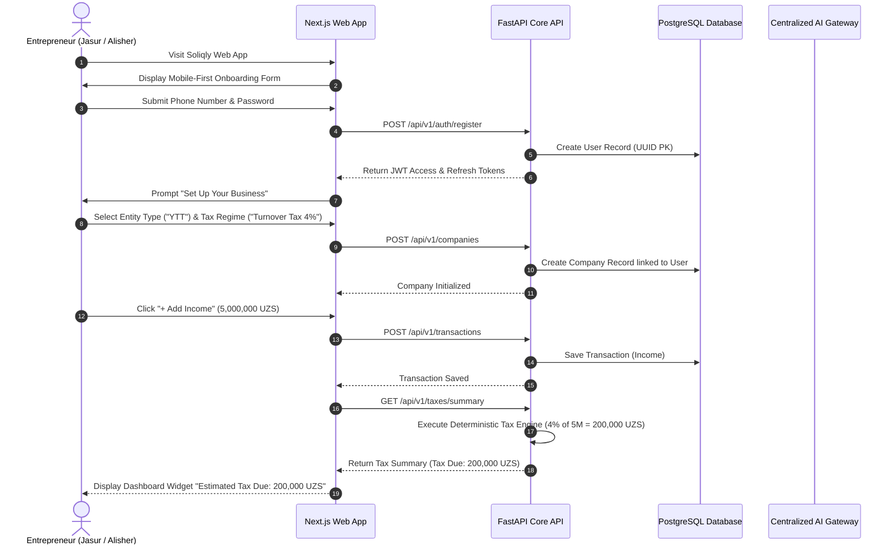

# Soliqly — Product Requirements Document (PRD)

**Version:** 1.0.0  
**Status:** Approved  
**Author:** Founding Product & Engineering Team  
**Created Date:** July 27, 2026  
**Last Updated:** July 27, 2026  
**Related Documents:** [PROJECT_DISCOVERY.md](file:///c:/Users/LENOVO/soliqli/soliqli-1/docs/PROJECT_DISCOVERY.md), [ENGINEERING_CONSTITUTION.md](file:///c:/Users/LENOVO/soliqli/soliqli-1/docs/ENGINEERING_CONSTITUTION.md), [ENGINEERING_CONSTITUTION_PART_2.md](file:///c:/Users/LENOVO/soliqli/soliqli-1/docs/ENGINEERING_CONSTITUTION_PART_2.md), [ENGINEERING_CONSTITUTION_PART_3.md](file:///c:/Users/LENOVO/soliqli/soliqli-1/docs/ENGINEERING_CONSTITUTION_PART_3.md), [ENGINEERING_CONSTITUTION_PART_4.md](file:///c:/Users/LENOVO/soliqli/soliqli-1/docs/ENGINEERING_CONSTITUTION_PART_4.md), [ENGINEERING_CONSTITUTION_PART_5.md](file:///c:/Users/LENOVO/soliqli/soliqli-1/docs/ENGINEERING_CONSTITUTION_PART_5.md), [ENGINEERING_CONSTITUTION_PART_6.md](file:///c:/Users/LENOVO/soliqli/soliqli-1/docs/ENGINEERING_CONSTITUTION_PART_6.md)  
**Dependencies:** [PROJECT_DISCOVERY.md](file:///c:/Users/LENOVO/soliqli/soliqli-1/docs/PROJECT_DISCOVERY.md)  

---

## 1. Executive Summary

### 1.1 Purpose of Document
This Product Requirements Document (PRD) establishes the definitive product specification for the Minimum Viable Product (MVP) of **Soliqly**—an AI-powered financial operating system tailored for self-employed professionals, sole proprietors (*Yakka Tartibdagi Tadbirkorlar* - YTT), and micro-businesses (*MCHJ*) in the Republic of Uzbekistan.

### 1.2 Core Product Proposition
Soliqly abstracts complex Uzbekistan state tax regulations (*Soliq Qo'mitasi* rules), manual spreadsheet calculations, and administrative portal friction into an automated, zero-jargon web application. The platform provides:
* Effortless manual and batch income/expense tracking.
* 100% deterministic tax liability calculations (Fixed Tax & 4% Turnover Tax / *Aylanmadan olinadigan soliq*).
* A 24/7 conversational Uzbek/Russian AI Tax Assistant powered by Retrieval-Augmented Generation (RAG).
* Exportable compliance summary reports (PDF/CSV).

---

## 2. Product Vision

### 2.1 Strategic Product Positioning
To become the **Financial Operating System of Uzbekistan** by evolving through five explicit maturity phases:

```
[Phase 1: MVP] Income/Expense Tracking + Deterministic Tax Engine + RAG AI Assistant
       │
       ▼
[Phase 2: Accounting Core] Double-Entry Ledger + Financial Statements (P&L, Balance Sheet)
       │
       ▼
[Phase 3: AI Document Processing] OCR Receipt Scanning & Automated Invoice Parser
       │
       ▼
[Phase 4: Government & Banking APIs] Soliq.uz Integration + E-Faktura Sync + Open Banking
       │
       ▼
[Phase 5: Financial Operating System] Embedded B2B Payments + AI Business Loan Scoring
```

---

## 3. Business Objectives

### 3.1 Measurable Business Benchmarks

| Milestone | Target Metric | Metric Definition | Target Timeline |
| :--- | :--- | :--- | :--- |
| **User Base Growth** | **10,000 MAU** | Monthly Active Users recording ≥ 1 transaction or AI query | Month 6 post-launch |
| **Monetization Scaling**| **$50,000 MRR** | Monthly Recurring Revenue from Pro & Business plans | Month 12 post-launch |
| **Conversion Rate** | **≥ 6.5%** | Freemium-to-Paid subscriber conversion rate | Continuous |
| **Customer Retention** | **< 2.0% Churn** | Monthly net logo churn across paid YTT & MCHJ tiers | Continuous |
| **LTV / CAC Ratio** | **> 5:1** | Ratio of Customer Lifetime Value to Acquisition Cost | Month 12 post-launch |

---

## 4. Problem Statement

Small business owners and self-employed individuals in Uzbekistan face four acute operational bottlenecks:
1. **Severe Tax Non-Compliance Anxiety:** Complex legislation leads to errors, resulting in bank account freezes (*kartoteka*) and automated fines.
2. **Spreadsheet & Paper Dependency:** Manual accounting in Excel or notebooks results in lost receipts, missing tax deductions, and incorrect month-end calculations.
3. **The "1C Trap":** Traditional accounting software (1C:Enterprise) is over-engineered for non-accountants, requiring expensive external consultants ($100+/mo).
4. **Opaque Tax Liability Forecasting:** Liabilities are computed retrospectively after deadlines pass rather than monitored in real-time.

---

## 5. Target Users

```
┌─────────────────────────────────────────────────────────────────────────────┐
│                           TARGET USER TAX TIERS                             │
├───────────────────────────────┬─────────────────────────────────────────────┤
│ Target User Category          │ Operational Regime & Tax Framework          │
├───────────────────────────────┼─────────────────────────────────────────────┤
│ Primary (MVP Target)          │ Self-Employed (Simplified 0%), YTT (Aylanma 4%)│
│ Secondary                     │ Micro MCHJ (Turnover Tax < 1B UZS), Bookkeepers│
│ Future Expansion              │ Medium Enterprises, Financial Institutions  │
└───────────────────────────────┴─────────────────────────────────────────────┘
```

---

## 6. Detailed User Personas

### 6.1 Persona A: "Jasur" — The IT Freelancer (Self-Employed)
* **Demographics:** Age 26, Tashkent, Remote Frontend Developer earning foreign currency ($2,500/mo).
* **Tax Status:** Registered as *O'zini o'zi band qilgan shaxs*.
* **Goals:** Receive client payments, pay mandatory social tax (*Ijtimoiy soliq*), maintain compliance, track monthly income against the 100 Million UZS threshold.
* **Pain Points:** Unsure when he will exceed the self-employed threshold and be forced to register as a YTT; hates complex paperwork.
* **Tech Proficiency:** High (MacBook, Telegram, Click, Payme).

### 6.2 Persona B: "Alisher" — The Retail Shop Owner (YTT)
* **Demographics:** Age 38, Samarkand, Owner of a clothing boutique.
* **Tax Status:** Sole Proprietor (*Yakka Tartibdagi Tadbirkor* - YTT) on 4% Turnover Tax (*Aylanmadan olinadigan soliq*).
* **Goals:** Record daily sales, track inventory expenses, calculate quarterly turnover tax accurately, export PDF summaries for state audits.
* **Pain Points:** Pays 600,000 UZS/month to an accountant who is frequently late with filing; fears bank freezes (*kartoteka*).
* **Tech Proficiency:** Moderate (Android Smartphone, Telegram, Humo POS terminal).

### 6.3 Persona C: "Nigora" — The Independent Bookkeeper
* **Demographics:** Age 34, Fergana, Freelance Accountant managing 25 micro-YTT clients.
* **Tax Status:** Manages multiple YTT and MCHJ entities.
* **Goals:** Speed up monthly client tax calculations, switch between client accounts effortlessly, batch-generate compliance reports.
* **Pain Points:** Spends hours collecting bank statements over Telegram and manually typing transaction numbers into Excel sheets.
* **Tech Proficiency:** Advanced (Windows PC, 1C, Excel, Soliq.uz).

---

## 7. End-to-End User Journeys

### 7.1 Registration, Onboarding & First Tax Calculation Flow



---

## 8. MVP Scope Boundaries (MoSCoW Prioritization)

```
┌─────────────────────────────────────────────────────────────────────────────┐
│                           MVP SCOPE BOUNDARIES                              │
├─────────────────────────────────────────────────────────────────────────────┤
│  MUST HAVE:     Auth, Company Profile, Income/Expense Entry, Ledger View,   │
│                 Deterministic Tax Calculator, Uzbek/Russian RAG AI, Reports  │
│  SHOULD HAVE:   Batch CSV Import, Category Analytics Charts, Dark Mode      │
│  COULD HAVE:    Telegram Bot Notification Integration, Receipt Photo Upload │
│  WON'T HAVE:    Inventory, CRM, Payroll, HR, ERP, Soliq.uz API Sync, E-IMZO │
└─────────────────────────────────────────────────────────────────────────────┘
```

| Category | Priority | Component / Feature | Rationale |
| :--- | :--- | :--- | :--- |
| **Authentication** | **Must Have** | JWT Phone/Password Login & Registration | Essential secure access foundation. |
| **Business Setup** | **Must Have** | Self-Employed vs. YTT Tax Profile Setup | Required for correct tax formula routing. |
| **Transactions** | **Must Have** | Manual Income & Expense Logger | Primary financial data input mechanism. |
| **Ledger View** | **Must Have** | Transaction Table with Filter, Search, Pagination | Core visibility requirement. |
| **Tax Engine** | **Must Have** | Deterministic Fixed & Turnover Tax Calculator | P0 core value proposition. |
| **AI Assistant** | **Must Have** | Conversational RAG AI (Uzbek/Russian) | AI-first guidance differentiator. |
| **Reporting** | **Must Have** | PDF & CSV Tax Summary Exporter | Compliance export requirement. |
| **Analytics** | **Should Have** | Income vs. Expense Trend Charts | Visual financial clarity. |
| **Batch Import** | **Should Have** | CSV Transaction Batch Uploader | Time-saving feature for accountants. |
| **Receipt OCR** | **Won't Have** | Automated Optical Character Recognition | Deferred to Phase 3. |
| **State Sync** | **Won't Have** | Direct Soliq.uz / E-Faktura API Sync | Deferred to Phase 4. |
| **Inventory/Payroll**| **Won't Have** | Stock management & Employee Payroll | Excluded from MVP scope. |

---

## 9. Feature Catalog

### 9.1 Comprehensive Feature Breakdown

| Feature ID | Feature Name | Primary Purpose | Business Value | Priority | Dependencies |
| :--- | :--- | :--- | :--- | :--- | :--- |
| **FEAT-AUTH-01** | **User Authentication** | Secure user registration and session authorization. | Account security and data isolation. | Must Have | Baseline |
| **FEAT-COMP-01** | **Company Management** | Profile configuration for Self-Employed / YTT / MCHJ. | Enables accurate tax rate selection. | Must Have | FEAT-AUTH-01 |
| **FEAT-TXN-01** | **Income Logging** | Record incoming business revenue with categories. | Revenue tracking & tax base calculation. | Must Have | FEAT-COMP-01 |
| **FEAT-TXN-02** | **Expense Logging** | Record outgoing business operational expenses. | Cash flow tracking & net margin analytics. | Must Have | FEAT-COMP-01 |
| **FEAT-TXN-03** | **Transaction Ledger** | Searchable table of all income and expenses. | Financial visibility & audit trail. | Must Have | FEAT-TXN-01, FEAT-TXN-02 |
| **FEAT-TAX-01** | **Deterministic Tax Calc** | Computes real-time tax liabilities based on tax code formulas. | Zero penalty compliance guarantee. | Must Have | FEAT-TXN-01 |
| **FEAT-AI-01** | **RAG Tax Assistant** | Answers Uzbek/Russian tax questions with legal citations. | Instant AI guidance without expensive accountants. | Must Have | FEAT-AUTH-01 |
| **FEAT-REP-01** | **Report Exporter** | Generates downloadable PDF and CSV tax statements. | Offline filing and record-keeping. | Must Have | FEAT-TAX-01 |

---

## 10. Functional Requirements

### 10.1 Authentication & Profile Management
* **FR-001:** The system MUST allow users to create an account using a valid Uzbekistan phone number (`+998XXXXXXXXX`) and password.
* **FR-002:** The system MUST issue stateless JWT access tokens (15-minute TTL) and refresh tokens (7-day TTL) upon successful authentication.
* **FR-003:** The system MUST support multi-factor authentication (MFA) via SMS OTP codes during password reset.

### 10.2 Company & Entity Setup
* **FR-004:** The system MUST allow an authenticated user to create one or more Company profiles.
* **FR-005:** The system MUST require selection of Entity Type (`SELF_EMPLOYED`, `YTT`, `MCHJ`) during company creation.
* **FR-006:** The system MUST require selection of Tax Regime (`SIMPLIFIED_FIXED`, `TURNOVER_TAX_4%`) for YTT entities.

### 10.3 Transaction Management (Income & Expense)
* **FR-007:** The system MUST allow logging of Income transactions with fields: `amount` (UZS), `date`, `category`, `description`, `payment_method` (`CASH`, `BANK_TRANSFER`, `CARD`).
* **FR-008:** The system MUST allow logging of Expense transactions with fields: `amount` (UZS), `date`, `category`, `description`, `payment_method`.
* **FR-009:** The system MUST display a paginated Ledger view supporting filtering by date range, transaction type (`INCOME`, `EXPENSE`), and category.
* **FR-010:** The system MUST support soft-deletion of transactions, retaining audit log records.

### 10.4 Deterministic Tax Engine
* **FR-011:** The system MUST compute turnover tax for YTT entities operating under Turnover Tax regime as exactly $4\%$ of gross revenue logged in the selected tax period.
* **FR-012:** The system MUST calculate mandatory Social Tax (*Ijtimoiy soliq*) for YTT entities as $1 \times \text{BHM}$ per month.
* **FR-013:** The system MUST alert Self-Employed entities when cumulative annual revenue reaches $80\%$ of the 100 Million UZS registration ceiling.
* **FR-014:** The system MUST execute all numerical tax calculations via deterministic Python unit-tested functions, prohibiting LLM computational output.

### 10.5 AI Assistant & RAG Pipeline
* **FR-015:** The system MUST provide a real-time conversational chat interface supporting Uzbek (*uz*) and Russian (*ru*).
* **FR-016:** The system MUST retrieve relevant Tax Code articles using vector similarity search (`pgvector`) over indexed legal documentation.
* **FR-017:** The system MUST attach official legal citations (e.g., *"Article 467 of the Tax Code of Uzbekistan"*) to all legal tax advice responses.
* **FR-018:** The system MUST sanitize user input prompts to strip PII and prevent prompt injection attacks.

### 10.6 Reporting & Data Export
* **FR-019:** The system MUST generate exportable tax summary reports in PDF and CSV formats.
* **FR-020:** The system MUST include company name, tax ID (*TIN/STIR*), date range, gross revenue, total expenses, and estimated tax due in generated PDF reports.

---

## 11. Non-Functional Requirements (NFR)

### 11.1 Performance & Speed
* **NFR-001 (Page Load):** Initial Web application load time MUST NOT exceed **1.8 seconds** on standard 4G mobile connections.
* **NFR-002 (API Response):** Core REST API endpoints (`/summary`, `/transactions`) MUST respond within **250 ms** (p95).
* **NFR-003 (AI Latency):** The AI Gateway MUST stream the first token of conversational responses within **1.5 seconds**.

### 11.2 Security & Compliance
* **NFR-004 (Encryption):** All data in transit MUST be encrypted using TLS 1.3. All sensitive database fields MUST be encrypted at rest using AES-256 GCM.
* **NFR-005 (Data Residency):** User financial data and audit records MUST reside on servers physically compliant with Uzbekistan Law No. ZRU-547 ("On Personal Data").
* **NFR-006 (OWASP Standards):** The API MUST enforce protection against OWASP Top 10 vulnerabilities (SQLi, XSS, CSRF, broken object-level authorization).

### 11.3 Availability & Reliability
* **NFR-007 (Uptime SLA):** The platform MUST maintain **99.9% uptime** availability.
* **NFR-008 (Fault Tolerance):** Database failovers MUST complete within 30 seconds without data loss.

---

## 12. Explicit Business Rules

```
┌─────────────────────────────────────────────────────────────────────────────┐
│                           CORE BUSINESS RULES                               │
├───────────┬─────────────────────────────────────────────────────────────────┤
│ Rule ID   │ Business Rule Enforcement                                       │
├───────────┼─────────────────────────────────────────────────────────────────┤
│ BR-001    │ Company Data Isolation: Users can access ONLY their companies. │
│ BR-002    │ Deterministic Calculation: Tax math MUST NOT use LLMs.         │
│ BR-003    │ Soft Delete Policy: Deleted records retain audit logs.          │
│ BR-004    │ Base Calculating Amount (BHM): Hardcoded updated state rate.    │
│ BR-005    │ Self-Employed Ceiling: Alert user at 100M UZS annual revenue.   │
└───────────┴─────────────────────────────────────────────────────────────────┘
```

* **BR-001 (Tenant Isolation):** Every transaction, tax record, and report belongs to exactly one `company_id`. Cross-tenant data leaks are strictly prevented via DB-level foreign key checks and service middleware.
* **BR-002 (Deterministic Execution):** All financial formulas, tax rates, and thresholds are hardcoded in source code (`packages/shared/tax/`). AI models explain context but **never** calculate numbers.
* **BR-003 (Currency Standard):** All monetary figures in the database are stored as exact 64-bit integers in Uzbek Som (*UZS*) to eliminate floating-point rounding errors.

---

## 13. User Stories

### 13.1 Authentication & Setup
* **US-001:** *As a self-employed developer*, I want to sign up with my phone number in under 1 minute, so that I can immediately start logging my project income.
* **US-002:** *As a YTT shop owner*, I want to select my entity type as "YTT Turnover Tax (4%)", so that the system automatically configures my correct tax rate.

### 13.2 Transactions & Ledger
* **US-003:** *As a freelancer*, I want to record an incoming payment of 10,000,000 UZS with a single tap, so that my revenue log stays up to date.
* **US-004:** *As a shop owner*, I want to filter my transaction ledger by "Expenses in July", so that I can analyze my supplier costs.

### 13.3 Tax Calculation & AI Guidance
* **US-005:** *As a YTT owner*, I want to see my live estimated tax liability on my dashboard, so that I am never surprised by month-end tax bills.
* **US-006:** *As an entrepreneur*, I want to ask the AI assistant *"What is the social tax rate for YTT in 2026?"*, so that I get a clear answer with the legal article citation.

---

## 14. Acceptance Criteria (Given-When-Then)

### 14.1 Acceptance Criteria 1: Turnover Tax Calculation
```gherkin
Scenario: Calculate 4% Turnover Tax for YTT Entity
  Given a user is operating a company with entity type "YTT" and tax regime "TURNOVER_TAX_4%"
  And the user has logged gross income of 20,000,000 UZS for the current month
  When the user views the Tax Summary dashboard widget
  Then the system displays estimated Turnover Tax due as exactly 800,000 UZS
  And displays mandatory Social Tax as 1 x BHM (375,000 UZS)
  And displays total tax liability as 1,175,000 UZS
```

### 14.2 Acceptance Criteria 2: AI Tax Code RAG Query
```gherkin
Scenario: Ask AI Assistant about Tax Regulations
  Given an authenticated user is on the AI Assistant screen
  When the user submits the query "Can self-employed individuals hire employees?"
  Then the AI Gateway queries the pgvector database for Tax Code Article 385
  And streams a natural language response in Uzbek/Russian stating "No, self-employed individuals cannot hire employees"
  And appends the official citation footer "[Source: Uzbekistan Tax Code, Article 385]"
```

---

## 15. Success Metrics (KPI Dashboard)

| Metric Category | Indicator Name | Measurement Method | Target Goal |
| :--- | :--- | :--- | :--- |
| **Product** | Task Completion Rate | % of users filing tax reports without support aid | ≥ 95% |
| **Product** | Time-to-Value (TTV) | Time from signup to first logged transaction | < 3.0 minutes |
| **Engineering** | System Uptime | High-availability server ping monitoring | 99.9% Uptime |
| **Engineering** | API Latency (p95) | OpenTelemetry backend request metric | < 250 ms |
| **AI Quality** | AI Accuracy Rate | Ground truth evaluation on benchmark tax questions | ≥ 99.5% |
| **AI Quality** | AI Hallucination Rate | Audited tax code citation accuracy | 0.0% Hallucination |

---

## 16. Product Risk Management Matrix

| Risk ID | Category | Description | Severity | Likelihood | Mitigation Strategy |
| :--- | :--- | :--- | :--- | :--- | :--- |
| **PR-01** | **Legal / Regulatory** | State Tax Committee alters turnover tax rates or BHM values. | High | High | Store tax rates in externalized database configuration tables (`tax_regime_rates`), editable without code deployment. |
| **PR-02** | **AI Safety** | LLM provides incorrect legal advice to a business owner. | Critical | Medium | Enforce strict RAG architecture, display mandatory legal disclaimers, and intercept numerical queries with deterministic engine. |
| **PR-03** | **UX Friction** | Non-accountant users confused by financial terms. | High | Medium | Perform usability testing; replace all accounting jargon with plain Uzbek/Russian terminology ("Money In", "Money Out"). |

---

## 17. Future Product Roadmap

```
Phase 1: MVP Core (Current Scope)
├── Auth, Company Profiles, Income/Expense Logging
├── Deterministic Fixed & Turnover Tax Calculator
├── Uzbek/Russian AI Tax Assistant (RAG)
└── PDF/CSV Summary Export

Phase 2: Accounting Core (Post-MVP Month 6)
├── Double-Entry General Ledger & Chart of Accounts
├── Automated Profit & Loss (P&L) Statements
└── Multi-user Tenant Roles (Owner + Accountant)

Phase 3: AI Document Processing (Month 12)
├── Mobile Camera Receipt OCR Scanning
└── PDF Invoice Automated Category Parser

Phase 4: State & Banking Integrations (Month 18)
├── Direct Soliq.uz Tax Portal Sync & E-IMZO Signing
└── Open Banking Direct Feeds (Kapitalbank, TBC)
```

---

## 18. Product Glossary

* **YTT (*Yakka Tartibdagi Tadbirkor*):** Sole Proprietor legal status in Uzbekistan.
* **MCHJ (*Mas'uliyati Cheklangan Jamiyat*):** Limited Liability Company (LLC) legal entity.
* **Turnover Tax (*Aylanmadan olinadigan soliq*):** Simplified gross revenue tax regime (4%) for entities earning under 1 Billion UZS annually.
* **Social Tax (*Ijtimoiy soliq*):** Mandatory monthly contribution to the state pension fund based on BHM.
* **BHM (*Bazaviy Hisoblash Miqdori*):** National Base Calculating Amount used to compute taxes and state fees.
* **Kartoteka:** Mandatory bank account freeze imposed by tax authorities for unpaid liabilities.

---

## 19. Cross References

* [PROJECT_DISCOVERY.md](file:///c:/Users/LENOVO/soliqli/soliqli-1/docs/PROJECT_DISCOVERY.md) — Baseline Product Discovery Document
* [ENGINEERING_CONSTITUTION.md](file:///c:/Users/LENOVO/soliqli/soliqli-1/docs/ENGINEERING_CONSTITUTION.md) — Soliqly Core Engineering Constitution
* [ENGINEERING_CONSTITUTION_PART_2.md](file:///c:/Users/LENOVO/soliqli/soliqli-1/docs/ENGINEERING_CONSTITUTION_PART_2.md) — Scope Boundaries & Vision
* [ENGINEERING_CONSTITUTION_PART_3.md](file:///c:/Users/LENOVO/soliqli/soliqli-1/docs/ENGINEERING_CONSTITUTION_PART_3.md) — Documentation Standards
* [ENGINEERING_CONSTITUTION_PART_4.md](file:///c:/Users/LENOVO/soliqli/soliqli-1/docs/ENGINEERING_CONSTITUTION_PART_4.md) — Software Architecture Standards
* [ENGINEERING_CONSTITUTION_PART_5.md](file:///c:/Users/LENOVO/soliqli/soliqli-1/docs/ENGINEERING_CONSTITUTION_PART_5.md) — Tech Stack & AI Platform Standards
* [ENGINEERING_CONSTITUTION_PART_6.md](file:///c:/Users/LENOVO/soliqli/soliqli-1/docs/ENGINEERING_CONSTITUTION_PART_6.md) — Documentation Generation Blueprint

---

**End of Document.**
