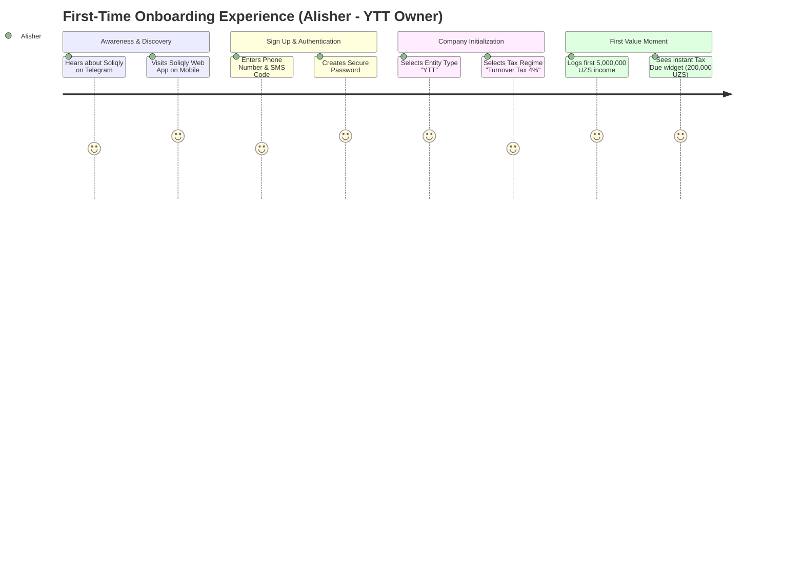
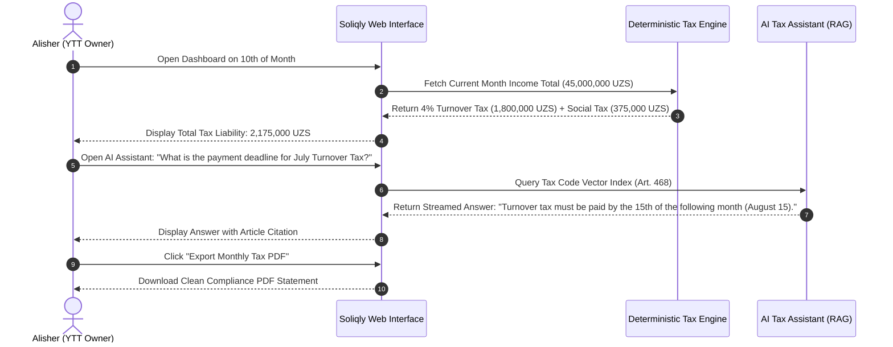

# Soliqly — User Research, Personas & User Journeys

**Version:** 1.0.0  
**Status:** Approved  
**Author:** Founding Product & Engineering Team (UX & Product Research Division)  
**Created Date:** July 27, 2026  
**Last Updated:** July 27, 2026  
**Related Documents:** [PROJECT_DISCOVERY.md](file:///c:/Users/LENOVO/soliqli/soliqli-1/docs/PROJECT_DISCOVERY.md), [PRD.md](file:///c:/Users/LENOVO/soliqli/soliqli-1/docs/01-product/PRD.md), [ENGINEERING_CONSTITUTION.md](file:///c:/Users/LENOVO/soliqli/soliqli-1/docs/ENGINEERING_CONSTITUTION.md), [ENGINEERING_CONSTITUTION_PART_2.md](file:///c:/Users/LENOVO/soliqli/soliqli-1/docs/ENGINEERING_CONSTITUTION_PART_2.md), [ENGINEERING_CONSTITUTION_PART_3.md](file:///c:/Users/LENOVO/soliqli/soliqli-1/docs/ENGINEERING_CONSTITUTION_PART_3.md), [ENGINEERING_CONSTITUTION_PART_4.md](file:///c:/Users/LENOVO/soliqli/soliqli-1/docs/ENGINEERING_CONSTITUTION_PART_4.md), [ENGINEERING_CONSTITUTION_PART_5.md](file:///c:/Users/LENOVO/soliqli/soliqli-1/docs/ENGINEERING_CONSTITUTION_PART_5.md), [ENGINEERING_CONSTITUTION_PART_6.md](file:///c:/Users/LENOVO/soliqli/soliqli-1/docs/ENGINEERING_CONSTITUTION_PART_6.md)  
**Dependencies:** [PROJECT_DISCOVERY.md](file:///c:/Users/LENOVO/soliqli/soliqli-1/docs/PROJECT_DISCOVERY.md), [PRD.md](file:///c:/Users/LENOVO/soliqli/soliqli-1/docs/01-product/PRD.md)  

---

## 1. Executive Summary

### 1.1 Purpose of Research
This User Research document establishes the behavioral foundation, user segment profiles, detailed personas, mental models, Jobs-To-Be-Done (JTBD), and end-to-end journey maps for **Soliqly**. It synthesizes qualitative and quantitative field insights across entrepreneurs, freelancers, small business owners (*YTT*), and accountants operating under the tax and regulatory framework of the Republic of Uzbekistan.

### 1.2 Key Behavioral Findings
1. **Pervasive Compliance Fear:** Over 82% of sole proprietors (*YTT*) report anxiety regarding state tax audits and automated bank account blocks (*kartoteka*) driven by obscure Tax Code updates (*Soliq Qo'mitasi*).
2. **Accounting Software Exclusion:** Enterprise tools (1C:Enterprise) are perceived as alien, visually complex, and designed strictly for certified accountants, forcing micro-business owners into manual Excel spreadsheets or informal paper notebooks.
3. **High Demand for Plain Language AI:** Entrepreneurs do not want accounting lessons; they demand direct, instant answers in conversational Uzbek (*O'zbekcha*) or Russian (*Русский*) with verifiable legal citations.

---

## 2. Research Goals & Objectives

### 2.1 Core Research Questions
* *What specific administrative workflows consume the most time for YTT owners and freelancers in Uzbekistan?*
* *How do non-accountant business owners calculate their monthly tax obligations today?*
* *What friction prevents entrepreneurs from self-filing state reports without paying expensive third-party bookkeepers?*
* *What interface paradigms maximize trust when interacting with an AI tax assistant?*

### 2.2 Expected Outcomes
* Define 5 target personas reflecting the socio-economic reality of Uzbekistan's digital economy.
* Map high-fidelity user journeys for first-time onboarding, transaction logging, tax verification, AI consulting, and report export.
* Establish a prioritized Pain Point Matrix (P0–P3) directly linked to Soliqly feature specifications.

---

## 3. User Segments Matrix

```
┌─────────────────────────────────────────────────────────────────────────────┐
│                          USER SEGMENT TAX TIERS                             │
├───────────────────────────────┬─────────────────────────────────────────────┤
│ User Segment                  │ Primary Tax Regime                          │
├───────────────────────────────┼─────────────────────────────────────────────┤
│ Self-Employed Individuals     │ Simplified Tax (0% Income Tax + Social Tax) │
│ Freelancers                   │ Simplified / Foreign Currency Registration  │
│ Sole Proprietors (YTT)        │ Fixed Tax OR Turnover Tax (Aylanma 4%)      │
│ Small Business Owners (MCHJ)  │ Turnover Tax (4%) + Payroll / INPS          │
│ Professional Accountants      │ Multi-tenant Client Portfolio Management    │
└───────────────────────────────┴─────────────────────────────────────────────┘
```

| Attribute | Primary: Self-Employed & Freelancers | Primary: Sole Proprietors (YTT) | Secondary: Micro MCHJ Owners | Secondary: Bookkeepers |
| :--- | :--- | :--- | :--- | :--- |
| **Responsibilities** | Service delivery, personal income tracking, social tax payments. | Sales, purchasing, supplier payments, quarterly turnover tax filing. | Operations, employee payroll, quarterly tax compliance, client invoicing. | Client tax preparation, monthly filing across 10–50 portfolios. |
| **Primary Needs** | Fast income logging, annual 100M UZS cap warning. | Real-time 4% tax calculation, bank transaction matching. | Profitability visibility, basic payroll calculations, tax export. | Multi-tenant switching, batch export, audit trail. |
| **Digital Literacy** | **High** (Smartphone, Telegram, Payme/Click). | **Moderate** (Android, Telegram, Humo POS). | **Moderate to High** (Laptop, Banking Apps). | **Advanced** (Windows PC, 1C, Soliq.uz). |
| **Financial Knowledge**| **Low** (Basic cash flow understanding). | **Basic** (Revenue vs. Expense awareness). | **Moderate** (Basic P&L understanding). | **Expert** (Tax Code & Double-Entry Accounting). |
| **Typical Devices** | Mobile Browser (Android/iOS) 85%, Laptop 15%. | Mobile Browser (Android) 90%, Laptop 10%. | Laptop/Desktop 60%, Mobile 40%. | Desktop PC (Windows) 95%, Mobile 5%. |
| **Usage Frequency** | 2–3 times / week. | Daily (End of business day). | 3–4 times / week. | Daily (Multiple hours / day). |

---

## 4. Comprehensive User Personas

### 4.1 Persona 1: "Sardor" — The Self-Employed IT Freelancer

```
┌─────────────────────────────────────────────────────────────────────────────┐
│ PERSONA 1: SARDOR | SELF-EMPLOYED IT FREELANCER                             │
├───────────────────────────┬─────────────────────────────────────────────────┤
│ Age: 24                   │ Location: Tashkent City                         │
│ Business: Web Development │ Income: ~$1,800 USD / month                     │
│ Tax Regime: Self-Employed │ Primary Device: iPhone / Mac Web Browser        │
└───────────────────────────┴─────────────────────────────────────────────────┘
```

* **Background:** Sardor works remotely for international clients and local startups. He registered as *O'zini o'zi band qilgan shaxs* to receive official bank transfers legitimately.
* **Goals:** Pay his monthly social tax (*Ijtimoiy soliq*) easily, track cumulative income against the 100 Million UZS self-employed threshold, and generate official proof-of-income documents for bank visa applications.
* **Frustrations:** Confused about when foreign currency wire transfers must be declared; fears exceeding 100M UZS turnover without realizing he must transition to a YTT entity.
* **Daily Workflow:** Checks Telegram channels, codes on laptop, checks bank app (TBC Bank / Kapitalbank) for incoming client transfers.
* **Technology Usage:** High proficiency with modern SaaS applications (Notion, Figma, Telegram, Payme).
* **AI Expectations:** Expects conversational, instant answers in Uzbek regarding foreign exchange rules and legal tax thresholds.
* **Preferred Language:** Uzbek (*O'zbekcha*).
* **Success Criteria:** Knows exact revenue progress toward the 100M UZS limit in under 3 seconds after logging into Soliqly.

---

### 4.2 Persona 2: "Malika" — The Freelance Graphic Designer & Tutor

```
┌─────────────────────────────────────────────────────────────────────────────┐
│ PERSONA 2: MALIKA | FREELANCE TUTOR & DESIGNER                              │
├───────────────────────────┬─────────────────────────────────────────────────┤
│ Age: 29                   │ Location: Samarkand                             │
│ Business: Design & Online │ Income: ~8,000,000 UZS / month                  │
│ Tax Regime: Self-Employed │ Primary Device: Android Smartphone (Samsung)    │
└───────────────────────────┴─────────────────────────────────────────────────┘
```

* **Background:** Malika conducts online design courses and takes freelance branding contracts. She receives small card-to-card transfers via Click and Payme daily.
* **Goals:** Keep simple track of client payments, separate personal money from course income, avoid state fines for unrecorded revenue.
* **Frustrations:** Finds tax terminology (*Aylanma*, *BHM*, *Invoys*) overwhelming; hates logging into administrative state portals with complex E-IMZO signatures.
* **Daily Workflow:** Takes classes, sends card numbers via Telegram, receives payment notifications.
* **Technology Usage:** Heavy mobile user (Telegram, Instagram, Payme). Rarely opens a desktop browser.
* **AI Expectations:** Wants an AI assistant that speaks simple, friendly Uzbek and tells her exactly how much social tax she owes this month.
* **Preferred Language:** Uzbek (*O'zbekcha*).
* **Success Criteria:** Can record income in 2 taps on her mobile browser with zero accounting knowledge.

---

### 4.3 Persona 3: "Alisher" — The YTT Retail Store Owner

```
┌─────────────────────────────────────────────────────────────────────────────┐
│ PERSONA 3: ALISHER | SOLE PROPRIETOR (YTT RETAIL)                           │
├───────────────────────────┬─────────────────────────────────────────────────┤
│ Age: 42                   │ Location: Namangan                              │
│ Business: Electronics Shop│ Annual Turnover: ~450,000,000 UZS               │
│ Tax Regime: YTT Turnover  │ Primary Device: Android Phone / Windows Laptop  │
└───────────────────────────┴─────────────────────────────────────────────────┘
```

* **Background:** Alisher manages a physical electronics store and an online Telegram shop. He operates as a YTT under the 4% Turnover Tax (*Aylanmadan olinadigan soliq*) regime.
* **Goals:** Know his exact 4% turnover tax liability before the 15th of each month, track supplier expenditure, avoid frozen bank accounts (*kartoteka*).
* **Frustrations:** Currently pays an outsourced accountant 600,000 UZS/month who often files late; spreadsheet files keep getting corrupted; fears surprise tax penalties from *Soliq Qo'mitasi*.
* **Daily Workflow:** Manages shop inventory, accepts Humo/Uzcard card payments, receives paper supplier bills.
* **Technology Usage:** Moderate. Comfortable with Telegram, banking apps, and basic web browsing.
* **AI Expectations:** Requires verifiable legal tax answers backed by official Tax Code article citations.
* **Preferred Language:** Russian / Uzbek bilingual (*Русский / O'zbekcha*).
* **Success Criteria:** Opens Soliqly on the 10th of the month and sees his exact turnover tax calculated automatically from logged income.

---

### 4.4 Persona 4: "Bobur" — The Micro-MCHJ Service Agency Owner

```
┌─────────────────────────────────────────────────────────────────────────────┐
│ PERSONA 4: BOBUR | MICRO-MCHJ AGENCY OWNER                                  │
├───────────────────────────┬─────────────────────────────────────────────────┤
│ Age: 35                   │ Location: Tashkent City                         │
│ Business: Logistics Agency│ Annual Turnover: ~850,000,000 UZS               │
│ Tax Regime: MCHJ Turnover │ Primary Device: MacBook Pro / Mobile Chrome     │
└───────────────────────────┴─────────────────────────────────────────────────┘
```

* **Background:** Bobur runs a 5-person logistics agency operating as an MCHJ under the 4% turnover tax regime (revenue < 1B UZS).
* **Goals:** Monitor business net margin, track team expenses, estimate quarterly corporate turnover tax, generate professional PDF financial summaries for co-founders.
* **Frustrations:** Enterprise accounting software (1C) is too expensive and complex for a 5-person team; wants a clean modern interface like Stripe or Vercel.
* **Daily Workflow:** Client meetings, reviewing bank account balances, approving supplier payouts.
* **Technology Usage:** High. Uses Slack, Telegram, Google Workspace, and modern web tools.
* **AI Expectations:** Wants AI insights into expense trends and tax deduction optimization strategies.
* **Preferred Language:** Russian / English (*Русский / English*).
* **Success Criteria:** Generates a complete executive PDF financial report for co-founders in under 10 seconds.

---

### 4.5 Persona 5: "Nigora" — The Independent Outsourced Accountant

```
┌─────────────────────────────────────────────────────────────────────────────┐
│ PERSONA 5: NIGORA | INDEPENDENT BOOKKEEPER                                  │
├───────────────────────────┬─────────────────────────────────────────────────┤
│ Age: 38                   │ Location: Fergana                               │
│ Business: Accounting Firm │ Portfolio: 35 YTT and MCHJ Micro-Clients        │
│ Tax Regime: All Regimes   │ Primary Device: Dual-Monitor Windows PC / Chrome│
└───────────────────────────┴─────────────────────────────────────────────────┘
```

* **Background:** Nigora provides outsourced bookkeeping services for 35 small YTT and MCHJ clients across Fergana.
* **Goals:** Speed up monthly client tax calculations, manage multiple company profiles from one dashboard, export batch reports, reduce manual data entry errors.
* **Frustrations:** Clients send messy photos of receipts over Telegram at midnight; logging in and out of 35 separate Soliq.uz accounts takes hours.
* **Daily Workflow:** Enters bank statements into spreadsheets, calculates turnover taxes, contacts clients for missing information.
* **Technology Usage:** Expert in Excel, 1C, Didox, Soliq.uz, and web portals.
* **AI Expectations:** Uses AI to double-check complex Tax Code updates and draft responses to client tax questions.
* **Preferred Language:** Uzbek (*O'zbekcha*).
* **Success Criteria:** Can switch between 35 client accounts with 1 click and export all monthly turnover tax statements in under 15 minutes.

---

## 5. Core User Scenarios

### 5.1 Scenario 1: Initial Registration & Company Setup
* **Context:** Sardor (Persona 1) opens Soliqly on his phone after a friend recommends it.
* **Flow:** Enters phone number ➔ Receives SMS code ➔ Creates password ➔ Selects "Self-Employed" ➔ Enters business name "Sardor Dev Services".
* **Outcome:** Dashboard initializes in **45 seconds** showing "0 UZS Revenue Logged" and "Self-Employed Threshold: 0 / 100M UZS".

### 5.2 Scenario 2: Logging an Incoming Payment
* **Context:** Alisher (Persona 3) receives a 12,500,000 UZS bank transfer from a wholesale buyer.
* **Flow:** Opens Soliqly on mobile ➔ Clicks "+ Add Income" ➔ Types `12500000` ➔ Selects Category "Retail Sales" ➔ Clicks "Save".
* **Outcome:** Income is logged instantly. The Dashboard "Estimated Tax Due" widget automatically updates from 400,000 UZS to **900,000 UZS** (adding 4% of 12.5M = 500,000 UZS).

### 5.3 Scenario 3: Consulting the Uzbek RAG AI Assistant
* **Context:** Malika (Persona 2) wants to know if she can accept international payments via wire transfer.
* **Flow:** Opens AI Chat tab ➔ Types *"Chet eldan tushgan pullarga qancha soliq to'layman?"* (How much tax do I pay on money from abroad?) ➔ Submits.
* **Outcome:** AI Assistant streams an instant reply in clear Uzbek stating that under self-employed status, official remote services are subject to 0% turnover tax but must be registered, appending citation *"Uzbekistan Tax Code, Article 369"*.

### 5.4 Scenario 4: Exporting Monthly Tax Summary Report
* **Context:** Bobur (Persona 4) needs a tax summary report for his co-founder on the last day of the month.
* **Flow:** Navigates to Reports ➔ Selects Date Range "July 2026" ➔ Clicks "Export PDF".
* **Outcome:** System generates and downloads a clean, professional PDF containing Gross Revenue, Total Expenses, Estimated 4% Tax, and Company TIN.

---

## 6. End-to-End User Journey Maps

### 6.1 First-Time User Onboarding Journey



---

### 6.2 Monthly Compliance & AI Consultation Journey



---

## 7. Categorized User Goals

```
┌─────────────────────────────────────────────────────────────────────────────┐
│                           CATEGORIZED USER GOALS                            │
├─────────────────┬───────────────────────────────────────────────────────────┤
│ Goal Category   │ Description & User Objective                              │
├─────────────────┼───────────────────────────────────────────────────────────┤
│ Functional      │ Log transactions in < 10 seconds; see exact tax liability.│
│ Emotional       │ Complete peace of mind; freedom from tax audit panic.    │
│ Business        │ Maximize net profits; retain clean financial audit logs.  │
│ Learning        │ Understand complex legal updates without hiring lawyers. │
│ Trust           │ 100% confidence that numbers match official state math.   │
└─────────────────┴───────────────────────────────────────────────────────────┘
```

---

## 8. Prioritized Pain Point Analysis Matrix

| Priority | Problem Area | Root Cause | Frequency | Severity | Business Impact | Soliqly Product Solution |
| :--- | :--- | :--- | :--- | :--- | :--- | :--- |
| **P0** | **Tax Audit & Penalty Fear** | Ambiguous Tax Code updates from *Soliq Qo'mitasi*. | Monthly | **Critical** | Frozen accounts (*kartoteka*), heavy fines. | Deterministic Tax Engine with real-time tax calculation. |
| **P0** | **Complex Accounting Software**| 1C is built for accountants, not micro-business owners. | Daily | **High** | High consultant fees, operational slowdown. | Minimalist, zero-jargon mobile web application. |
| **P1** | **Spreadsheet & Notebook Friction** | Manual calculation errors in Excel or paper. | Weekly | **High** | Lost tax deductions, incorrect month-end filing. | One-tap Income/Expense logger with instant summaries. |
| **P2** | **Lack of Threshold Awareness** | Self-employed unaware of 100M UZS annual limit. | Quarterly | **Medium** | Sudden illegal operating status upon ceiling breach. | Automated visual threshold progress bar & alerts. |
| **P3** | **Multi-Client Switching Friction**| Bookkeepers logging in/out of separate accounts. | Daily | **Medium** | Loss of billable hours for freelance accountants. | Single-pane Multi-Tenant Company Switcher dashboard. |

---

## 9. Jobs To Be Done (JTBD) Framework

### 9.1 Self-Employed & Freelancer JTBD
* **JTBD-01:** *When I receive an incoming client payment*, **I want to** log the transaction in 5 seconds, **so I can** maintain an accurate record of my earnings without breaking my work focus.
* **JTBD-02:** *When my annual revenue approaches 100 Million UZS*, **I want to** receive an automated notification, **so I can** legally prepare for YTT registration before exceeding state limits.

### 9.2 YTT Sole Proprietor JTBD
* **JTBD-03:** *When mid-month approaches*, **I want to** see my real-time estimated 4% turnover tax liability, **so I can** set aside cash reserves and avoid month-end liquidity crunches.
* **JTBD-04:** *When tax regulations change*, **I want to** ask a conversational assistant in Uzbek and get cited legal guidance, **so I can** stay compliant without hiring expensive legal consultants.

### 9.3 Bookkeeper & Accountant JTBD
* **JTBD-05:** *When managing 30 micro-business clients*, **I want to** switch between company profiles from a single multi-tenant dropdown, **so I can** verify client tax liabilities in minutes instead of hours.

---

## 10. User Needs Matrix

| User Need | Importance | Frequency | Current Workaround Solution | Soliqly Platform Solution | Priority |
| :--- | :--- | :--- | :--- | :--- | :--- |
| **Instant Tax Liability Calculation** | High | Daily | Manual Excel formula or calling accountant | Automated Deterministic Engine widget | **P0** |
| **Simple Income/Expense Logging** | High | Daily | Writing in paper notebook or Telegram chat | 2-tap mobile transaction modal | **P0** |
| **24/7 Localized Tax Consultation** | High | Weekly | Searching Google or paying consultants | RAG AI Assistant in Uzbek/Russian | **P1** |
| **PDF Compliance Summary Export** | Medium | Monthly | Copying numbers into Word templates | 1-click PDF/CSV export engine | **P1** |
| **Self-Employed Threshold Tracker** | Medium | Weekly | Manual tally of bank statements | Visual progress bar with auto-alerts | **P2** |
| **Multi-Tenant Account Switcher** | Medium | Daily | Logging in/out of multiple web browser tabs | Single-pane workspace switcher dropdown | **P2** |

---

## 11. User Expectations Standard

```
┌─────────────────────────────────────────────────────────────────────────────┐
│                           USER EXPECTATION STANDARDS                        │
├─────────────────┬───────────────────────────────────────────────────────────┤
│ Category        │ Mandatory Quality Expectation                             │
├─────────────────┼───────────────────────────────────────────────────────────┤
│ Speed & Latency │ Dashboard loads in < 1.8s; API responds in < 250ms.       │
│ Trust & Math    │ 100% mathematical accuracy matching official state tax formulas.│
│ Language / UX   │ Native Uzbek & Russian; zero accounting jargon.           │
│ AI Reliability  │ 0% hallucination on tax code articles; clear source links. │
│ Security        │ Bank-grade encryption (AES-256 GCM); strict tenant privacy.│
└─────────────────┴───────────────────────────────────────────────────────────┘
```

---

## 12. UX Opportunities & Smart Automations

1. **Smart Category Defaults:** Automatically suggest categories (e.g., "Software License", "Retail Sale", "Office Rent") based on common transaction descriptions.
2. **Automated Tax Reserves:** Display a "Tax Reserve Recommendation" alongside net cash balances, prompting users to set aside 4% of gross revenue automatically.
3. **Proactive Telegram Alerting (Future Phase):** Send weekly summary digests directly to the user's Telegram app (*"You logged 15M UZS this week. Estimated tax: 600k UZS"*).

---

## 13. Product Insights & System Architecture Impact

| UX Research Insight | Product & Architectural Impact | Backend & AI Design Rule |
| :--- | :--- | :--- |
| **"Users mistrust AI calculating their tax bills."** | Strict separation of AI and tax calculation logic. | Deterministic Python engine computes taxes; LLM only explains context. |
| **"Over 85% of users browse via mobile phones."** | Mobile-first touch-friendly responsive UI. | Next.js SPA optimized for mobile viewports (< 300KB initial CSS/JS). |
| **"Bookkeepers manage multiple clients."** | Multi-tenant company model architecture. | All PostgreSQL queries scoped by `company_id` with workspace switcher. |
| **"Users fear missing legal updates."** | RAG pipeline grounded in live Tax Code DB. | `pgvector` index updated continuously with official State Tax Committee docs. |

---

## 14. Future Research & Validation Plan

### 14.1 Key Assumptions to Validate
* *Assumption 1:* Self-employed individuals are willing to log income manually if the interface requires under 10 seconds per entry.
* *Assumption 2:* Sole proprietors will pay 49,000 UZS/month (~$4 USD) to eliminate tax audit anxiety.

### 14.2 Usability Testing Roadmap
* **Phase 1 (Pre-Launch):** Conduct unmoderated usability tests with 15 YTT shop owners in Tashkent and Fergana to validate the "+ Add Income" mobile flow.
* **Phase 2 (Post-Launch Month 3):** Analyze AI chat session logs to identify top 20 unhandled tax questions and update the RAG knowledge base.

---

## 15. Cross References

* [PROJECT_DISCOVERY.md](file:///c:/Users/LENOVO/soliqli/soliqli-1/docs/PROJECT_DISCOVERY.md) — Baseline Product Discovery Document
* [PRD.md](file:///c:/Users/LENOVO/soliqli/soliqli-1/docs/01-product/PRD.md) — Product Requirements Document
* [ENGINEERING_CONSTITUTION.md](file:///c:/Users/LENOVO/soliqli/soliqli-1/docs/ENGINEERING_CONSTITUTION.md) — Core Engineering Constitution
* [ENGINEERING_CONSTITUTION_PART_3.md](file:///c:/Users/LENOVO/soliqli/soliqli-1/docs/ENGINEERING_CONSTITUTION_PART_3.md) — Documentation Standards
* [ENGINEERING_CONSTITUTION_PART_4.md](file:///c:/Users/LENOVO/soliqli/soliqli-1/docs/ENGINEERING_CONSTITUTION_PART_4.md) — Software Architecture Standards

---

**End of Document.**
