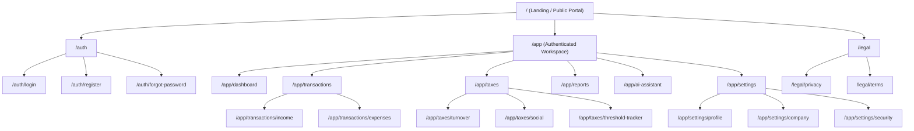
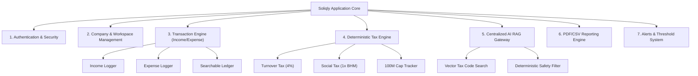
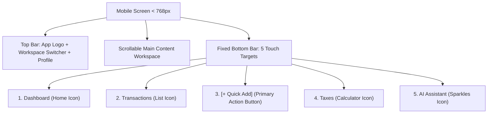

# Soliqly — Information Architecture Specification

**Version:** 1.0.0  
**Status:** Approved  
**Author:** Founding Product & Engineering Team (UX Architecture Division)  
**Created Date:** July 27, 2026  
**Last Updated:** July 27, 2026  
**Related Documents:** [PROJECT_DISCOVERY.md](file:///c:/Users/LENOVO/soliqli/soliqli-1/docs/PROJECT_DISCOVERY.md), [PRD.md](file:///c:/Users/LENOVO/soliqli/soliqli-1/docs/01-product/PRD.md), [USER_RESEARCH.md](file:///c:/Users/LENOVO/soliqli/soliqli-1/docs/01-product/USER_RESEARCH.md), [ENGINEERING_CONSTITUTION.md](file:///c:/Users/LENOVO/soliqli/soliqli-1/docs/ENGINEERING_CONSTITUTION.md), [ENGINEERING_CONSTITUTION_PART_3.md](file:///c:/Users/LENOVO/soliqli/soliqli-1/docs/ENGINEERING_CONSTITUTION_PART_3.md), [ENGINEERING_CONSTITUTION_PART_4.md](file:///c:/Users/LENOVO/soliqli/soliqli-1/docs/ENGINEERING_CONSTITUTION_PART_4.md), [ENGINEERING_CONSTITUTION_PART_5.md](file:///c:/Users/LENOVO/soliqli/soliqli-1/docs/ENGINEERING_CONSTITUTION_PART_5.md), [ENGINEERING_CONSTITUTION_PART_6.md](file:///c:/Users/LENOVO/soliqli/soliqli-1/docs/ENGINEERING_CONSTITUTION_PART_6.md)  
**Dependencies:** [PROJECT_DISCOVERY.md](file:///c:/Users/LENOVO/soliqli/soliqli-1/docs/PROJECT_DISCOVERY.md), [PRD.md](file:///c:/Users/LENOVO/soliqli/soliqli-1/docs/01-product/PRD.md), [USER_RESEARCH.md](file:///c:/Users/LENOVO/soliqli/soliqli-1/docs/01-product/USER_RESEARCH.md)  

---

## 1. Executive Summary

### 1.1 Purpose of Information Architecture
This Information Architecture (IA) specification establishes the structural topology, navigation systems, routing paths, screen hierarchies, module relationships, dashboard layout, and accessibility rules for **Soliqly**. It translates product requirements and user mental models into an intuitive, scalable, mobile-first web interface designed for entrepreneurs, sole proprietors (*Yakka Tartibdagi Tadbirkorlar* - YTT), self-employed individuals (*O'zini o'zi band qilgan shaxslar*), micro-businesses (*MCHJ*), and accountants in Uzbekistan.

---

## 2. Core Information Architecture Principles

```
┌─────────────────────────────────────────────────────────────────────────────┐
│                           CORE IA DESIGN PRINCIPLES                         │
├─────────────────┬───────────────────────────────────────────────────────────┤
│ Principle       │ Architectural Rationale & Implementation                  │
├─────────────────┼───────────────────────────────────────────────────────────┤
│ 1. Simplicity   │ Abstract complex accounting debits/credits into "Money In" │
│                 │ and "Money Out" with 3-click maximum depth.               │
│ 2. Predictability│ Uniform top bar & side/bottom navigation anchors across all│
│                 │ authenticated workspaces.                                 │
│ 3. Progressive  │ Display core metrics on top-level dashboards; reveal detailed│
│    Disclosure   │ audit logs and breakdown drawers only on user demand.    │
│ 4. Mobile-First │ Primary navigation adapts seamlessly from desktop sidebars │
│                 │ to mobile touch bottom bars (< 300ms interaction latency).│
│ 5. Accessibility│ WCAG 2.1 AA keyboard focus order, high-contrast ratios,   │
│                 │ and native screen reader label attributes (`aria-*`).      │
└─────────────────┴───────────────────────────────────────────────────────────┘
```

---

## 3. Global Site Map



---

## 4. Navigation Architecture

### 4.1 Multi-Layered Navigation Taxonomy

```
Desktop Topbar:      [Logo] [Workspace Switcher] ------- [Search Cmd+K] [Notifications] [User Profile]
Desktop Sidebar:     [Dashboard] [Transactions] [Taxes] [Reports] [AI Assistant] | [Settings]
Mobile Bottom Bar:   [Dashboard] [Transactions] [+ Quick Add] [Taxes] [AI Assistant]
```

1. **Primary Navigation:** Persistent left sidebar (Desktop) / bottom navigation bar (Mobile) linking to 5 core hubs: Dashboard, Transactions, Taxes, Reports, and AI Assistant.
2. **Workspace Switcher:** Header dropdown allowing users and bookkeepers to switch between managed companies with 1 click.
3. **Quick Action Trigger (`+` Button):** Prominent primary action button triggering the "+ Add Income / + Add Expense" modal.
4. **Command Palette (`Cmd+K` / `Ctrl+K`):** Global modal overlay enabling instant fuzzy search across routes, transactions, and tax articles.
5. **Breadcrumbs System:** Contextual header breadcrumbs on sub-pages (e.g., `App > Transactions > Add Income`).

---

## 5. Standardized Route Structure

| Route Pattern | Access Level | Page Component Title | Primary Purpose |
| :--- | :--- | :--- | :--- |
| `/` | Public | Home / Marketing Landing | Product overview, pricing tiers, value proposition. |
| `/auth/login` | Public Guest | Login Page | Phone number + password authentication. |
| `/auth/register` | Public Guest | Registration Page | Sign-up form + SMS OTP verification. |
| `/app/onboarding` | Authenticated | Business Onboarding Wizard | Initial company setup (Self-Employed / YTT regime). |
| `/app/dashboard` | Authenticated | Main Dashboard | Live financial metrics, tax due summary, recent activity. |
| `/app/transactions` | Authenticated | Transaction Ledger Hub | Combined searchable table of income and expenses. |
| `/app/transactions/income` | Authenticated | Income Logger Page | Dedicated view for income entries & batch CSV upload. |
| `/app/transactions/expenses`| Authenticated | Expense Logger Page | Dedicated view for logging operational expenses. |
| `/app/taxes` | Authenticated | Tax Compliance Center | Deterministic turnover tax (4%) & social tax calculations.|
| `/app/reports` | Authenticated | Financial Reports Page | PDF & CSV summary report exporter. |
| `/app/ai-assistant` | Authenticated | AI Tax Assistant Workspace | Conversational Uzbek/Russian tax RAG interface. |
| `/app/settings/company` | Authenticated | Company Profile Settings | Update TIN/STIR, business name, tax regime. |
| `/app/settings/profile` | Authenticated | User Account Settings | Security options, phone number updates, password reset. |

---

## 6. Comprehensive Screen Inventory

| Screen ID | Screen Name | Target Users | Primary User Actions | Related Modules | Dependencies |
| :--- | :--- | :--- | :--- | :--- | :--- |
| **SCR-001** | **Landing Page** | Public Visitors | Sign Up, Log In, View Pricing | Auth | None |
| **SCR-002** | **Sign Up / Login** | Guests | Enter phone number, verify OTP | Auth | SCR-001 |
| **SCR-003** | **Onboarding Wizard** | New Users | Select entity (Self-Employed / YTT) | Companies | SCR-002 |
| **SCR-004** | **Main Dashboard** | YTT / Self-Employed | View Tax Due, Net Profit, Add Transaction | Dashboard, Taxes | SCR-003 |
| **SCR-005** | **Transaction Ledger**| All Users | Filter, search, edit, delete transactions | Transactions | SCR-004 |
| **SCR-006** | **Income / Expense Modal**| All Users | Enter amount, date, category | Transactions | SCR-005 |
| **SCR-007** | **Tax Summary Hub** | YTT Owners | Inspect 4% Turnover Tax breakdown | Taxes Engine | SCR-004 |
| **SCR-008** | **AI Chat Workspace** | All Users | Type tax question, read cited sources | AI RAG Gateway | SCR-004 |
| **SCR-009** | **Report Exporter** | YTT / MCHJ / Accountants| Select date range, download PDF/CSV | Reporting | SCR-004 |
| **SCR-010** | **Workspace Switcher**| Bookkeepers | Switch active company context | Multi-Tenant DB | SCR-004 |

---

## 7. Product Module Hierarchy



---

## 8. Role-Based Navigation & Permission Mapping

```
┌─────────────────────────────────────────────────────────────────────────────┐
│                           ROLE PERMISSION MATRIX                            │
├─────────────────┬───────────┬───────────┬───────────────┬───────────────────┤
│ Screen / Module │ Guest     │ User      │ Company Owner │ Accountant (Pro)  │
├─────────────────┼───────────┼───────────┼───────────────┼───────────────────┤
│ Landing Page    │ Read/Write│ Read      │ Read          │ Read              │
│ Dashboard Hub   │ Hidden    │ Read-Only │ Full Access   │ Full Access       │
│ Log Income/Exp  │ Hidden    │ Disabled  │ Full Access   │ Full Access       │
│ Tax Calculation │ Hidden    │ Disabled  │ Full Access   │ Full Access       │
│ AI Assistant    │ Hidden    │ 10 q/mo   │ Unlimited     │ Unlimited         │
│ Export PDF/CSV  │ Hidden    │ Disabled  │ Full Access   │ Batch Export      │
│ Company Switcher│ Hidden    │ Hidden    │ 1 Company     │ Multi-Tenant (35+)│
│ Company Settings│ Hidden    │ Hidden    │ Full Access   │ Read-Only         │
└─────────────────┴───────────┴───────────┴───────────────┴───────────────────┘
```

---

## 9. Information Hierarchy Standard

1. **Primary Information (P0):** Always visible on main dashboard card widgets (e.g., *Current Month Estimated Tax Liability*, *Total Revenue Logged*, *Self-Employed Threshold %*).
2. **Secondary Information (P1):** Accessible within 1 click (e.g., *Filtered List of July Income Entries*, *Tax Code Source Article Citations*).
3. **Supporting Information (P2):** Accessible via modals or drawers (e.g., *Individual Transaction Audit Metadata*, *User Account Security Logs*).
4. **Contextual Guidance:** Inline tooltips and info icons explaining local terms (e.g., *"BHM = 375,000 UZS"*).

---

## 10. Dashboard Layout & Widget Architecture

```
┌─────────────────────────────────────────────────────────────────────────────┐
│                            SOLIQLY MAIN DASHBOARD                           │
├─────────────────────────────────────────────────────────────────────────────┤
│ [Header] Welcome back, Alisher!  |  [Workspace: Alisher Store (YTT)]  [+ Add]│
├───────────────────────────────┬─────────────────────────────┬───────────────┤
│ WIDGET 1: TAX LIABILITY DUE   │ WIDGET 2: MONTHLY REVENUE   │ WIDGET 3: CAP │
│ 1,800,000 UZS (Turnover 4%)   │ 45,000,000 UZS Logged       │ 45% of 100M   │
│ Payment Deadline: Aug 15      │ (+12% vs last month)        │ Self-Employed │
├───────────────────────────────┴─────────────────────────────┴───────────────┤
│ WIDGET 4: FINANCIAL TRENDS CHART (Income vs. Expense past 6 months)        │
│ [=================================================================]         │
├──────────────────────────────────────────────┬──────────────────────────────┤
│ WIDGET 5: RECENT TRANSACTIONS LEDGER          │ WIDGET 6: AI TAX ASSISTANT   │
│ • July 27: +5,000,000 UZS (Retail Sale)      │ "How is Turnover Tax computed│
│ • July 26: -1,200,000 UZS (Inventory Supplier)│ for YTT entities?"           │
│ [View All Ledger...]                         │ [Ask AI Assistant...]        │
└──────────────────────────────────────────────┴──────────────────────────────┘
```

---

## 11. Error, Loading & State Architecture

### 11.1 Standard UI State Patterns
* **Loading States:** Render skeleton component placeholders matching widget layouts during data fetching to prevent layout shifts (CLS < 0.05).
* **Empty States:** Friendly contextual illustrations with direct action buttons (e.g., *"No income logged yet for July. Click [+ Add Income] to start"*).
* **Network Error / Offline Mode:** Display a sticky amber top banner (*"Connection lost. Reconnecting to Soliqly server..."*) with cached offline viewing.
* **404 / 403 Errors:** Clear user navigation options returning to `/app/dashboard`.

---

## 12. Mobile Information Architecture & Touch Rules



* **Touch Target Standard:** Minimum interactive touch target size of **48x48 px** with a 8px touch spacing buffer.
* **Thumb Zone Optimization:** Core actions (`+ Quick Add`, `AI Chat Send`) positioned within natural bottom-third thumb reach zones.

---

## 13. Accessibility & Usability Standards (WCAG 2.1 AA)

1. **Keyboard Focus Order:** Logical tab stop order matching DOM hierarchy (`Header` ➔ `Sidebar` ➔ `Main Content` ➔ `Actions`).
2. **Screen Reader Attributes:** All interactive icons feature explicit `aria-label` tags (e.g., `aria-label="Add new income entry"`).
3. **Contrast Ratios:** Minimum contrast ratio of **4.5:1** for standard text and **3:1** for UI buttons and icons against dark/light backgrounds.

---

## 14. Future Expansion Strategy

The IA topology is structured to accommodate Phase 2–Phase 5 modules without restructuring top-level navigation:
* **Phase 2 (Double-Entry Accounting):** Extends `/app/transactions` with tab extensions (`/app/transactions/journal`, `/app/transactions/chart-of-accounts`).
* **Phase 3 (AI OCR Receipt Scanner):** Integrates camera trigger directly into the `+ Quick Add` modal (`[Camera / Upload Receipt]`).
* **Phase 4 (Soliq.uz & E-Faktura Sync):** Extends `/app/taxes` with sub-tabs (`/app/taxes/e-faktura`, `/app/taxes/state-filing`).

---

## 15. Cross References

* [PROJECT_DISCOVERY.md](file:///c:/Users/LENOVO/soliqli/soliqli-1/docs/PROJECT_DISCOVERY.md) — Baseline Product Discovery Document
* [PRD.md](file:///c:/Users/LENOVO/soliqli/soliqli-1/docs/01-product/PRD.md) — Product Requirements Document
* [USER_RESEARCH.md](file:///c:/Users/LENOVO/soliqli/soliqli-1/docs/01-product/USER_RESEARCH.md) — Personas & User Journeys
* [ENGINEERING_CONSTITUTION_PART_4.md](file:///c:/Users/LENOVO/soliqli/soliqli-1/docs/ENGINEERING_CONSTITUTION_PART_4.md) — Software Architecture Standards

---

**End of Document.**
