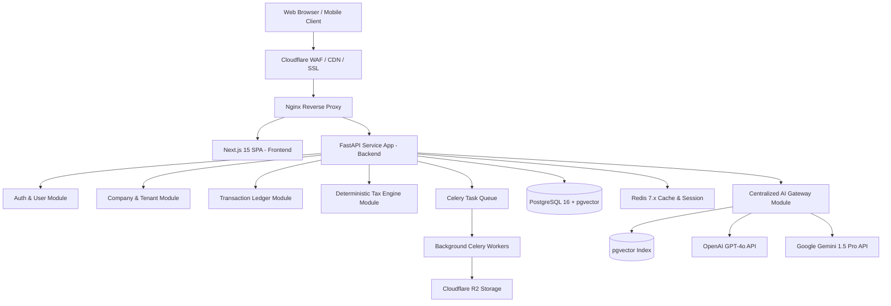
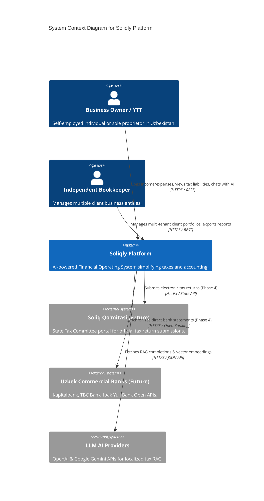
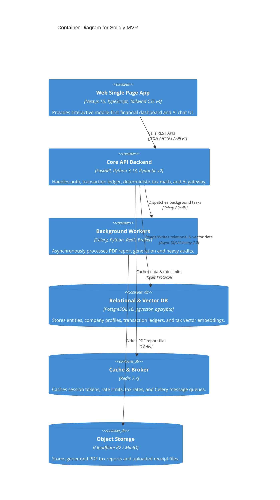
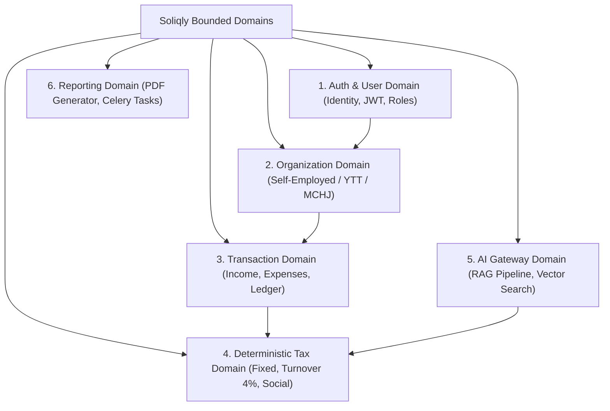
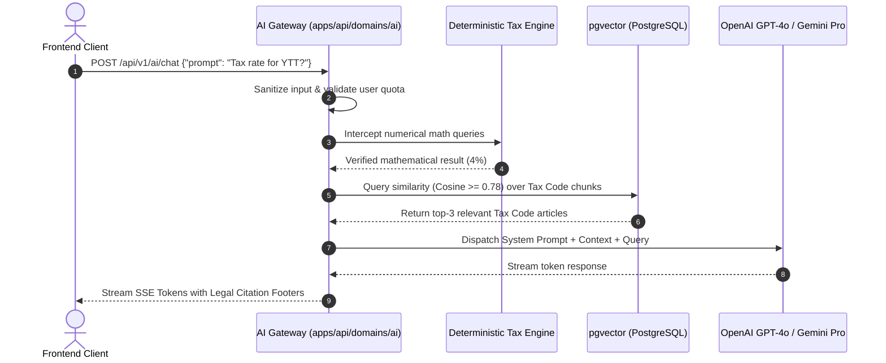
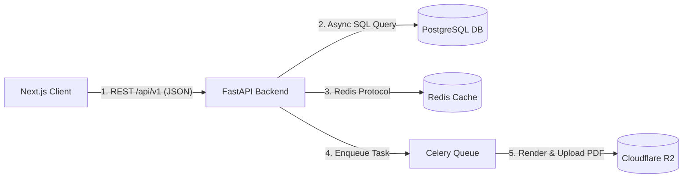

# Soliqly — Enterprise Software Architecture Blueprint

**Version:** 1.0.0  
**Status:** Approved  
**Author:** Founding Product & Engineering Team (Architecture & CTO Division)  
**Created Date:** July 27, 2026  
**Last Updated:** July 27, 2026  
**Related Documents:** [PROJECT_DISCOVERY.md](file:///c:/Users/LENOVO/soliqli/soliqli-1/docs/00-project-management/PROJECT_DISCOVERY.md), [PRD.md](file:///c:/Users/LENOVO/soliqli/soliqli-1/docs/01-product/PRD.md), [USER_RESEARCH.md](file:///c:/Users/LENOVO/soliqli/soliqli-1/docs/01-product/USER_RESEARCH.md), [INFORMATION_ARCHITECTURE.md](file:///c:/Users/LENOVO/soliqli/soliqli-1/docs/02-architecture/INFORMATION_ARCHITECTURE.md), [UX_BLUEPRINT.md](file:///c:/Users/LENOVO/soliqli/soliqli-1/docs/06-design/UX_BLUEPRINT.md), [DESIGN_SYSTEM.md](file:///c:/Users/LENOVO/soliqli/soliqli-1/docs/06-design/DESIGN_SYSTEM.md), [ENGINEERING_CONSTITUTION.md](file:///c:/Users/LENOVO/soliqli/soliqli-1/docs/ENGINEERING_CONSTITUTION.md)  
**Dependencies:** All Baseline Phase 0 Product & Design Specifications  

---

## 1. Executive Summary

### 1.1 Architectural Vision
This Enterprise Software Architecture Blueprint establishes the authoritative technical blueprint, component boundaries, domain models, data access layers, AI gateway pipelines, security safeguards, and deployment topologies for **Soliqly**.

The MVP adopts a **Decoupled Modular Monolith** architecture. This pattern combines the operational simplicity and fast development velocity of a single backend service with the strict domain boundary isolation required for seamless future microservices extraction.

---

## 2. Core Architecture Principles

```
┌─────────────────────────────────────────────────────────────────────────────┐
│                        CORE ARCHITECTURAL PRINCIPLES                        │
├─────────────────┬───────────────────────────────────────────────────────────┤
│ Principle       │ Architectural Enforcement & Rationale                     │
├─────────────────┼───────────────────────────────────────────────────────────┤
│ 1. API First    │ Backend functionality exposed exclusively via versioned  │
│                 │ OpenAPI 3.0 REST endpoints (`/api/v1`).                   │
│ 2. Clean Layering│ Strictly inward dependency flow:                          │
│                 │ Presentation ➔ Application ➔ Domain ➔ Infrastructure.     │
│ 3. DDD Contexts │ Business domains (Taxes, Transactions, Auth) isolated in │
│                 │ bounded modules with clear aggregate roots.               │
│ 4. Deterministic│ Financial & tax math executed strictly in Python code,    │
│    Tax Core     │ preventing LLM computational hallucinated outputs.        │
│ 5. SOLID / KISS │ Interface segregation, dependency injection, zero premature│
│                 │ microservices overhead during MVP phase.                  │
└─────────────────┴───────────────────────────────────────────────────────────┘
```

---

## 3. High-Level System Architecture



---

## 4. C4 Architecture Diagrams

### 4.1 Level 1: System Context Diagram



---

### 4.2 Level 2: Container Diagram



---

## 5. Monorepo Directory Topology

```
soliqli/
├── apps/
│   ├── web/                     # Next.js 15 Web SPA (App Router)
│   │   ├── app/                 # Next.js Routes (/app/dashboard, /app/transactions)
│   │   ├── components/          # Page-level React Components
│   │   └── hooks/               # Custom React Hooks (TanStack Query)
│   └── api/                     # FastAPI Backend Application
│       ├── app/
│       │   ├── api/v1/          # REST API Controllers / Route Handlers
│       │   ├── core/            # Config, Security, Database Engine Setup
│       │   ├── domains/         # Bounded Domain Modules (Auth, Txns, Taxes, AI)
│       │   └── worker.py        # Celery Background Worker Entrypoint
├── packages/
│   ├── ui/                      # Shared shadcn/ui React Components
│   ├── types/                   # Shared TypeScript Interfaces & DTO Schemas
│   ├── config/                  # Shared Eslint, Prettier, TypeScript Configs
│   └── shared/                  # Deterministic Tax Rules & Prompt Templates
├── docs/                        # Phase 0 Documentation System (Parts 1-6)
├── scripts/                     # Seed Scripts & DB Migration Runners
└── infrastructure/              # Docker, Nginx & Terraform Deployment Specs
```

---

## 6. Bounded Domain Architecture



| Domain Name | Aggregate Root | Domain Responsibilities | Database Tables Owned |
| :--- | :--- | :--- | :--- |
| **Authentication** | `User` | Password hashing, JWT issuance, phone SMS OTP, roles. | `users`, `user_sessions` |
| **Organization** | `Company` | Legal entity metadata, entity type (`YTT`/`MCHJ`), TIN/STIR. | `companies`, `company_members` |
| **Transaction** | `Transaction` | Income/expense ledger recording, categories, soft delete.| `transactions`, `categories` |
| **Tax Engine** | `TaxCalculation`| Deterministic turnover (4%) and social tax computation. | `tax_calculations`, `tax_rates` |
| **AI Gateway** | `AIConversation` | Vector search (`pgvector`), prompt routing, RAG completions. | `ai_conversations`, `vector_chunks` |
| **Reporting** | `ReportJob` | PDF report generation background worker orchestration. | `report_jobs` |

---

## 7. Backend Clean Architecture Layering

```
                     ┌────────────────────────────────────────┐
                     │           API / PRESENTATION           │
                     │  (FastAPI Controllers & Pydantic DTOs) │
                     └───────────────────┬────────────────────┘
                                         │
                                         ▼
                     ┌────────────────────────────────────────┐
                     │           APPLICATION LAYER            │
                     │  (Service Orchestrators & Use Cases)   │
                     └───────────────────┬────────────────────┘
                                         │
                                         ▼
                     ┌────────────────────────────────────────┐
                     │              DOMAIN LAYER              │
                     │ (Entities, Value Objects & Tax Formulas)│
                     └───────────────────┬────────────────────┘
                                         │
                                         ▼
                     ┌────────────────────────────────────────┐
                     │          INFRASTRUCTURE LAYER          │
                     │ (SQLAlchemy Repos, Redis, LLM Clients) │
                     └────────────────────────────────────────┘
```

---

## 8. Database Access & Persistence Strategy

* **ORM Standard:** SQLAlchemy 2.0 Async Session Management (`AsyncSession`).
* **Repository Pattern:** All database queries encapsulated in explicit Repository classes (e.g., `TransactionRepository`, `TaxRepository`).
* **Soft Delete Policy:** Tables include `deleted_at TIMESTAMPTZ NULL`. Queries default to filtering `WHERE deleted_at IS NULL`.
* **Optimistic Locking:** Sensitive monetary records use `version_id INT DEFAULT 1` to prevent concurrent write collisions.

---

## 9. Centralized AI Gateway Architecture



---

## 10. Master Communication Flows



---

## 11. Security Architecture & Controls

* **JWT Stateless Auth:** 15-minute access tokens signed with HMAC-SHA256 (`HS256`) + 7-day refresh tokens stored in HTTP-Only cookies.
* **Tenant Data Isolation:** Multi-tenancy enforced at database query level by injecting `company_id = current_user.active_company_id` into repository predicates.
* **Data At Rest Encryption:** Sensitive tax numbers (*TIN/STIR/JSHSHIR*) encrypted using PostgreSQL `pgcrypto` AES-256 GCM.
* **Rate Limiting:** Enforced via Redis sliding window counter middleware (`100 req/min` per user API client).

---

## 12. Scalability & Migration Path

```
[Phase 1: MVP - Modular Monolith]
 single FastAPI backend process, single PostgreSQL instance with pgvector.
       │
       ▼
[Phase 2: Database Read Replicas]
 Primary Postgres DB (Writes) + 2 Read Replicas (Ledger & Analytics Queries).
       │
       ▼
[Phase 3: Service Extraction (Microservices)]
 Extract AI Gateway Service & Celery Worker Clusters into isolated microservices.
```

---

## 13. System Performance Optimization Matrix

| Operational Component | Optimization Technique | Targeted Latency Impact |
| :--- | :--- | :--- |
| **Database Queries** | Compound B-tree indexes on `(company_id, date)` | Transaction query latency < 15ms. |
| **Vector Search** | HNSW index on `pgvector` embedding column | Vector retrieval latency < 45ms. |
| **API Caching** | Redis caching of static tax rates & user profiles | Dashboard API response < 120ms (p95). |
| **AI Stream Output** | Server-Sent Events (SSE) word streaming | First-token latency < 1.2 seconds. |
| **Report Generation** | Asynchronous Celery background workers | Zero API main-thread blocking. |

---

## 14. Architecture Decision Records (ADRs)

| ADR ID | Decision Title | Selected Technology | Rejected Alternative | Key Rationale |
| :--- | :--- | :--- | :--- | :--- |
| **ADR-001**| **System Architecture**| Decoupled Modular Monolith | Microservices Architecture | Eliminates premature network complexity while reserving domain extraction paths. |
| **ADR-002**| **Backend Framework** | FastAPI (Python 3.13) | Node.js (Express) / Go | Native async support, Pydantic validation speed, seamless AI/LLM ecosystem. |
| **ADR-003**| **Frontend Stack** | Next.js 15 (App Router) | Vite React SPA | Server Components provide fast HTML first-render critical for Uzbekistan mobile networks. |
| **ADR-004**| **Vector Database** | PostgreSQL (`pgvector`) | Pinecone / Qdrant | Keeps all transactional and vector data in one ACID-compliant database during MVP. |
| **ADR-005**| **AI Routing Engine**| Centralized AI Gateway | Frontend Direct API Calls | Protects API secret keys, enforces PII masking, and handles provider failover. |

---

## 15. Cross References

* [PROJECT_DISCOVERY.md](file:///c:/Users/LENOVO/soliqli/soliqli-1/docs/00-project-management/PROJECT_DISCOVERY.md) — Baseline Product Discovery Document
* [PRD.md](file:///c:/Users/LENOVO/soliqli/soliqli-1/docs/01-product/PRD.md) — Product Requirements Document
* [USER_RESEARCH.md](file:///c:/Users/LENOVO/soliqli/soliqli-1/docs/01-product/USER_RESEARCH.md) — Personas & User Journeys
* [INFORMATION_ARCHITECTURE.md](file:///c:/Users/LENOVO/soliqli/soliqli-1/docs/02-architecture/INFORMATION_ARCHITECTURE.md) — Information Architecture Specification
* [DESIGN_SYSTEM.md](file:///c:/Users/LENOVO/soliqli/soliqli-1/docs/06-design/DESIGN_SYSTEM.md) — Design System & UI Specifications

---

**End of Document.**
