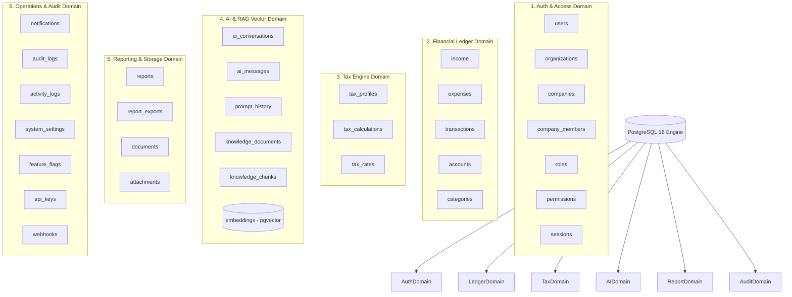
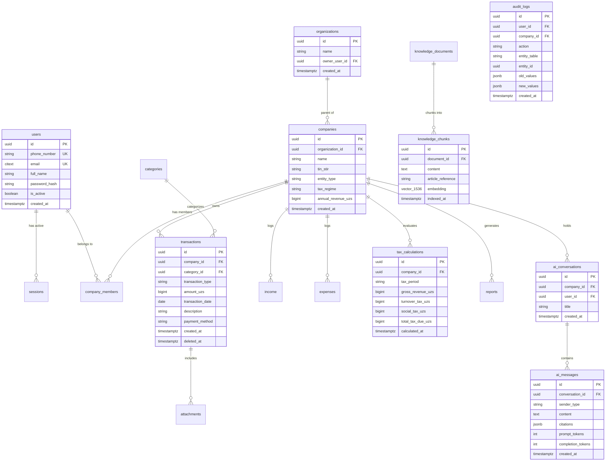
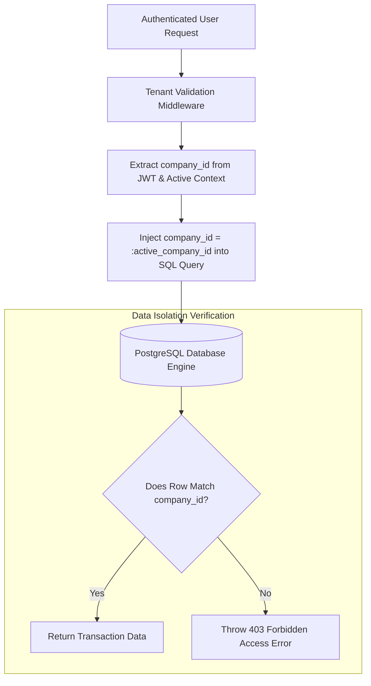

# Soliqly — Enterprise Database Blueprint & Data Architecture

**Version:** 1.0.0  
**Status:** Approved  
**Author:** Founding Product & Engineering Team (Database & Data Architecture Division)  
**Created Date:** July 27, 2026  
**Last Updated:** July 27, 2026  
**Related Documents:** [PROJECT_DISCOVERY.md](file:///c:/Users/LENOVO/soliqli/soliqli-1/docs/00-project-management/PROJECT_DISCOVERY.md), [PRD.md](file:///c:/Users/LENOVO/soliqli/soliqli-1/docs/01-product/PRD.md), [USER_RESEARCH.md](file:///c:/Users/LENOVO/soliqli/soliqli-1/docs/01-product/USER_RESEARCH.md), [INFORMATION_ARCHITECTURE.md](file:///c:/Users/LENOVO/soliqli/soliqli-1/docs/02-architecture/INFORMATION_ARCHITECTURE.md), [SOFTWARE_ARCHITECTURE.md](file:///c:/Users/LENOVO/soliqli/soliqli-1/docs/02-architecture/SOFTWARE_ARCHITECTURE.md), [ENGINEERING_CONSTITUTION.md](file:///c:/Users/LENOVO/soliqli/soliqli-1/docs/ENGINEERING_CONSTITUTION.md)  
**Dependencies:** All Baseline Phase 0 Product & Software Architecture Specifications  

---

## 1. Executive Summary

### 1.1 Purpose of Database Blueprint
This Enterprise Database Blueprint establishes the comprehensive data architecture, relational schema specifications, vector store integration, multi-tenant isolation, index strategies, audit frameworks, and security controls for **Soliqly**.

The database architecture utilizes **PostgreSQL 16+** enhanced with native extensions (`uuid-ossp`, `pgvector`, `pgcrypto`, `citext`). It provides ACID-compliant transaction safety for financial ledger records, 100% deterministic tax math calculations, high-performance RAG vector embeddings, and multi-tenant data isolation across organizations, sole proprietors (*Yakka Tartibdagi Tadbirkorlar* - YTT), self-employed individuals (*O'zini o'zi band qilgan shaxslar*), micro-businesses (*MCHJ*), and independent bookkeepers in Uzbekistan.

---

## 2. Core Database Principles

```
┌─────────────────────────────────────────────────────────────────────────────┐
│                       CORE DATABASE DESIGN PRINCIPLES                       │
├─────────────────┬───────────────────────────────────────────────────────────┤
│ Principle       │ Architectural Rationale & Implementation                  │
├─────────────────┼───────────────────────────────────────────────────────────┤
│ 1. Normalization│ 3rd Normal Form (3NF) relational design to prevent data   │
│                 │ duplication across multi-tenant workspace boundaries.     │
│ 2. Selective    │ Calculated financial summaries (e.g., `annual_revenue_uzs`)│
│    Denorm       │ cached for high-performance sub-250ms API responses.      │
│ 3. Integer      │ All monetary amounts stored as 64-bit BigInt in Uzbek Som │
│    Currency     │ (UZS) to prevent floating-point rounding errors.          │
│ 4. UUID Primary │ 128-bit UUID v4 (`uuid-ossp`) PKs on every entity to       │
│    Keys         │ eliminate primary key enumeration attacks across REST APIs.│
│ 5. Soft Delete  │ Financial records maintain immutable audit trails via     │
│                 │ `deleted_at TIMESTAMPTZ NULL` soft-deletion columns.      │
│ 6. Hybrid Vector│ Unified PostgreSQL engine utilizing `pgvector` for AI    │
│    Storage      │ embeddings alongside relational transactional ledgers.    │
└─────────────────┴───────────────────────────────────────────────────────────┘
```

---

## 3. High-Level Database Architecture



---

## 4. Master Entity Relationship Diagram (ERD)



---

## 5. Complete Entity Catalog & Specification

### 5.1 Identity & Tenant Entities

#### 1. `users`
* **Purpose:** Stores core user identities, credentials, and verification state.
* **Fields:** `id` (UUID PK), `phone_number` (VARCHAR UK), `email` (CITEXT UK), `full_name` (VARCHAR), `password_hash` (VARCHAR), `is_active` (BOOL), `is_verified` (BOOL), `created_at`, `updated_at`, `deleted_at`.
* **Owner:** Auth Domain.

#### 2. `organizations`
* **Purpose:** Top-level multi-tenant enterprise parent account for multi-company groups.
* **Fields:** `id` (UUID PK), `name` (VARCHAR), `owner_user_id` (UUID FK), `created_at`, `updated_at`, `deleted_at`.
* **Owner:** Organization Domain.

#### 3. `companies`
* **Purpose:** Legal business entity in Uzbekistan (*YTT, Self-Employed, MCHJ*).
* **Fields:** `id` (UUID PK), `organization_id` (UUID FK), `name` (VARCHAR), `tin_stir` (VARCHAR encrypted), `entity_type` (VARCHAR), `tax_regime` (VARCHAR), `annual_revenue_uzs` (BIGINT), `created_at`, `updated_at`, `deleted_at`.
* **Owner:** Organization Domain.

#### 4. `company_members`
* **Purpose:** Junction table mapping users to company access with RBAC roles.
* **Fields:** `id` (UUID PK), `company_id` (UUID FK), `user_id` (UUID FK), `role_id` (UUID FK), `created_at`.
* **Owner:** Security & RBAC Domain.

#### 5. `roles` & `permissions`
* **Purpose:** System and custom role-based access control definitions (`OWNER`, `ACCOUNTANT`, `VIEWER`).
* **Fields:** `id` (UUID PK), `name` (VARCHAR), `description` (TEXT), `permissions_mask` (JSONB).
* **Owner:** Security & RBAC Domain.

#### 6. `sessions`
* **Purpose:** Stores active user JWT refresh token metadata and device sessions.
* **Fields:** `id` (UUID PK), `user_id` (UUID FK), `refresh_token_hash` (VARCHAR), `user_agent` (VARCHAR), `ip_address` (VARCHAR), `expires_at` (TIMESTAMPTZ), `created_at`.
* **Owner:** Auth Domain.

---

### 5.2 Financial Ledger Entities

#### 7. `transactions`
* **Purpose:** Master financial ledger storing incoming Revenue and outgoing Operational Expenses.
* **Fields:** `id` (UUID PK), `company_id` (UUID FK), `category_id` (UUID FK), `transaction_type` (`INCOME`/`EXPENSE`), `amount_uzs` (BIGINT > 0), `transaction_date` (DATE), `description` (TEXT), `payment_method` (`CASH`/`BANK_TRANSFER`/`CARD`), `created_by` (UUID FK), `created_at`, `updated_at`, `deleted_at`.
* **Owner:** Transaction Domain.

#### 8. `income` & `expenses`
* **Purpose:** Domain-specific transactional breakdown tables providing localized metadata for revenues and overheads.
* **Fields:** `id` (UUID PK), `transaction_id` (UUID FK), `vendor_or_client_name` (VARCHAR), `invoice_number` (VARCHAR), `is_tax_deductible` (BOOL).
* **Owner:** Transaction Domain.

#### 9. `categories`
* **Purpose:** Standardized chart of accounts categories for business income and expenses.
* **Fields:** `id` (UUID PK), `company_id` (UUID FK NULL for global), `name` (VARCHAR), `type` (`INCOME`/`EXPENSE`), `is_system` (BOOL).
* **Owner:** Transaction Domain.

#### 10. `accounts`
* **Purpose:** Track business financial accounts (Cash, Commercial Bank Accounts, Card Rails).
* **Fields:** `id` (UUID PK), `company_id` (UUID FK), `account_name` (VARCHAR), `account_type` (`BANK`, `CASH`, `CARD`), `currency` (VARCHAR DEFAULT 'UZS').
* **Owner:** Transaction Domain.

---

### 5.3 Tax Engine Entities

#### 11. `tax_profiles`
* **Purpose:** Tracks historical tax configuration changes per company entity.
* **Fields:** `id` (UUID PK), `company_id` (UUID FK), `tax_regime` (VARCHAR), `effective_from` (DATE), `effective_to` (DATE NULL).
* **Owner:** Tax Engine Domain.

#### 12. `tax_calculations`
* **Purpose:** Immutable audit outputs of deterministic tax calculations generated by the Python core math engine.
* **Fields:** `id` (UUID PK), `company_id` (UUID FK), `tax_period` (VARCHAR), `gross_revenue_uzs` (BIGINT), `turnover_tax_uzs` (BIGINT), `social_tax_uzs` (BIGINT), `total_tax_due_uzs` (BIGINT), `calculation_metadata` (JSONB), `calculated_at` (TIMESTAMPTZ).
* **Owner:** Tax Engine Domain.

#### 13. `tax_rates`
* **Purpose:** Externalized state-mandated tax rates and Base Calculating Amounts (*BHM*) in Uzbekistan.
* **Fields:** `id` (UUID PK), `regime_code` (VARCHAR), `rate_percentage` (NUMERIC), `bhm_multiplier` (NUMERIC), `bhm_amount_uzs` (BIGINT), `effective_year` (INT).
* **Owner:** Tax Engine Domain.

---

### 5.4 AI Platform & Vector Entities

#### 14. `ai_conversations` & `ai_messages`
* **Purpose:** Stores user chat session threads, message history, streamed responses, and prompt/completion token metrics.
* **Fields (`ai_messages`):** `id` (UUID PK), `conversation_id` (UUID FK), `sender_type` (`USER`/`ASSISTANT`), `content` (TEXT), `citations` (JSONB), `prompt_tokens` (INT), `completion_tokens` (INT), `cost_usd` (NUMERIC), `created_at` (TIMESTAMPTZ).
* **Owner:** AI Gateway Domain.

#### 15. `knowledge_documents` & `knowledge_chunks`
* **Purpose:** Stores official Uzbekistan Tax Code articles, chunked sections, and `pgvector` HNSW embedding vectors.
* **Fields (`knowledge_chunks`):** `id` (UUID PK), `document_id` (UUID FK), `content` (TEXT), `article_reference` (VARCHAR), `embedding` (VECTOR 1536), `indexed_at` (TIMESTAMPTZ).
* **Owner:** AI Gateway Domain.

#### 16. `prompt_history`
* **Purpose:** Immutable audit log of all prompts executed through the Centralized AI Gateway.
* **Fields:** `id` (UUID PK), `prompt_id` (VARCHAR), `prompt_version` (VARCHAR), `user_id` (UUID FK), `tokens_used` (INT), `latency_ms` (INT), `created_at` (TIMESTAMPTZ).
* **Owner:** AI Gateway Domain.

---

### 5.5 Operations, Security & Audit Entities

#### 17. `report_jobs` & `report_exports`
* **Purpose:** Tracks background Celery PDF/CSV report generation tasks and Cloudflare R2 file links.
* **Fields:** `id` (UUID PK), `company_id` (UUID FK), `report_type` (VARCHAR), `status` (`PENDING`/`COMPLETED`/`FAILED`), `file_url` (VARCHAR), `created_at` (TIMESTAMPTZ).
* **Owner:** Reporting Domain.

#### 18. `attachments` & `documents`
* **Purpose:** Object storage references for uploaded receipts, paper invoices, and generated PDF reports.
* **Fields:** `id` (UUID PK), `company_id` (UUID FK), `file_name` (VARCHAR), `file_path` (VARCHAR), `mime_type` (VARCHAR), `file_size_bytes` (BIGINT), `created_at` (TIMESTAMPTZ).
* **Owner:** Storage Domain.

#### 19. `audit_logs` & `activity_logs`
* **Purpose:** Immutable system security and data mutation logs storing old and new values in JSONB.
* **Fields (`audit_logs`):** `id` (UUID PK), `user_id` (UUID FK NULL), `company_id` (UUID FK NULL), `action` (VARCHAR), `entity_table` (VARCHAR), `entity_id` (UUID), `old_values` (JSONB), `new_values` (JSONB), `ip_address` (VARCHAR), `created_at` (TIMESTAMPTZ).
* **Owner:** Operations & Audit Domain.

#### 20. `system_settings`, `feature_flags`, `api_keys`, `webhooks`
* **Purpose:** Application configuration flags, dynamic feature toggles, API keys, and webhook subscription endpoints.
* **Owner:** System Operations Domain.

---

## 6. Multi-Tenant Data Isolation Architecture



---

## 7. Master Index Strategy Matrix

| Table Name | Index Name | Index Type | Target Columns | Primary Query Purpose |
| :--- | :--- | :--- | :--- | :--- |
| `transactions` | `idx_txns_company_date` | B-tree | `(company_id, transaction_date DESC)` | Accelerates main transaction ledger rendering. |
| `transactions` | `idx_txns_company_type` | B-tree | `(company_id, transaction_type)` | Speeds up separate Income vs. Expense sum calculations. |
| `knowledge_chunks`| `idx_chunks_embedding` | HNSW | `embedding vector_cosine_ops` | Accelerates RAG vector similarity search (< 45ms). |
| `companies` | `idx_companies_org` | B-tree | `(organization_id, id)` | Speeds up multi-company workspace switcher lookup. |
| `audit_logs` | `idx_audit_company_date` | B-tree | `(company_id, created_at DESC)` | Accelerates compliance audit log queries. |
| `users` | `idx_users_deleted` | Partial | `(deleted_at) WHERE deleted_at IS NULL` | Filters active non-deleted users efficiently. |

---

## 8. Data Security & Encryption Architecture

```
┌─────────────────────────────────────────────────────────────────────────────┐
│                          DATA SECURITY & ENCRYPTION                         │
├─────────────────┬───────────────────────────────────────────────────────────┤
│ Layer           │ Encryption & Safeguard Rule                               │
├─────────────────┼───────────────────────────────────────────────────────────┤
│ Data in Transit │ Enforced TLS 1.3 encryption across all client-API REST calls.│
│ Data at Rest    │ PostgreSQL `pgcrypto` AES-256 GCM encryption for sensitive│
│                 │ taxpayer identifiers (`tin_stir`).                         │
│ Password Security│ Argon2id / bcrypt hashing with unique salt per user.      │
│ PII Protection  │ Automatic masking of personal identification in AI logs.  │
└─────────────────┴───────────────────────────────────────────────────────────┘
```

---

## 9. Migration & Backup Strategy

* **Schema Migrations:** Managed exclusively using async **Alembic** migration scripts (`scripts/migrations/`).
* **Zero-Downtime Rule:** Migrations use additive column steps (no destructive `DROP COLUMN` without multi-release deprecation).
* **WAL Archiving & PITR:** Continuous Write-Ahead Logging (WAL) shipping enabling Point-in-Time Recovery (PITR) to any second within 30 days.
* **Target SLAs:** Recovery Time Objective (RTO) < 30 minutes; Recovery Point Objective (RPO) < 5 minutes.

---

## 10. Master System Matrix Summary

### 10.1 Retention & Archive Policy Matrix

| Data Domain | Retention Period | Action Upon Expiration | Legal & Compliance Basis |
| :--- | :--- | :--- | :--- |
| **Financial Ledger (`transactions`)** | **5 Years** | Cold Storage Archive | Mandatory Uzbekistan Tax Code Record Retention. |
| **Tax Calculations (`tax_calculations`)**| **5 Years** | Cold Storage Archive | State Tax Committee Compliance Audit Window. |
| **Audit Logs (`audit_logs`)** | **3 Years** | Archived to R2 Storage | System Security & Identity Compliance. |
| **AI Message Logs (`ai_messages`)** | **90 Days** | Purged / Anonymized | AI Data Privacy & Storage Cost Optimization. |
| **User Sessions (`sessions`)** | **7 Days** | Automated Expired Row Purge | Session Security Standard. |

---

## 11. Cross References

* [PROJECT_DISCOVERY.md](file:///c:/Users/LENOVO/soliqli/soliqli-1/docs/00-project-management/PROJECT_DISCOVERY.md) — Baseline Product Discovery Document
* [PRD.md](file:///c:/Users/LENOVO/soliqli/soliqli-1/docs/01-product/PRD.md) — Product Requirements Document
* [USER_RESEARCH.md](file:///c:/Users/LENOVO/soliqli/soliqli-1/docs/01-product/USER_RESEARCH.md) — Personas & User Journeys
* [SOFTWARE_ARCHITECTURE.md](file:///c:/Users/LENOVO/soliqli/soliqli-1/docs/02-architecture/SOFTWARE_ARCHITECTURE.md) — Software Architecture Blueprint
* [ENGINEERING_CONSTITUTION_PART_4.md](file:///c:/Users/LENOVO/soliqli/soliqli-1/docs/ENGINEERING_CONSTITUTION_PART_4.md) — Software Architecture Standards

---

**End of Document.**
