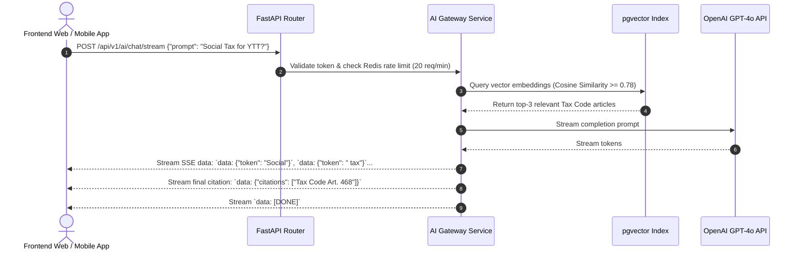

# Soliqly — Enterprise API Architecture & Specification

**Version:** 1.0.0  
**Status:** Approved  
**Author:** Founding Product & Engineering Team (API & Backend Architecture Division)  
**Created Date:** July 27, 2026  
**Last Updated:** July 27, 2026  
**Related Documents:** [PROJECT_DISCOVERY.md](file:///c:/Users/LENOVO/soliqli/soliqli-1/docs/00-project-management/PROJECT_DISCOVERY.md), [PRD.md](file:///c:/Users/LENOVO/soliqli/soliqli-1/docs/01-product/PRD.md), [USER_RESEARCH.md](file:///c:/Users/LENOVO/soliqli/soliqli-1/docs/01-product/USER_RESEARCH.md), [INFORMATION_ARCHITECTURE.md](file:///c:/Users/LENOVO/soliqli/soliqli-1/docs/02-architecture/INFORMATION_ARCHITECTURE.md), [SOFTWARE_ARCHITECTURE.md](file:///c:/Users/LENOVO/soliqli/soliqli-1/docs/02-architecture/SOFTWARE_ARCHITECTURE.md), [DATABASE_BLUEPRINT.md](file:///c:/Users/LENOVO/soliqli/soliqli-1/docs/03-database/DATABASE_BLUEPRINT.md), [ENGINEERING_CONSTITUTION.md](file:///c:/Users/LENOVO/soliqli/soliqli-1/docs/ENGINEERING_CONSTITUTION.md)  
**Dependencies:** All Baseline Phase 0 Architectural Specifications  

---

## 1. Executive Summary

### 1.1 Purpose of API Architecture
This Enterprise API Architecture and Specification defines the official RESTful contract (`/api/v1`), data payloads, error envelopes, rate limits, security headers, and AI gateway streaming protocols for **Soliqly**.

Engineered on **FastAPI (Python 3.13)** with Pydantic v2 validation, this API serves as the single source of truth for Next.js web applications, future mobile apps (iOS/Android), background task workers, and authorized third-party integrations across Uzbekistan.

---

## 2. Core API Architecture Principles

```
┌─────────────────────────────────────────────────────────────────────────────┐
│                          CORE API DESIGN PRINCIPLES                         │
├─────────────────┬───────────────────────────────────────────────────────────┤
│ Principle       │ Specification & Implementation Standard                   │
├─────────────────┼───────────────────────────────────────────────────────────┤
│ 1. REST First   │ Predictable resource-oriented URLs using standard HTTP    │
│                 │ verbs (GET, POST, PUT, PATCH, DELETE).                    │
│ 2. Versioning   │ Explicit base path versioning (`/api/v1/...`).            │
│ 3. Uniform Envelope│ All responses wrapped in standardized JSON envelopes.     │
│ 4. Idempotency  │ Non-idempotent operations accept `X-Idempotency-Key`      │
│                 │ headers to prevent duplicate financial transaction writes.│
│ 5. OpenAPI 3.0  │ Native interactive documentation automatically generated  │
│                 │ at `/docs` and `/redoc`.                                  │
└─────────────────┴───────────────────────────────────────────────────────────┘
```

---

## 3. Standard Response & Error Envelope Formats

### 3.1 Standard Success Response Envelope (`200 OK`, `201 Created`)

```json
{
  "success": true,
  "data": {
    "id": "8f92a1b4-290c-4e12-881a-902319208a01",
    "company_id": "c1a93b48-110a-4b92-801a-112233445566",
    "transaction_type": "INCOME",
    "amount_uzs": 15000000,
    "transaction_date": "2026-07-27",
    "description": "Retail Merchandise Sales",
    "payment_method": "BANK_TRANSFER",
    "created_at": "2026-07-27T14:30:00Z"
  },
  "meta": {
    "page": 1,
    "limit": 20,
    "total": 1
  },
  "timestamp": "2026-07-27T14:30:00.124Z",
  "trace_id": "req-902319208a01"
}
```

---

### 3.2 Standard Error Response Envelope (`400 Bad Request`, `422 Unprocessable Entity`)

```json
{
  "success": false,
  "error": {
    "code": "TAX_CALCULATION_INVALID_THRESHOLD",
    "message": "Annual revenue exceeds the simplified self-employed threshold limit.",
    "details": [
      {
        "field": "annual_revenue_uzs",
        "issue": "Annual revenue 105,000,000 UZS exceeds 100,000,000 UZS ceiling for self-employed status."
      }
    ]
  },
  "timestamp": "2026-07-27T14:30:00.124Z",
  "trace_id": "req-902319208a01"
}
```

---

## 4. Master Endpoint Inventory & Permission Matrix

| HTTP Method | Route Endpoint Path | Auth Required | Role Permission | Primary Purpose |
| :--- | :--- | :--- | :--- | :--- |
| **POST** | `/api/v1/auth/register` | Public | None | Register new user account. |
| **POST** | `/api/v1/auth/login` | Public | None | Authenticate credentials & issue JWT tokens. |
| **POST** | `/api/v1/auth/refresh` | Refresh Token| None | Issue new 15-minute access token. |
| **GET** | `/api/v1/users/me` | Bearer JWT | User | Fetch active user profile. |
| **POST** | `/api/v1/companies` | Bearer JWT | User | Create new business company (*YTT/MCHJ*). |
| **GET** | `/api/v1/dashboard/summary` | Bearer JWT | Company Member| Fetch main dashboard financial metrics. |
| **GET** | `/api/v1/transactions` | Bearer JWT | Company Member| List & filter transaction ledger entries. |
| **POST** | `/api/v1/transactions` | Bearer JWT | Owner / Accountant| Log new Income or Expense transaction. |
| **POST** | `/api/v1/taxes/calculate` | Bearer JWT | Company Member| Compute real-time Turnover 4% & Social Tax.|
| **POST** | `/api/v1/ai/chat/stream` | Bearer JWT | Company Member| Stream AI tax RAG answer via SSE. |
| **POST** | `/api/v1/reports/pdf` | Bearer JWT | Owner / Accountant| Dispatch background Celery job for PDF report.|

---

## 5. Core API Endpoints & Request Specifications

### 5.1 Authentication API (`/api/v1/auth`)

#### `POST /api/v1/auth/login`
* **Purpose:** Authenticate user via Uzbekistan phone number and password.
* **Rate Limit:** 5 requests / minute.

**Request Body:**
```json
{
  "phone_number": "+998901234567",
  "password": "SecurePassword123!"
}
```

**Response (200 OK):**
```json
{
  "success": true,
  "data": {
    "access_token": "eyJhbGciOiJIUzI1NiIsInR5cCI6IkpXVCJ9...",
    "token_type": "bearer",
    "expires_in": 900,
    "refresh_token": "def456... (Stored in HTTP-Only Cookie)"
  },
  "timestamp": "2026-07-27T14:30:00Z",
  "trace_id": "req-login-001"
}
```

---

### 5.2 Transaction Ledger API (`/api/v1/transactions`)

#### `POST /api/v1/transactions`
* **Purpose:** Log a new Income or Expense monetary record.
* **Header:** `X-Idempotency-Key: uuid-v4-key` (Optional but recommended).

**Request Body:**
```json
{
  "company_id": "c1a93b48-110a-4b92-801a-112233445566",
  "category_id": "cat-889900-a1b2",
  "transaction_type": "INCOME",
  "amount_uzs": 25000000,
  "transaction_date": "2026-07-27",
  "description": "B2B Software Development Service Fee",
  "payment_method": "BANK_TRANSFER"
}
```

---

### 5.3 Deterministic Tax Engine API (`/api/v1/taxes`)

#### `POST /api/v1/taxes/calculate`
* **Purpose:** Execute 100% deterministic Python calculation for turnover and social tax.

**Request Body:**
```json
{
  "company_id": "c1a93b48-110a-4b92-801a-112233445566",
  "tax_period": "2026-Q2"
}
```

**Response (200 OK):**
```json
{
  "success": true,
  "data": {
    "company_id": "c1a93b48-110a-4b92-801a-112233445566",
    "tax_period": "2026-Q2",
    "tax_regime": "TURNOVER_TAX_4%",
    "gross_revenue_uzs": 45000000,
    "turnover_tax_rate": 0.04,
    "turnover_tax_uzs": 1800000,
    "bhm_current_amount_uzs": 375000,
    "social_tax_uzs": 375000,
    "total_tax_due_uzs": 2175000,
    "payment_deadline": "2026-08-15"
  },
  "timestamp": "2026-07-27T14:30:00Z",
  "trace_id": "req-tax-002"
}
```

---

### 5.4 AI Gateway Streaming API (`/api/v1/ai`)

#### `POST /api/v1/ai/chat/stream`
* **Purpose:** Stream RAG-enhanced tax advice word-by-word via Server-Sent Events (SSE).



---

## 6. Standardized Error Catalog

| Error Code | HTTP Status | Business Meaning & Description |
| :--- | :--- | :--- |
| `AUTH_INVALID_CREDENTIALS` | `401 Unauthorized` | Invalid phone number or password. |
| `AUTH_TOKEN_EXPIRED` | `401 Unauthorized` | JWT access token expired. Refresh required. |
| `AUTH_FORBIDDEN_TENANT` | `403 Forbidden` | User attempts to access a company they do not belong to. |
| `VAL_INVALID_PHONE` | `422 Unprocessable` | Phone number does not match `+998XXXXXXXXX` format. |
| `TAX_THRESHOLD_EXCEEDED` | `400 Bad Request` | Revenue exceeds self-employed registration cap (100M UZS). |
| `AI_RATE_LIMIT_EXCEEDED` | `429 Too Many Requests`| AI query limit exceeded for current subscription plan. |
| `SYS_INTERNAL_ERROR` | `500 Server Error` | Unexpected backend error. Tracked via Sentry/OpenTelemetry. |

---

## 7. Rate Limiting Strategy Matrix

| Endpoint Group | Redis Sliding Window Limit | Action Upon Exceeded |
| :--- | :--- | :--- |
| **Authentication (`/auth/*`)** | **5 requests / minute** | Return `429 Too Many Requests` (15-min lockout). |
| **Transaction Ingestion (`/transactions`)** | **120 requests / minute** | Return `429 Too Many Requests`. |
| **AI Streaming (`/ai/chat/stream`)** | **20 requests / minute** | Return `429` with plan upgrade prompt. |
| **Report Generation (`/reports/*`)** | **10 requests / hour** | Return `429` with background job status link. |

---

## 8. Webhooks Architecture

* **Subscription Endpoints:** Registered at `/api/v1/webhooks/subscriptions`.
* **Security & Signature:** Every webhook HTTP POST includes signature header `X-Soliqly-Signature: t=160000,v1=sha256_hash`.
* **Supported Events:**
  * `transaction.created`
  * `tax_calculation.completed`
  * `report_job.finished`

---

## 9. Cross References

* [PROJECT_DISCOVERY.md](file:///c:/Users/LENOVO/soliqli/soliqli-1/docs/00-project-management/PROJECT_DISCOVERY.md) — Baseline Product Discovery Document
* [PRD.md](file:///c:/Users/LENOVO/soliqli/soliqli-1/docs/01-product/PRD.md) — Product Requirements Document
* [SOFTWARE_ARCHITECTURE.md](file:///c:/Users/LENOVO/soliqli/soliqli-1/docs/02-architecture/SOFTWARE_ARCHITECTURE.md) — Software Architecture Blueprint
* [DATABASE_BLUEPRINT.md](file:///c:/Users/LENOVO/soliqli/soliqli-1/docs/03-database/DATABASE_BLUEPRINT.md) — Enterprise Database Blueprint
* [ENGINEERING_CONSTITUTION_PART_4.md](file:///c:/Users/LENOVO/soliqli/soliqli-1/docs/ENGINEERING_CONSTITUTION_PART_4.md) — Software Engineering Standards

---

**End of Document.**
