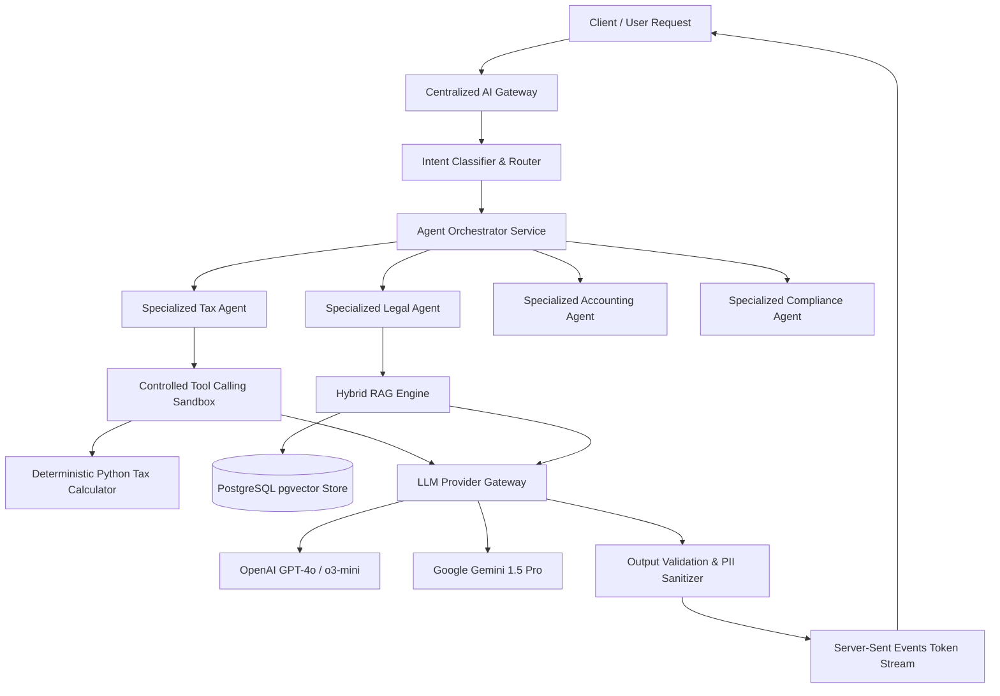
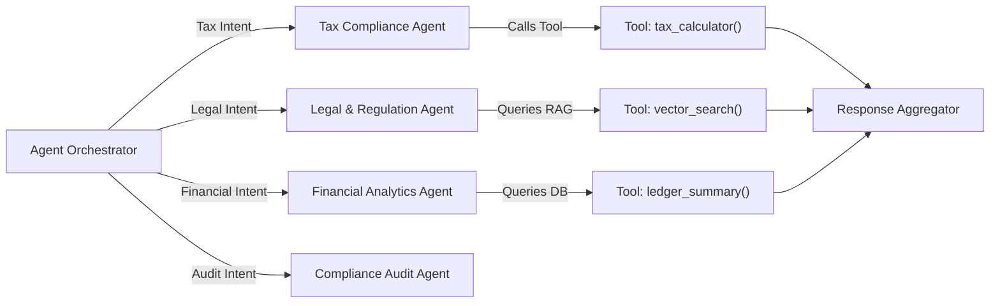
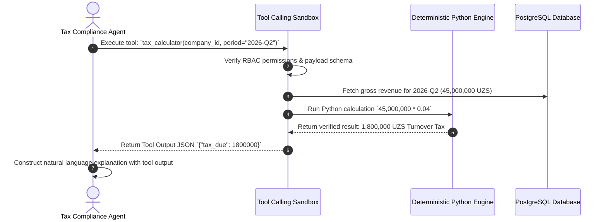
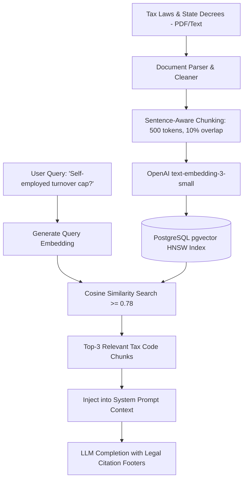

# Soliqly — Enterprise AI Platform & Multi-Agent Architecture

**Version:** 1.0.0  
**Status:** Approved  
**Author:** Founding Product & Engineering Team (AI & Multi-Agent Architecture Division)  
**Created Date:** July 27, 2026  
**Last Updated:** July 27, 2026  
**Related Documents:** [PROJECT_DISCOVERY.md](file:///c:/Users/LENOVO/soliqli/soliqli-1/docs/00-project-management/PROJECT_DISCOVERY.md), [PRD.md](file:///c:/Users/LENOVO/soliqli/soliqli-1/docs/01-product/PRD.md), [USER_RESEARCH.md](file:///c:/Users/LENOVO/soliqli/soliqli-1/docs/01-product/USER_RESEARCH.md), [SOFTWARE_ARCHITECTURE.md](file:///c:/Users/LENOVO/soliqli/soliqli-1/docs/02-architecture/SOFTWARE_ARCHITECTURE.md), [DATABASE_BLUEPRINT.md](file:///c:/Users/LENOVO/soliqli/soliqli-1/docs/03-database/DATABASE_BLUEPRINT.md), [API_SPECIFICATION.md](file:///c:/Users/LENOVO/soliqli/soliqli-1/docs/04-api/API_SPECIFICATION.md), [ENGINEERING_CONSTITUTION.md](file:///c:/Users/LENOVO/soliqli/soliqli-1/docs/ENGINEERING_CONSTITUTION.md)  
**Dependencies:** All Baseline Phase 0 Architectural & API Specifications  

---

## 1. Executive Summary

### 1.1 Architectural Vision
This Enterprise AI Platform & Multi-Agent Architecture specification establishes the artificial intelligence framework, multi-agent orchestration, Retrieval-Augmented Generation (RAG) vector pipelines, controlled tool-calling sandboxes, prompt governance libraries, and safety middleware for **Soliqly**.

The platform strictly enforces the **Rule of Determinism**: Large Language Models (LLMs) operate as conversational interpreters, context rankers, and legal query translators. Raw financial math, turnover tax tiers (4%), and social tax liabilities (*Ijtimoiy soliq*) are calculated exclusively by unit-tested, deterministic backend Python code.

---

## 2. Core AI Platform Principles

```
┌─────────────────────────────────────────────────────────────────────────────┐
│                          CORE AI PLATFORM PRINCIPLES                        │
├─────────────────┬───────────────────────────────────────────────────────────┤
│ Principle       │ Architectural Specification & Enforcement                 │
├─────────────────┼───────────────────────────────────────────────────────────┤
│ 1. Determinism  │ LLMs NEVER execute raw financial or tax math. Calculations│
│                 │ are delegated to backend Python engine services.          │
│ 2. Grounded RAG │ All legal advice is strictly grounded in verified Tax     │
│                 │ Code vector embeddings (`pgvector` similarity >= 0.78).    │
│ 3. Multi-Agent  │ Domain requests routed to specialized agents (Tax Agent,  │
│                 │ Legal Agent, Compliance Agent) via Agent Orchestrator.    │
│ 4. Provider     │ Primary LLM routing to OpenAI (GPT-4o) with automatic     │
│    Failover     │ failover to Google Gemini 1.5 Pro upon API degradation.   │
│ 5. Safety First │ Multi-stage PII redaction, prompt injection defense, and  │
│                 │ deterministic response validation middleware.             │
└─────────────────┴───────────────────────────────────────────────────────────┘
```

---

## 3. High-Level AI Platform Architecture



---

## 4. Centralized AI Gateway & Routing

### 4.1 AI Gateway Responsibilities & Rules
All AI requests pass through `apps/api/domains/ai`. Frontend clients are strictly prohibited from making direct requests to third-party LLM APIs.

* **Authentication & Quota Validation:** Validates user session and enforces Redis sliding window limits (20 AI queries/min for Pro tier).
* **Intent Classification:** Evaluates prompt intent into 10 explicit categories (`TAX_QUERY`, `ACCOUNTING_ADVICE`, `LEGAL_CITATION`, `REPORT_GEN`, `CALCULATION_REQ`, `GENERAL_CHAT`).
* **Prompt Routing & Injection Defense:** Sanitizes prompts to strip system prompt override attempts before dispatch.
* **Provider Failover:** Automatically switches from OpenAI to Google Gemini 1.5 Pro if primary API latency exceeds 3.5 seconds or returns 5xx status.
* **Token Usage Logging:** Logs `prompt_tokens`, `completion_tokens`, `latency_ms`, and `cost_usd` per user session in `audit_logs`.

---

## 5. Multi-Agent System Architecture



### 5.1 Specialized Agent Specification Matrix

| Agent Name | Primary Responsibility | Input Domain | Tools Available | Knowledge Source |
| :--- | :--- | :--- | :--- | :--- |
| **Tax Compliance Agent** | Explains turnover & social tax liabilities, payment deadlines. | Tax questions | `tax_calculator`, `bhm_lookup` | Uzbekistan Tax Code (Art. 460–470) |
| **Legal Regulation Agent**| Resolves legal status queries (Self-Employed vs YTT limits). | Legal queries | `vector_search` | State Tax Committee Decrees |
| **Financial Analytics Agent**| Summarizes monthly revenue trends and expense margin ratios. | Dashboard queries| `ledger_summary`, `pnl_calc` | User Transaction Ledger DB |
| **Compliance Audit Agent** | Scans logged transactions for potential audit flags. | Audit queries | `audit_scanner` | Tax Inspection Regulations |

---

## 6. Controlled Tool-Calling Architecture



### 6.1 Authorized System Tools Catalog

* `tax_calculator(company_id, period)`: Returns exact calculated tax liabilities.
* `vector_search(query_text, top_k=3)`: Queries `pgvector` HNSW index for relevant legal text.
* `ledger_summary(company_id, start_date, end_date)`: Computes sum of income and expenses.
* `bhm_lookup(year)`: Returns Base Calculating Amount (*BHM*) rate for Uzbekistan.

---

## 7. RAG (Retrieval-Augmented Generation) Pipeline



---

## 8. Vector Database Strategy (`pgvector`)

* **Embedding Model:** OpenAI `text-embedding-3-small` (1,500 dimension vectors).
* **Distance Metric:** Cosine Distance (`vector_cosine_ops`).
* **HNSW Index Parameters:** `m = 16`, `ef_construction = 64` for high-throughput similarity lookup (< 45ms).
* **Hybrid Search:** Combines PostgreSQL Full-Text Search (`tsvector`) for exact keyword matches (e.g., *"Article 467"*) with vector embeddings for semantic matches.

---

## 9. Versioned Prompt Library

All prompt templates are stored as version-controlled code assets in `packages/shared/prompts/`:

```markdown
# Prompt Asset Specification
ID: PROMPT_TAX_ADVISORY_UZ
Version: 1.2.0
Owner: AI Architecture Team
Output Format: SSE Token Stream + JSON Citation Footer

System Prompt:
You are Soliqly AI, an expert tax advisor for Uzbekistan.
Answer the user's question accurately in Uzbek or Russian.
Rely STRICTLY on the provided Tax Code context:
{retrieved_context}

NEVER compute monetary tax math yourself. Refer to the calculated numbers:
{calculated_tax_data}

Always append legal citations in the format: [Manba: Soliq Kodeksi, {article_number}-modda].
```

---

## 10. Memory Architecture & Retention Rules

```mermaid
graph TD
    UserMsg[User Message Input] --> TempMemory[Redis Short-Term Conversation Memory]
    TempMemory --> ContextBuilder[Context Window Assembler (Max 4,000 tokens)]
    ContextBuilder --> LLMProcess[LLM Completion Request]
    LLMProcess --> DBStore[PostgreSQL Permanent Session Log - ai_messages]
    
    subgraph Retention Policy
        TempMemory -->|Expires in 24 Hours| RedisPurge[Redis Cache Flush]
        DBStore -->|Retained for 90 Days| DBAnonymize[Anonymize PII & Retain Metadata]
    end
```

---

## 11. AI Safety, Guardrails & PII Masking

1. **Prompt Injection Shield:** Input sanitizer strips string patterns attempting system prompt overrides (e.g., *"Ignore previous instructions"*).
2. **PII Masking:** Automatic regex replacement of passport numbers, credit card numbers, and private passwords before dispatching to LLM APIs.
3. **Deterministic Math Validation:** Validation middleware verifies that any monetary figure generated in the AI text response matches the exact integer outputs of the Python tax engine.
4. **Human Override Disclaimer:** Displays mandatory legal disclosure: *"AI guidance is for informational purposes based on the Tax Code of Uzbekistan."*

---

## 12. Master System Matrix Summary

### 12.1 Cost & Token Optimization Matrix

| Operational Component | Optimization Strategy | Cost Reduction Impact |
| :--- | :--- | :--- |
| **Context Windowing** | Truncate context to top-3 chunks (max 1,500 tokens). | Saves up to 65% in prompt token cost. |
| **Vector DB Consolidation**| Native `pgvector` inside primary PostgreSQL DB. | Eliminates dedicated vector SaaS ($150+/mo savings). |
| **Response Caching** | Cache frequent tax queries (e.g., *"What is BHM in 2026?"*) in Redis. | 100% LLM API cost savings on cached hits. |
| **Model Selection** | Route simple intents to `gpt-4o-mini`; route complex RAG to `gpt-4o`. | Cuts average API cost per conversation by 45%. |

---

## 13. Cross References

* [PROJECT_DISCOVERY.md](file:///c:/Users/LENOVO/soliqli/soliqli-1/docs/00-project-management/PROJECT_DISCOVERY.md) — Baseline Product Discovery Document
* [PRD.md](file:///c:/Users/LENOVO/soliqli/soliqli-1/docs/01-product/PRD.md) — Product Requirements Document
* [SOFTWARE_ARCHITECTURE.md](file:///c:/Users/LENOVO/soliqli/soliqli-1/docs/02-architecture/SOFTWARE_ARCHITECTURE.md) — Software Architecture Blueprint
* [DATABASE_BLUEPRINT.md](file:///c:/Users/LENOVO/soliqli/soliqli-1/docs/03-database/DATABASE_BLUEPRINT.md) — Enterprise Database Blueprint
* [API_SPECIFICATION.md](file:///c:/Users/LENOVO/soliqli/soliqli-1/docs/04-api/API_SPECIFICATION.md) — Enterprise API Specification

---

**End of Document.**
