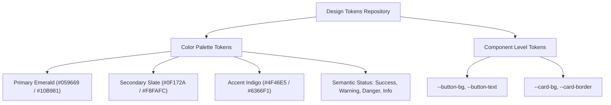
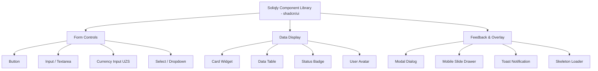

# Soliqly — Design System & UI Foundation Specification

**Version:** 1.0.0  
**Status:** Approved  
**Author:** Founding Product & Engineering Team (Design System & UI Architecture Division)  
**Created Date:** July 27, 2026  
**Last Updated:** July 27, 2026  
**Related Documents:** [PROJECT_DISCOVERY.md](file:///c:/Users/LENOVO/soliqli/soliqli-1/docs/00-project-management/PROJECT_DISCOVERY.md), [PRD.md](file:///c:/Users/LENOVO/soliqli/soliqli-1/docs/01-product/PRD.md), [USER_RESEARCH.md](file:///c:/Users/LENOVO/soliqli/soliqli-1/docs/01-product/USER_RESEARCH.md), [INFORMATION_ARCHITECTURE.md](file:///c:/Users/LENOVO/soliqli/soliqli-1/docs/02-architecture/INFORMATION_ARCHITECTURE.md), [UX_BLUEPRINT.md](file:///c:/Users/LENOVO/soliqli/soliqli-1/docs/06-design/UX_BLUEPRINT.md), [ENGINEERING_CONSTITUTION.md](file:///c:/Users/LENOVO/soliqli/soliqli-1/docs/ENGINEERING_CONSTITUTION.md)  
**Dependencies:** [PRD.md](file:///c:/Users/LENOVO/soliqli/soliqli-1/docs/01-product/PRD.md), [INFORMATION_ARCHITECTURE.md](file:///c:/Users/LENOVO/soliqli/soliqli-1/docs/02-architecture/INFORMATION_ARCHITECTURE.md), [UX_BLUEPRINT.md](file:///c:/Users/LENOVO/soliqli/soliqli-1/docs/06-design/UX_BLUEPRINT.md)  

---

## 1. Executive Summary

### 1.1 Purpose of Design System
This Design System specification defines the official visual design language, design token repository, typography scale, color system, component architecture (shadcn/ui + Tailwind CSS v4), dashboard layout, motion guidelines, and accessibility standards for **Soliqly**. Inspired by the crisp, high-trust visual aesthetics of Stripe, Linear, Mercury, Vercel, and Notion, it ensures complete consistency across Figma libraries, Next.js web applications, AI interfaces, and future native mobile apps in Uzbekistan.

---

## 2. Brand Identity & Design Personality

* **Mission:** Transform complex state tax regulations (*Soliq Qo'mitasi*) into an intuitive, high-speed, and empowering financial environment.
* **Visual Personality:** Professional, minimal, modern, trustworthy, high-contrast, fast, accessible.
* **Brand Voice & Tone:** Clear, objective, supportive, zero-jargon, confident.
* **Design Core Values:** Trust before decoration; performance over visual bloat; sub-second interaction feedback.

---

## 3. Core Design Principles

1. **Consistency First:** Universal component variants, spacing grids, and color tokens across all workspaces.
2. **Visual Hierarchy:** Primary financial metrics are prominent; supporting audit logs are progressively disclosed.
3. **Generous Whitespace:** Clean spatial padding (4px baseline grid) prevents cognitive clutter during tax reporting.
4. **Subtle Micro-Interactions:** Fast transition physics (< 150ms) communicate system status without distraction.
5. **Universal Accessibility:** Built to WCAG 2.1 AA standards with high-contrast ratios (≥ 4.5:1) and visible focus rings.

---

## 4. Color System & Design Tokens



### 4.1 Master Color Palette Matrix

| Semantic Token | Light Mode HEX | Dark Mode HEX | HSL Equivalent | Primary Usage & Rationale |
| :--- | :--- | :--- | :--- | :--- |
| `--color-primary` | `#059669` | `#10B981` | `hsl(160, 84%, 39%)` | Primary brand green (growth, financial trust, CTAs). |
| `--color-primary-hover`| `#047857` | `#34D399` | `hsl(160, 90%, 25%)` | Interactive hover state for primary buttons. |
| `--color-secondary` | `#0F172A` | `#F8FAFC` | `hsl(222, 47%, 11%)` | High-contrast headers, primary text, and dark controls.|
| `--color-background` | `#FFFFFF` | `#090D16` | `hsl(0, 0%, 100%)` | Canvas background for main application viewport. |
| `--color-surface` | `#F8FAFC` | `#111827` | `hsl(210, 40%, 98%)` | Card containers, sidebar backgrounds, input fills. |
| `--color-border` | `#E2E8F0` | `#1F2937` | `hsl(214, 32%, 91%)` | Component dividers, input borders, card borders. |
| `--color-success` | `#16A34A` | `#22C55E` | `hsl(142, 76%, 36%)` | Income transactions, positive metrics, tax-paid badges.|
| `--color-warning` | `#D97706` | `#F59E0B` | `hsl(38, 92%, 50%)` | Tax threshold alerts (80% of 100M UZS), pending reviews.|
| `--color-danger` | `#DC2626` | `#EF4444` | `hsl(0, 84%, 60%)` | Expense entries, overdue tax warnings, deletion actions. |
| `--color-info` | `#2563EB` | `#3B82F6` | `hsl(217, 91%, 60%)` | Information badges, AI chat highlights, help popovers. |

---

## 5. Typography System

### 5.1 Typography Specifications & Scale
* **Primary Font Family:** `Inter`, `-apple-system`, `BlinkMacSystemFont`, `Segoe UI`, `Roboto`, `sans-serif`.
* **Monospace Font (Numbers/Code):** `JetBrains Mono`, `Fira Code`, `monospace`.

| Style Token | Font Size (px / rem) | Line Height | Weight | Letter Spacing | Applied Usage |
| :--- | :--- | :--- | :--- | :--- | :--- |
| `text-display` | `36px / 2.25rem` | `1.2` | `700 (Bold)` | `-0.02em` | Main dashboard summary monetary figures. |
| `text-h1` | `28px / 1.75rem` | `1.25` | `700 (Bold)` | `-0.015em` | Primary page title headers (`<h1>`). |
| `text-h2` | `22px / 1.375rem` | `1.3` | `600 (SemiBold)`| `-0.01em` | Section headers & card group headers (`<h2>`). |
| `text-h3` | `18px / 1.125rem` | `1.4` | `600 (SemiBold)`| `0em` | Widget titles, modal titles (`<h3>`). |
| `text-body-lg` | `16px / 1.0rem` | `1.5` | `400 (Regular)` | `0em` | Primary body text, lead paragraphs. |
| `text-body-md` | `14px / 0.875rem` | `1.5` | `400 (Regular)` | `0em` | Default UI text, table cell text, form labels. |
| `text-caption` | `12px / 0.75rem` | `1.4` | `500 (Medium)` | `0.01em` | Input field helper text, badge text, metadata. |
| `text-code` | `13px / 0.8125rem`| `1.4` | `400 (Regular)` | `0em` | Tax Code article citations, transaction UUIDs. |

---

## 6. Spacing System & 4px Grid

```
Spacing Scale: [ 0, 4px, 8px, 12px, 16px, 20px, 24px, 32px, 40px, 48px, 64px ]
Grid Baseline: 4px Increments
```

| Token Name | Value (px / rem) | Primary Structural Usage |
| :--- | :--- | :--- |
| `--spacing-1` | `4px / 0.25rem` | Icon-to-text spacing, tight badge padding. |
| `--spacing-2` | `8px / 0.5rem` | Compact button padding, input field vertical gaps. |
| `--spacing-3` | `12px / 0.75rem` | Standard input field horizontal padding, table cell padding. |
| `--spacing-4` | `16px / 1.0rem` | Default card padding, layout grid gaps. |
| `--spacing-6` | `24px / 1.5rem` | Section padding, drawer container margins. |
| `--spacing-8` | `32px / 2.0rem` | Page container padding (Desktop viewports). |
| `--spacing-12`| `48px / 3.0rem` | Major dashboard layout section splits. |

---

## 7. Border Radius & Elevation (Shadows)

### 7.1 Border Radius Tokens

| Token Name | Value | Component Application |
| :--- | :--- | :--- |
| `--radius-xs` | `4px` | Badges, tooltips, inline code blocks. |
| `--radius-sm` | `6px` | Buttons, text input fields, select dropdowns. |
| `--radius-md` | `8px` | Small cards, table containers, popover drawers. |
| `--radius-lg` | `12px` | Main dashboard card containers, modal dialogs. |
| `--radius-full`| `9999px` | User avatars, circular status indicators. |

### 7.2 Elevation & Shadow Tokens

* `--shadow-sm`: `0 1px 2px 0 rgba(0, 0, 0, 0.05)` (Cards, table rows on hover).
* `--shadow-md`: `0 4px 6px -1px rgba(0, 0, 0, 0.1), 0 2px 4px -1px rgba(0, 0, 0, 0.06)` (Dropdown menus, popovers).
* `--shadow-lg`: `0 10px 15px -3px rgba(0, 0, 0, 0.1), 0 4px 6px -2px rgba(0, 0, 0, 0.05)` (Modal dialogs, slide-up drawers).

---

## 8. Master Component Inventory & Architecture



### 8.1 Component Specification Matrix

| Component | Variants | States | Accessibility Standard |
| :--- | :--- | :--- | :--- |
| **Button** | Primary, Secondary, Outline, Ghost, Danger | Default, Hover, Active, Disabled, Loading | `aria-disabled`, visible focus ring (`ring-2`). |
| **Currency Input**| Default (UZS suffix), Error, Success | Focused, Filled, Error, Read-only | `aria-invalid`, thousand separator masking. |
| **Data Table** | Default, Striped, Compact | Loading (Skeleton), Empty, Sorted | `role="grid"`, `aria-sort`, keyboard navigation. |
| **Status Badge** | Success (Green), Warning (Amber), Danger (Red) | Static | High-contrast contrast background ratio ≥ 4.5:1.|
| **Modal Dialog** | Standard, Confirmation, Full-screen | Open, Closing, Closed | Trap focus (`aria-modal="true"`), Close on `Esc`. |
| **AI Chat Bubble**| User Message, AI Response (Streamed) | Typing (3 dots), Streaming, Complete | `aria-live="polite"` for streamed tokens. |

---

## 9. Form Experience & Financial Inputs

1. **Currency Field Standard (UZS):** Input automatically renders trailing unit `"UZS"` with thousand spaces (`15 000 000 UZS`).
2. **Date Picker:** Native responsive date-picker defaulting to current Uzbekistan timezone (`Asia/Tashkent`).
3. **Inline Error Messaging:** Red input border (`--color-danger`) paired with an inline icon and sub-label text (`"Amount must be greater than 0 UZS"`).

---

## 10. Table Design & Data Ledger

* **Header Behavior:** Sticky table header during vertical scroll with re-sorting indicators ($\uparrow / \downarrow$).
* **Row Interaction:** Hover state activates subtle background tint (`--color-surface`); clicking row opens details drawer.
* **Pagination Control:** Compact footer pagination bar showing `Showing 1-20 of 145 transactions` with `[Previous] [Next]` buttons.

---

## 11. AI UI & Conversational Component Design

```
┌─────────────────────────────────────────────────────────────────────────────┐
│                            AI CHAT WORKSPACE UI                             │
├─────────────────────────────────────────────────────────────────────────────┤
│ [User Bubble] "YTT 4% aylanma solig'ini qanday hisoblayman?"                │
├─────────────────────────────────────────────────────────────────────────────┤
│ [AI Avatar] [Soliqly AI Assistant]                                         │
│ 💬 Turnover tax for YTT is computed as 4% of gross monthly revenue.         │
│    Formula: Tax = Revenue x 0.04                                            │
│                                                                             │
│ [Manba: O'zbekiston Respublikasi Soliq Kodeksi, 467-modda]                  │
│                                                                             │
│ [Was this helpful?  👍 Yes   👎 No]    [📋 Copy]                            │
└─────────────────────────────────────────────────────────────────────────────┘
```

---

## 12. Motion Design & Animation Physics

* **Timing Curve:** `cubic-bezier(0.16, 1, 0.3, 1)` (Custom ease-out curve for natural UI physics).
* **Modal / Drawer Slide:** Duration `200ms` slide-up from viewport bottom.
* **Hover State Transition:** Duration `100ms` color transition.
* **Reduced Motion Rule:** Respect user operating system setting `@media (prefers-reduced-motion: reduce)` by disabling non-essential slide animations.

---

## 13. Responsive Breakpoint Matrix

| Breakpoint Name | Viewport Width | Primary Device Target | Layout Grid Adaptations |
| :--- | :--- | :--- | :--- |
| **Mobile (`sm`)** | `< 640px` | Android / iOS Smartphones | Single column cards, fixed bottom navigation bar. |
| **Tablet (`md`)** | `640px – 1024px` | iPads, Tablets, Foldables | 2-column card grid, collapsible left sidebar. |
| **Desktop (`lg`)** | `1024px – 1280px`| Laptops, Small Displays | 3-column dashboard grid, expanded left sidebar. |
| **Wide Desktop (`xl`)**| `> 1280px` | Large Desktop Monitors | Max container width `1280px` centered with auto margins.|

---

## 14. Accessibility Matrix (WCAG 2.1 AA)

| Accessibility Criterion | Engineering Standard | Implementation Rule |
| :--- | :--- | :--- |
| **1.4.3 Contrast (Minimum)**| Contrast ratio ≥ 4.5:1 | Text colors enforced via `--color-secondary` and `--color-background`. |
| **2.1.1 Keyboard Access** | 100% feature access via keyboard | Logical `tabIndex`, arrow key table navigation, `Esc` modal dismiss. |
| **2.4.7 Focus Visible** | Clear visual focus indicator | Native outline replaced with `focus-visible:ring-2 focus-visible:ring-emerald-500`. |
| **4.1.2 Name, Role, Value** | Semantic HTML + ARIA | Native elements used (`<button>`, `<input>`); ARIA attributes added where needed. |

---

## 15. Figma File Structure & Library Governance

```
Figma Master Library (Soliqly-Design-System-v1)
├── 01-Cover & Architecture Specs
├── 02-Design Tokens (Colors, Typography, Spacing, Shadows)
├── 03-Iconography (Lucide SVG Icons)
├── 04-Component Primitives (Buttons, Inputs, Badges, Modals)
├── 05-Complex Widgets (Dashboard Cards, Tables, AI Chat)
└── 06-Screen Layouts (Mobile & Desktop App Views)
```

---

## 16. Cross References

* [PROJECT_DISCOVERY.md](file:///c:/Users/LENOVO/soliqli/soliqli-1/docs/00-project-management/PROJECT_DISCOVERY.md) — Baseline Product Discovery Document
* [PRD.md](file:///c:/Users/LENOVO/soliqli/soliqli-1/docs/01-product/PRD.md) — Product Requirements Document
* [INFORMATION_ARCHITECTURE.md](file:///c:/Users/LENOVO/soliqli/soliqli-1/docs/02-architecture/INFORMATION_ARCHITECTURE.md) — Information Architecture Specification
* [UX_BLUEPRINT.md](file:///c:/Users/LENOVO/soliqli/soliqli-1/docs/06-design/UX_BLUEPRINT.md) — UX Blueprint & Application Flow
* [ENGINEERING_CONSTITUTION_PART_5.md](file:///c:/Users/LENOVO/soliqli/soliqli-1/docs/ENGINEERING_CONSTITUTION_PART_5.md) — Frontend Technology Stack Standards

---

**End of Document.**
