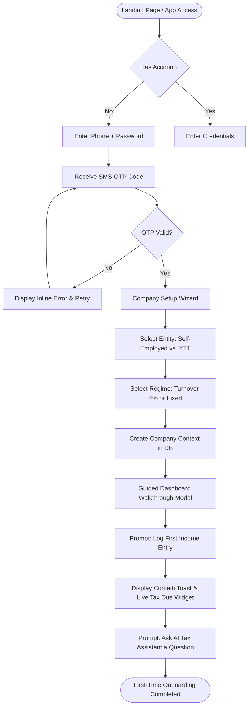
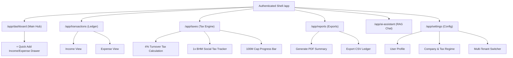
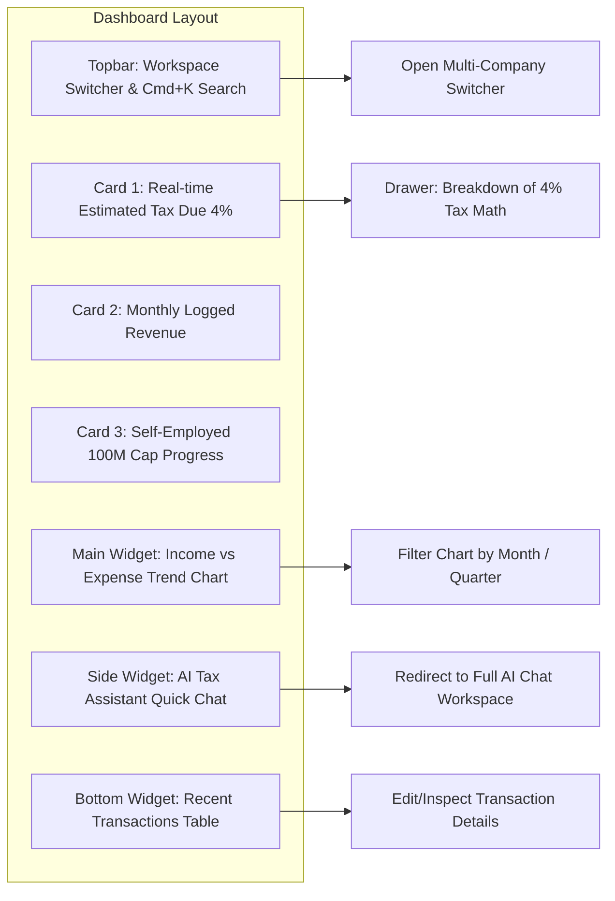
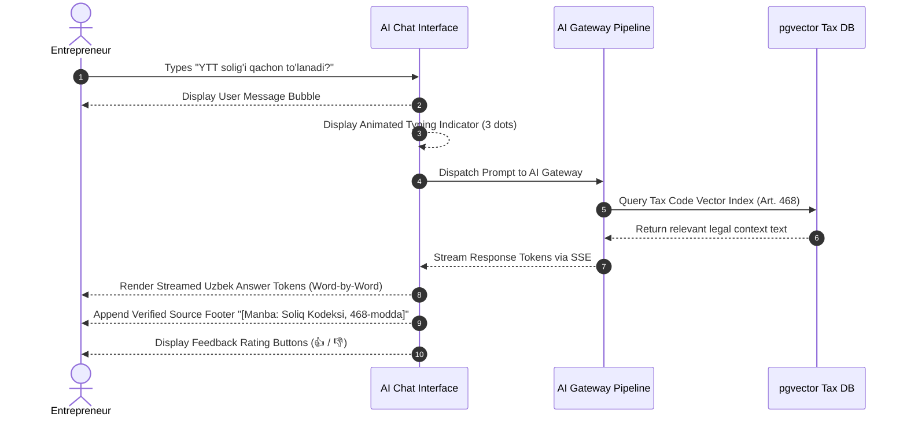
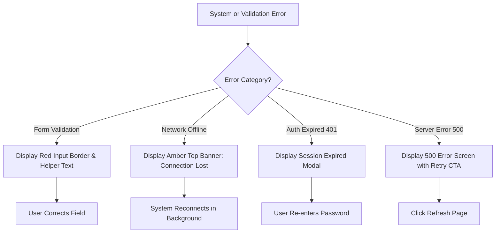

# Soliqly — UX Blueprint & Application Flow

**Version:** 1.0.0  
**Status:** Approved  
**Author:** Founding Product & Engineering Team (UX & Interaction Design Division)  
**Created Date:** July 27, 2026  
**Last Updated:** July 27, 2026  
**Related Documents:** [PROJECT_DISCOVERY.md](file:///c:/Users/LENOVO/soliqli/soliqli-1/docs/00-project-management/PROJECT_DISCOVERY.md), [PRD.md](file:///c:/Users/LENOVO/soliqli/soliqli-1/docs/01-product/PRD.md), [USER_RESEARCH.md](file:///c:/Users/LENOVO/soliqli/soliqli-1/docs/01-product/USER_RESEARCH.md), [INFORMATION_ARCHITECTURE.md](file:///c:/Users/LENOVO/soliqli/soliqli-1/docs/02-architecture/INFORMATION_ARCHITECTURE.md), [ENGINEERING_CONSTITUTION.md](file:///c:/Users/LENOVO/soliqli/soliqli-1/docs/ENGINEERING_CONSTITUTION.md)  
**Dependencies:** [PROJECT_DISCOVERY.md](file:///c:/Users/LENOVO/soliqli/soliqli-1/docs/00-project-management/PROJECT_DISCOVERY.md), [PRD.md](file:///c:/Users/LENOVO/soliqli/soliqli-1/docs/01-product/PRD.md), [USER_RESEARCH.md](file:///c:/Users/LENOVO/soliqli/soliqli-1/docs/01-product/USER_RESEARCH.md), [INFORMATION_ARCHITECTURE.md](file:///c:/Users/LENOVO/soliqli/soliqli-1/docs/02-architecture/INFORMATION_ARCHITECTURE.md)  

---

## 1. Executive Summary

### 1.1 Purpose of UX Blueprint
This User Experience (UX) Blueprint specifies the complete interaction design, onboarding flows, screen behavior, dashboard mechanics, state management (loading/empty/error), accessibility standards, and mobile interaction rules for **Soliqly**. It establishes a predictable, low-cognitive-load design system for self-employed individuals (*O'zini o'zi band qilgan shaxslar*), sole proprietors (*Yakka Tartibdagi Tadbirkorlar* - YTT), micro-businesses (*MCHJ*), and accountants in the Republic of Uzbekistan.

---

## 2. Categorized UX Goals

```
┌─────────────────────────────────────────────────────────────────────────────┐
│                           CATEGORIZED UX GOALS                              │
├─────────────────┬───────────────────────────────────────────────────────────┤
│ UX Dimension    │ Measurable User Experience Benchmark                      │
├─────────────────┼───────────────────────────────────────────────────────────┤
│ Business UX     │ Maximize onboarding completion (> 88%) and 3-day retention.│
│ User UX         │ Achieve sub-10-second transaction logging on mobile web.  │
│ Usability UX    │ Zero accounting jargon; 100% plain Uzbek/Russian terminology.│
│ Accessibility UX│ WCAG 2.1 AA keyboard navigation and screen reader support.│
│ AI Experience UX│ First-token streaming latency < 1.5s; 0% math hallucination.│
└─────────────────┴───────────────────────────────────────────────────────────┘
```

---

## 3. First-Time User Experience (FTUE) & Onboarding Flow



---

## 4. Master Application Flow



---

## 5. Screen Inventory & Interaction Blueprint

| Screen ID | Screen Title | Primary User | Main User Goal | Primary Actions | Expected Outcome | Dependencies |
| :--- | :--- | :--- | :--- | :--- | :--- | :--- |
| **SCR-UX-01** | **Landing Page** | Public Visitors | Understand Soliqly value & sign up | "Try Free", "Log In" | Redirect to Sign Up / Auth | None |
| **SCR-UX-02** | **Register / Login**| Guests | Authenticate via SMS & Password | Submit Phone, Verify OTP | Issued JWT & redirect | SCR-UX-01 |
| **SCR-UX-03** | **Company Wizard** | New Users | Set entity type (Self-Employed/YTT)| Select Entity & Tax Regime | Created Company in DB | SCR-UX-02 |
| **SCR-UX-04** | **Main Dashboard** | YTT / Self-Employed | Monitor live Tax Due & Revenue | Click "+ Add", Ask AI | Open Transaction Drawer | SCR-UX-03 |
| **SCR-UX-05** | **Transaction Ledger**| All Users | Audit, filter, search transactions | Filter by Date/Type, Search | Filtered Table View | SCR-UX-04 |
| **SCR-UX-06** | **Quick Add Drawer**| All Users | Log Income or Expense in seconds | Enter Amount, Category, Save | Updated Dashboard & DB | SCR-UX-04 |
| **SCR-UX-07** | **Tax Summary Hub**| YTT Owners | Check Turnover Tax & Social Tax | Inspect 4% Math, Set Reserve| Detailed Tax Sheet View | SCR-UX-04 |
| **SCR-UX-08** | **AI Assistant Chat**| All Users | Get Uzbek/Russian legal tax advice | Type question, click prompt | Streamed cited answer | SCR-UX-04 |
| **SCR-UX-09** | **Report Exporter**| YTT / Bookkeepers | Export offline compliance PDF | Select Date Range, Download | PDF file downloaded | SCR-UX-04 |

---

## 6. Main Dashboard Interaction Architecture



---

## 7. Standardized Interaction Patterns

| Interaction Pattern | UI Control Component | Trigger Behavior | Expected Feedback & Animation |
| :--- | :--- | :--- | :--- |
| **Primary Action** | High-contrast Solid Button | Mouse click / Mobile tap | Active press state (scale 0.98), instant modal open. |
| **Quick Transaction** | Bottom Slide-up Drawer | Tap "+ Quick Add" floating button | Smooth spring drawer slide-up from bottom viewport. |
| **Table Sorting** | Column Header Button | Click header cell (Date/Amount) | Toggle arrow icon ($\uparrow / \downarrow$), immediate re-sort. |
| **Filter Selection** | Multi-select Badge Pill | Click category filter pill | Active color state toggle, fade transaction rows. |
| **Global Search** | `Cmd+K` / `Ctrl+K` Overlay | Press hotkey or topbar search bar | Dim background backdrop, focus search input field. |
| **System Alert** | Top-right Toast Message | Form save or network status event | Slide-in toast notification with 4s auto-dismiss. |

---

## 8. Form Experience & Input Masking

### 8.1 Currency & Tax Input Validation Standard
* **Currency Formatting (UZS):** Automatic thousand separators rendered in real time (e.g., typing `12500000` renders as `12 500 000 UZS`).
* **Phone Number Mask:** Enforces national phone mask `+998 (XX) XXX-XX-XX`.
* **Smart Category Defaults:** Defaults expense category based on input text matching (e.g., typing *"Arenda"* defaults category to *"Rent & Facilities"*).
* **Autosave Drafts:** Form drawers retain unsubmitted text in local storage (`localStorage`) to prevent data loss upon accidental closure.

---

## 9. AI Conversational Experience & Safety UX



* **Confidence & Disclaimers:** Every AI response includes a subtle footer: *"AI guidance based on Uzbekistan Tax Code. Financial calculations executed by Soliqly Deterministic Engine."*

---

## 10. Empty State Matrix

| Module | Screen Context | Visual Layout Representation | Primary Action CTA |
| :--- | :--- | :--- | :--- |
| **Income** | Zero logged income | Illustration: Open wallet with sparkles | `[+ Add First Income]` button |
| **Expenses** | Zero logged expenses | Illustration: Receipt checklist | `[+ Add Expense]` button |
| **Reports** | No data for selected date range | Illustration: Calendar with question mark | `[Change Date Range]` dropdown |
| **Search** | Query returns zero matches | Illustration: Magnifying glass over document | `[Clear Search Filters]` button |
| **AI Chat** | New conversation session | 4 Suggested Prompt Pills (e.g., *"How to pay Social Tax?"*) | Click any prompt pill to begin |

---

## 11. Loading States & Skeleton Screens

```
[ Skeleton Card Loader ]
┌────────────────────────────────────────────────────────┐
│ ▒▒▒▒▒▒▒▒▒▒▒▒▒▒▒▒▒▒              ▒▒▒▒▒▒▒▒▒▒             │
│ ▒▒▒▒▒▒▒▒▒▒▒▒▒▒▒▒▒▒▒▒▒▒▒▒▒▒▒▒                           │
│                                                        │
│ ▒▒▒▒▒▒▒▒▒▒▒▒▒▒▒▒   ▒▒▒▒▒▒▒▒▒▒▒▒▒▒▒▒  ▒▒▒▒▒▒▒▒▒▒▒▒▒▒▒▒  │
└────────────────────────────────────────────────────────┘
```

* **Skeleton Loaders:** Replaces spinners for dashboard cards and table rows during API fetches, maintaining exact width/height layout stability.
* **Button Progress:** Submitting forms changes button state to disabled with an inline spinner (`"Saving transaction..."`).

---

## 12. Error Experience & Recovery Matrix



---

## 13. Mobile UX & Responsive Touch Guidelines

* **Bottom Navigation Bar:** Fixed position at bottom of mobile viewports (< 768px) containing 5 core touch targets (`Dashboard`, `Transactions`, `+ Add`, `Taxes`, `AI`).
* **Swipe Gestures:** Support swipe-to-delete or swipe-to-edit on transaction rows in mobile viewports.
* **Touch Target Buffer:** Minimum 48x48 px interactive size with an 8px spacing buffer between buttons.

---

## 14. Accessibility (WCAG 2.1 AA Compliance)

| Accessibility Requirement | Implementation Standard | Verification Test |
| :--- | :--- | :--- |
| **Keyboard Navigation** | Complete tab focus order through header, navigation, and modal forms. | Navigate entire app using `Tab`, `Enter`, and `Esc` keys. |
| **Focus Indicator** | Visible 2px high-contrast blue focus ring (`ring-2 ring-primary`). | Visual focus check on all inputs and buttons. |
| **Color Contrast Ratio** | Minimum 4.5:1 for normal text; 3:1 for large headers and icons. | Automated axe-core accessibility audit. |
| **Screen Reader Support** | Native `aria-label`, `aria-expanded`, and `role="dialog"` attributes. | VoiceOver (macOS/iOS) & TalkBack (Android) validation. |

---

## 15. Key UX Metrics Dashboard

* **Task Completion Rate (TCR):** Target ≥ 95% for logging transactions and exporting reports.
* **Time on Task (TOT):** Target < 10 seconds to add a new income transaction on mobile.
* **System Usability Scale (SUS):** Target SUS score ≥ 85/100 across surveyed YTT shop owners.

---

## 16. Future UX Evolution Roadmap

* **Phase 2 (Accounting Core):** Introduce split-screen Journal Ledger views for accountants.
* **Phase 3 (Mobile Camera OCR):** Camera shutter overlay inside the `+ Add` modal to auto-fill amount and vendor from paper receipts.
* **Phase 4 (Voice UX):** Uzbek voice-to-text input button inside the AI Assistant chat bar.

---

## 17. Cross References

* [PROJECT_DISCOVERY.md](file:///c:/Users/LENOVO/soliqli/soliqli-1/docs/00-project-management/PROJECT_DISCOVERY.md) — Baseline Product Discovery Document
* [PRD.md](file:///c:/Users/LENOVO/soliqli/soliqli-1/docs/01-product/PRD.md) — Product Requirements Document
* [USER_RESEARCH.md](file:///c:/Users/LENOVO/soliqli/soliqli-1/docs/01-product/USER_RESEARCH.md) — Personas & User Journeys
* [INFORMATION_ARCHITECTURE.md](file:///c:/Users/LENOVO/soliqli/soliqli-1/docs/02-architecture/INFORMATION_ARCHITECTURE.md) — Information Architecture Specification

---

**End of Document.**
