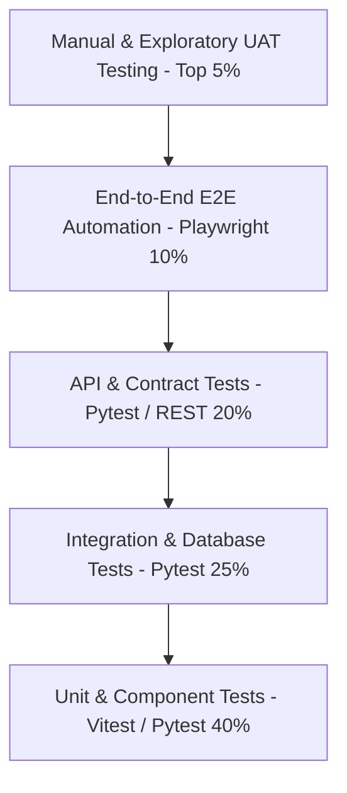
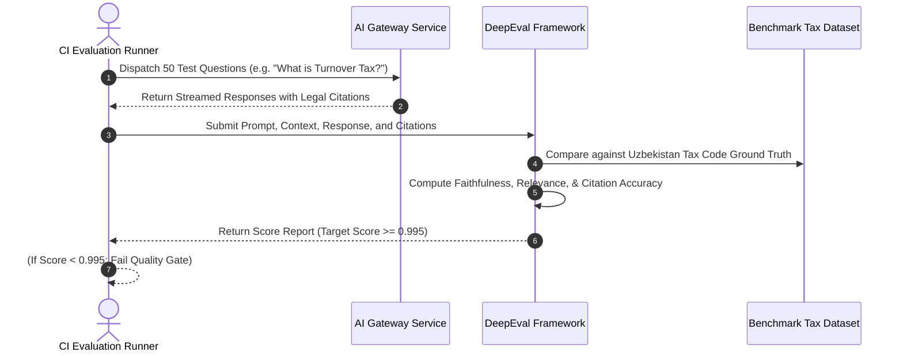
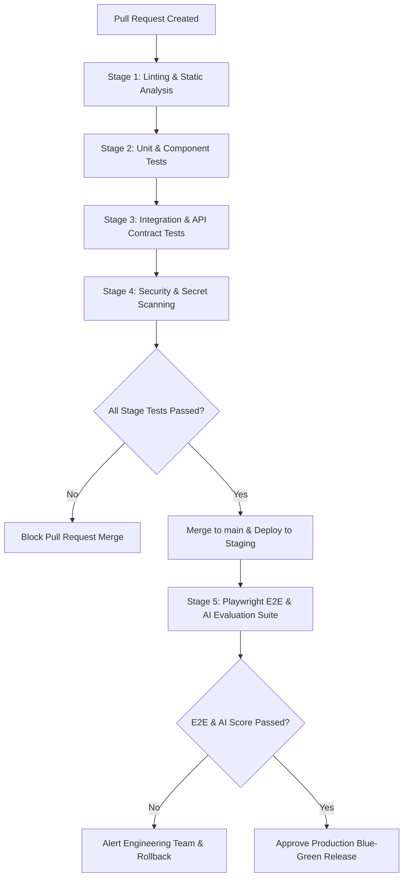
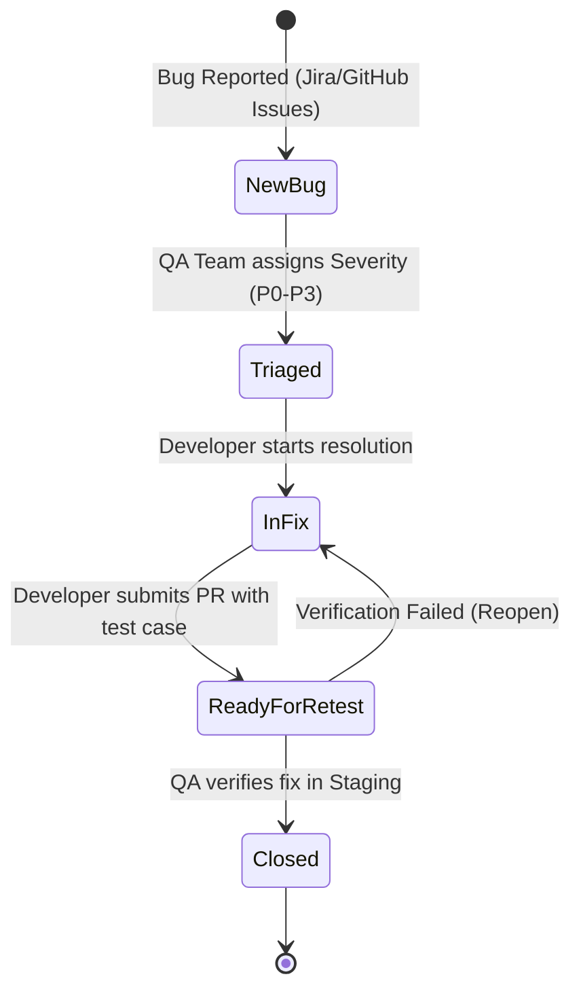

# Soliqly — Enterprise Testing Strategy & Quality Assurance Blueprint

**Version:** 1.0.0  
**Status:** Approved  
**Author:** Founding Product & Engineering Team (Quality Engineering & QA Division)  
**Created Date:** July 27, 2026  
**Last Updated:** July 27, 2026  
**Related Documents:** [PROJECT_DISCOVERY.md](file:///c:/Users/LENOVO/soliqli/soliqli-1/docs/00-project-management/PROJECT_DISCOVERY.md), [PRD.md](file:///c:/Users/LENOVO/soliqli/soliqli-1/docs/01-product/PRD.md), [USER_RESEARCH.md](file:///c:/Users/LENOVO/soliqli/soliqli-1/docs/01-product/USER_RESEARCH.md), [SOFTWARE_ARCHITECTURE.md](file:///c:/Users/LENOVO/soliqli/soliqli-1/docs/02-architecture/SOFTWARE_ARCHITECTURE.md), [DATABASE_BLUEPRINT.md](file:///c:/Users/LENOVO/soliqli/soliqli-1/docs/03-database/DATABASE_BLUEPRINT.md), [API_SPECIFICATION.md](file:///c:/Users/LENOVO/soliqli/soliqli-1/docs/04-api/API_SPECIFICATION.md), [AI_ARCHITECTURE.md](file:///c:/Users/LENOVO/soliqli/soliqli-1/docs/05-ai/AI_ARCHITECTURE.md), [SECURITY_ARCHITECTURE.md](file:///c:/Users/LENOVO/soliqli/soliqli-1/docs/07-security/SECURITY_ARCHITECTURE.md), [DEVOPS_ARCHITECTURE.md](file:///c:/Users/LENOVO/soliqli/soliqli-1/docs/08-devops/DEVOPS_ARCHITECTURE.md), [ENGINEERING_CONSTITUTION.md](file:///c:/Users/LENOVO/soliqli/soliqli-1/docs/ENGINEERING_CONSTITUTION.md)  
**Dependencies:** All Baseline Phase 0 Architectural, Data, API, AI, Security, and DevOps Specifications  

---

## 1. Executive Summary

### 1.1 Purpose of Testing Strategy
This Enterprise Testing Strategy and Quality Assurance Blueprint establishes the multi-layered verification framework, automated testing pipelines, deterministic tax calculation validation benchmarks, AI evaluation metrics, security scanning gates, and release criteria for **Soliqly**.

The strategy guarantees 100% mathematical accuracy for turnover and social tax calculations (*Soliq Qo'mitasi* compliance), zero AI math hallucinations, sub-250ms API response performance, and high production stability across Next.js web applications, FastAPI backends, and PostgreSQL data stores in Uzbekistan.

---

## 2. Core Quality Engineering Principles

```
┌─────────────────────────────────────────────────────────────────────────────┐
│                       CORE QUALITY DESIGN PRINCIPLES                        │
├─────────────────┬───────────────────────────────────────────────────────────┤
│ Principle       │ Architectural Specification & Enforcement                 │
├─────────────────┼───────────────────────────────────────────────────────────┤
│ 1. Shift Left   │ Testing begins during Phase 0 architecture & API contract │
│                 │ design. Automated unit & lint tests run on every commit.  │
│ 2. Test Pyramid │ Heavy unit/component test foundation with lean, high-value │
│                 │ integration, API, and End-to-End (E2E) automation suites. │
│ 3. Deterministic│ Financial tax calculation formulas are verified against   │
│    Tax Math     │ official State Tax Committee test suites with 0% margin.  │
│ 4. AI Evaluation│ AI outputs pass multi-metric benchmark evaluations for    │
│    Benchmarking │ legal citation accuracy, grounding, and safety guardrails. │
│ 5. Automated    │ 100% automated regression gates in CI/CD before any code   │
│    Release Gates│ reaches Staging or Production Blue-Green environments.    │
└─────────────────┴───────────────────────────────────────────────────────────┘
```

---

## 3. Standardized Testing Pyramid



---

## 4. Master Test Types & Strategy Catalog

| Test Category | Framework / Tool | Test Target | Execution Trigger | Success Benchmark |
| :--- | :--- | :--- | :--- | :--- |
| **Static Analysis** | ESLint, Ruff, Mypy | Code syntax, types, style | On Git Commit / Push | 0 Errors, 0 Type Warnings. |
| **Unit Testing** | Pytest (Python), Vitest (TS) | Individual functions, tax math | Every Pull Request | ≥ 85% Code Coverage. |
| **Integration Testing**| Pytest Async + Testcontainers| FastAPI + Postgres + Redis | CI Pipeline Build | 100% DB transaction rollback clean. |
| **API Testing** | Pytest HTTPX / Tavern | REST `/api/v1` endpoints | CI Pipeline Build | 100% Schema & Status validation. |
| **E2E Testing** | Playwright (TypeScript) | Web SPA onboarding & checkout | Pre-Merge to `main` | 100% Critical user journey pass. |
| **AI RAG Evaluation** | DeepEval / Ragas | Vector retrieval & prompt citation| Daily Scheduled Build | ≥ 99.5% Legal Citation Accuracy. |
| **Security Scanning** | Trivy, Gitleaks, OWASP ZAP| Container images, secrets, OWASP | CI/CD Build Gate | 0 High/Critical Vulnerabilities. |
| **Performance Testing**| Locust / k6 | API throughput & latency | Weekly / Pre-Release | p95 Latency < 250ms @ 500 rps. |
| **Accessibility (a11y)**| axe-core / Pa11y | Web SPA visual accessibility | CI Pipeline Build | WCAG 2.1 AA Compliance (0 Errors).|

---

## 5. Deterministic Tax Math & Financial Calculation Testing

* **Rule of Zero Margin:** Turnover tax (4%) and social tax calculations (*Ijtimoiy soliq*) must evaluate with 100% mathematical precision.
* **Test Dataset:** Tested against official State Tax Committee test scenario datasets spanning 100+ business edge cases (e.g., entity threshold breaches, leap year periods, BHM updates).

```python
# Conceptual Tax Engine Unit Test Specification (Pytest Standard)
def test_turnover_tax_calculation_ytt_4_percent():
    # Given a YTT entity with gross revenue of 50,000,000 UZS
    gross_revenue = 50_000_000
    tax_rate = 0.04
    
    # When calculated by the deterministic Python tax engine
    tax_due = calculate_turnover_tax(gross_revenue, tax_rate)
    
    # Then turnover tax must equal exactly 2,000,000 UZS
    assert tax_due == 2_000_000
```

---

## 6. AI Platform & RAG Evaluation Testing



### 6.1 Key AI Quality Evaluation Metrics
1. **Faithfulness & Grounding:** Evaluates whether AI completions rely strictly on retrieved Tax Code vector chunks (`pgvector`). Target: **100%**.
2. **Citation Accuracy:** Verifies that legal source citations (e.g., *Soliq Kodeksi, 467-modda*) reference exact matching articles. Target: **100%**.
3. **Deterministic Math Compliance:** Audits AI answers to verify no hallucinated monetary numbers contradict backend engine calculations. Target: **0% Error**.

---

## 7. CI/CD Automated Testing Pipeline & Quality Gates



---

## 8. Release Quality Gate Matrix

| Quality Gate Name | Gate Type | Mandatory Success Threshold | Blocking Enforcement |
| :--- | :--- | :--- | :--- |
| **Code Coverage Gate** | Automated CI | Overall Code Coverage ≥ **85%**; Core Tax Engine Coverage = **100%**. | Hard Block (PR Merge Rejected). |
| **Security CVE Gate** | Automated CI | **0 High or Critical** vulnerabilities in Trivy container scans. | Hard Block (Deployment Halted). |
| **AI Accuracy Gate** | Automated CI | DeepEval Legal Citation Accuracy Score ≥ **99.5%**. | Hard Block (Staging Promotion Halted). |
| **API Latency Gate** | Automated CI | p95 API Latency < **250 ms** under simulated load. | Hard Block (Production Release Halted). |
| **Accessibility Gate** | Automated CI | **0 WCAG 2.1 AA Errors** in automated axe-core browser scan. | Soft Block (Requires QA Review). |

---

## 9. Defect Severity & SLA Matrix



| Severity Level | Definition & Examples | Resolution SLA | Hotfix Required? |
| :--- | :--- | :--- | :--- |
| **P0 (Blocker)** | Incorrect tax calculation, security breach, application crash, data loss. | **< 4 Hours** | **Immediate Hotfix** |
| **P1 (Critical)** | Core feature broken (e.g. inability to add income, API 500 error). | **< 24 Hours** | Same-day Release |
| **P2 (Major)** | Secondary feature issue, minor UI layout bug, slow page load. | **< 3 Days** | Next Sprint Release |
| **P3 (Minor)** | Minor cosmetic issue, typo in help text, non-critical enhancement. | **< 10 Days** | Future Backlog |

---

## 10. Test Data & Scenario Management

1. **Synthetic Tax Datasets:** Maintained in `tests/datasets/tax_scenarios.json` covering self-employed income limits, YTT turnover tiers (4%), social tax rates (*BHM* multipliers), and quarterly filing deadlines.
2. **Database Test Isolation:** Integration tests run inside containerized PostgreSQL instances using `pytest-asyncio`, rolling back transaction state after every test case.
3. **Anonymized Production Snapshots:** Real customer data is strictly prohibited in non-production environments.

---

## 11. Cross References

* [PROJECT_DISCOVERY.md](file:///c:/Users/LENOVO/soliqli/soliqli-1/docs/00-project-management/PROJECT_DISCOVERY.md) — Baseline Product Discovery Document
* [PRD.md](file:///c:/Users/LENOVO/soliqli/soliqli-1/docs/01-product/PRD.md) — Product Requirements Document
* [SOFTWARE_ARCHITECTURE.md](file:///c:/Users/LENOVO/soliqli/soliqli-1/docs/02-architecture/SOFTWARE_ARCHITECTURE.md) — Software Architecture Blueprint
* [DATABASE_BLUEPRINT.md](file:///c:/Users/LENOVO/soliqli/soliqli-1/docs/03-database/DATABASE_BLUEPRINT.md) — Enterprise Database Blueprint
* [API_SPECIFICATION.md](file:///c:/Users/LENOVO/soliqli/soliqli-1/docs/04-api/API_SPECIFICATION.md) — Enterprise API Specification
* [AI_ARCHITECTURE.md](file:///c:/Users/LENOVO/soliqli/soliqli-1/docs/05-ai/AI_ARCHITECTURE.md) — Enterprise AI Platform Specification
* [SECURITY_ARCHITECTURE.md](file:///c:/Users/LENOVO/soliqli/soliqli-1/docs/07-security/SECURITY_ARCHITECTURE.md) — Enterprise Security Blueprint
* [DEVOPS_ARCHITECTURE.md](file:///c:/Users/LENOVO/soliqli/soliqli-1/docs/08-devops/DEVOPS_ARCHITECTURE.md) — DevOps Architecture Blueprint

---

**End of Document.**
