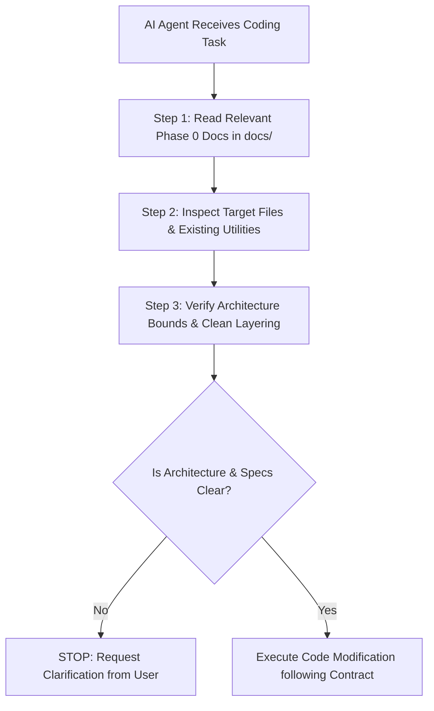
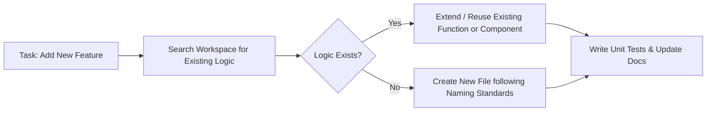
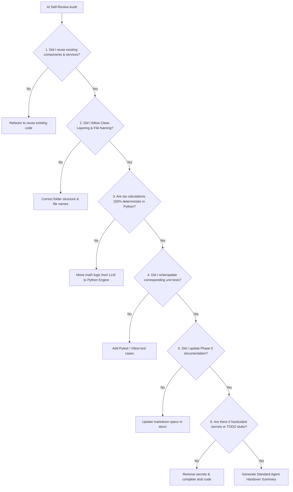

# Soliqly — AI Agent Development Contract & Coding Protocol

**Version:** 1.0.0  
**Status:** Approved & Binding  
**Author:** Founding Product & Engineering Team (AI Governance & Engineering Excellence Division)  
**Created Date:** July 27, 2026  
**Last Updated:** July 27, 2026  
**Related Documents:** [PROJECT_DISCOVERY.md](file:///c:/Users/LENOVO/soliqli/soliqli-1/docs/00-project-management/PROJECT_DISCOVERY.md), [PRD.md](file:///c:/Users/LENOVO/soliqli/soliqli-1/docs/01-product/PRD.md), [SOFTWARE_ARCHITECTURE.md](file:///c:/Users/LENOVO/soliqli/soliqli-1/docs/02-architecture/SOFTWARE_ARCHITECTURE.md), [DATABASE_BLUEPRINT.md](file:///c:/Users/LENOVO/soliqli/soliqli-1/docs/03-database/DATABASE_BLUEPRINT.md), [API_SPECIFICATION.md](file:///c:/Users/LENOVO/soliqli/soliqli-1/docs/04-api/API_SPECIFICATION.md), [AI_ARCHITECTURE.md](file:///c:/Users/LENOVO/soliqli/soliqli-1/docs/05-ai/AI_ARCHITECTURE.md), [SECURITY_ARCHITECTURE.md](file:///c:/Users/LENOVO/soliqli/soliqli-1/docs/07-security/SECURITY_ARCHITECTURE.md), [DEVOPS_ARCHITECTURE.md](file:///c:/Users/LENOVO/soliqli/soliqli-1/docs/08-devops/DEVOPS_ARCHITECTURE.md), [TESTING_STRATEGY.md](file:///c:/Users/LENOVO/soliqli/soliqli-1/docs/09-quality/TESTING_STRATEGY.md), [ENGINEERING_PLAYBOOK.md](file:///c:/Users/LENOVO/soliqli/soliqli-1/docs/10-engineering/ENGINEERING_PLAYBOOK.md), [PRODUCT_ROADMAP.md](file:///c:/Users/LENOVO/soliqli/soliqli-1/docs/11-roadmap/PRODUCT_ROADMAP.md), [ENGINEERING_CONSTITUTION.md](file:///c:/Users/LENOVO/soliqli/soliqli-1/docs/ENGINEERING_CONSTITUTION.md)  
**Dependencies:** Mandatory Contract for All Human Developers and Autonomous AI Coding Agents  

---

## 1. Executive Summary & Governance Scope

### 1.1 Purpose of AI Agent Contract
This AI Agent Development Contract establishes the mandatory engineering rules, architectural boundaries, code modification protocols, database safety constraints, security guardrails, and quality gates governing **all AI coding agents** operating on **Soliqly**.

### 1.2 Target AI Coding Agent Platforms
This contract is binding upon all current and future autonomous AI coding agents, pair programmers, subagents, and LLM code generators, including:
* **Google Antigravity** (Primary Agentic Architecture Environment)
* **Kimi, ChatGPT, Claude, Claude Code, Codex, Gemini CLI**
* **Cursor, Windsurf, GitHub Copilot, OpenHands, Aider, OpenCode**

```
┌─────────────────────────────────────────────────────────────────────────────┐
│                      MANDATORY AI AGENT CONTRACT RULE                       │
├─────────────────────────────────────────────────────────────────────────────┤
│ No AI agent is permitted to write, edit, refactor, or delete code in the    │
│ Soliqly repository without verifying compliance with this contract.        │
└─────────────────────────────────────────────────────────────────────────────┘
```

---

## 2. Core AI Governance Principles

```
┌─────────────────────────────────────────────────────────────────────────────┐
│                       CORE AI GOVERNANCE PRINCIPLES                         │
├─────────────────┬───────────────────────────────────────────────────────────┤
│ Principle       │ Architectural Specification & Enforcement                 │
├─────────────────┼───────────────────────────────────────────────────────────┤
│ 1. Read First   │ AI agents MUST inspect documentation & existing source    │
│                 │ code before writing or editing a single line of code.     │
│ 2. Zero         │ AI agents MUST search for existing services, components,  │
│    Duplication  │ and utilities, reusing them instead of re-implementing.  │
│ 3. Deterministic│ Financial tax calculations executed strictly in Python,   │
│    Tax Core     │ prohibiting LLM probabilistic mathematical reasoning.    │
│ 4. Clean        │ Enforce inward dependency flow:                           │
│    Architecture │ Presentation ➔ Application ➔ Domain ➔ Infrastructure.     │
│ 5. Complete     │ AI agents MUST update corresponding unit tests and docs    │
│    Handover     │ for every code modification made in the codebase.         │
└─────────────────┴───────────────────────────────────────────────────────────┘
```

---

## 3. Required Pre-Check Verification Protocol



Before generating any implementation code, every AI agent **must execute the following 4-step pre-check**:

1. **Step 1 — Document Inspection:** Inspect [SOFTWARE_ARCHITECTURE.md](file:///c:/Users/LENOVO/soliqli/soliqli-1/docs/02-architecture/SOFTWARE_ARCHITECTURE.md), [DATABASE_BLUEPRINT.md](file:///c:/Users/LENOVO/soliqli/soliqli-1/docs/03-database/DATABASE_BLUEPRINT.md), [API_SPECIFICATION.md](file:///c:/Users/LENOVO/soliqli/soliqli-1/docs/04-api/API_SPECIFICATION.md), and [ENGINEERING_PLAYBOOK.md](file:///c:/Users/LENOVO/soliqli/soliqli-1/docs/10-engineering/ENGINEERING_PLAYBOOK.md).
2. **Step 2 — Code Search:** Execute file search/grep to locate existing functions, components, hooks, or repositories.
3. **Step 3 — Dependency Verification:** Verify that new code imports from existing shared packages (`packages/ui`, `packages/types`, `packages/shared`).
4. **Step 4 — Alignment Check:** Verify that changes align with Phase 1 MVP scope in [PRODUCT_ROADMAP.md](file:///c:/Users/LENOVO/soliqli/soliqli-1/docs/11-roadmap/PRODUCT_ROADMAP.md).

---

## 4. Strict Code Modification & Refactoring Rules



* **Search Before Write:** Agents MUST run code search tools (`grep_search`, `view_file`) prior to adding new helper functions.
* **Reuse UI Primitives:** All UI elements MUST utilize existing shadcn/ui components (`packages/ui`).
* **Zero Duplicate Services:** Backend logic MUST extend domain services in `apps/api/app/domains/` rather than creating inline controller logic.
* **Refactor over Bloat:** Prefer refactoring existing helper functions over creating duplicate inline implementations.

---

## 5. Architectural Boundaries & Domain Isolation Rules

| Domain Layer | Allowed Imports | Prohibited Imports | Enforcement Violation Action |
| :--- | :--- | :--- | :--- |
| **Presentation Layer** (`apps/web`) | Domain Schemas, UI Primitives, Client Hooks. | DB ORM Models, Backend Routers, Secrets. | Hard Reject. |
| **Application Layer** (`apps/api/app/api`) | Services, DTO Schemas, Dependency Injection. | Raw SQL Queries, Database Sessions directly. | Hard Reject (Must use Service). |
| **Domain Layer** (`apps/api/app/domains`) | Pure Python, Domain Entities, Interfaces. | FastAPI Router objects, HTTP Web Frameworks. | Hard Reject (Domain must be pure).|
| **Infrastructure Layer** (`infrastructure`) | Docker, Nginx, DB Engines, MinIO, Redis. | Application UI Components, React Hooks. | Hard Reject. |

---

## 6. Database Safety & Migration Governance

```sql
-- MANDATORY DATABASE INTEGRITY RULES FOR AI AGENTS:
-- 1. All primary keys MUST use UUID v4: `id UUID PRIMARY KEY DEFAULT uuid_generate_v4()`
-- 2. Transactional tables MUST include soft deletion: `deleted_at TIMESTAMPTZ NULL`
-- 3. All monetary values MUST use BIGINT integers in Uzbek Som (UZS)
-- 4. Multi-tenant isolation MUST include: `company_id UUID NOT NULL REFERENCES companies(id)`
```

* **Alembic Migration Requirement:** Schema changes MUST be accompanied by executable Alembic migration scripts in `scripts/migrations/`.
* **Zero Destructive Drops:** AI agents are strictly prohibited from generating `DROP TABLE` or `DROP COLUMN` DDL scripts without explicit user authorization.

---

## 7. AI Platform & Deterministic Math Directives

```
┌─────────────────────────────────────────────────────────────────────────────┐
│                    RULE OF DETERMINISTIC TAX MATH FOR AI                    │
├─────────────────────────────────────────────────────────────────────────────┤
│ LLM models (OpenAI, Gemini, Claude) MUST NEVER calculate financial numbers  │
│ or monetary tax liabilities. All math MUST be executed by backend Python   │
│ units. LLMs process natural language context & formatting ONLY.            │
└─────────────────────────────────────────────────────────────────────────────┘
```

* **RAG Legal Citations:** AI completions providing tax advice MUST cite exact articles from the Uzbekistan Tax Code (*Soliq Kodeksi*).
* **Prompt Versioning:** Prompts MUST be stored in `packages/shared/prompts/` with semantic version headers.

---

## 8. Master Forbidden Actions Matrix

| Forbidden Action | Violation Description | Remediation Protocol |
| :--- | :--- | :--- |
| **Hardcoded Secrets** | Writing API keys, DB passwords, or tokens in source code. | Immediately remove & use environment variables (`.env`). |
| **Floating-Point Currency** | Storing UZS monetary amounts as `FLOAT` or `NUMERIC`. | Convert to 64-bit `BIGINT` integer Uzbek Som. |
| **Placeholder Code** | Leaving `// TODO: implement later` or empty mock functions.| Write complete production implementation or ask user. |
| **Duplicate Components** | Creating duplicate Button/Input React components. | Import existing primitive from `packages/ui`. |
| **Bypassing Service Layer** | Writing SQL/ORM queries directly inside FastAPI route handlers.| Move database query logic to Domain Repository class. |
| **Deleting Unit Tests** | Deleting or commenting out failing test assertions. | Fix underlying code to make tests pass legitimately. |

---

## 9. Mandatory AI Self-Review Verification Protocol

Before declaring any coding task complete, the AI agent **must execute this 6-point self-review**:



---

## 10. Standard AI Agent Handover Output Format

For every completed coding task, the AI agent **must output a structured handover report** formatted as follows:

```markdown
### AI Coding Agent Task Handover Summary

* **Task Description:** [Brief description of what was built or refactored]
* **Files Created / Modified:**
  * `[NEW]` [apps/web/components/TransactionDrawer.tsx](file:///c:/Users/LENOVO/soliqli/soliqli-1/apps/web/components/TransactionDrawer.tsx)
  * `[MODIFY]` [apps/api/app/domains/taxes/services.py](file:///c:/Users/LENOVO/soliqli/soliqli-1/apps/api/app/domains/taxes/services.py)
* **Architectural Rationale:** [Reasoning behind key technical design choices]
* **Verification & Testing Conducted:** [Pytest / Vitest test execution output]
* **Documentation Updated:** [Files updated in docs/]
* **Potential Risks / Follow-ups:** [Any open considerations for human review]
```

---

## 11. Cross References

* [PROJECT_DISCOVERY.md](file:///c:/Users/LENOVO/soliqli/soliqli-1/docs/00-project-management/PROJECT_DISCOVERY.md) — Baseline Product Discovery Document
* [PRD.md](file:///c:/Users/LENOVO/soliqli/soliqli-1/docs/01-product/PRD.md) — Product Requirements Document
* [SOFTWARE_ARCHITECTURE.md](file:///c:/Users/LENOVO/soliqli/soliqli-1/docs/02-architecture/SOFTWARE_ARCHITECTURE.md) — Software Architecture Blueprint
* [DATABASE_BLUEPRINT.md](file:///c:/Users/LENOVO/soliqli/soliqli-1/docs/03-database/DATABASE_BLUEPRINT.md) — Enterprise Database Blueprint
* [API_SPECIFICATION.md](file:///c:/Users/LENOVO/soliqli/soliqli-1/docs/04-api/API_SPECIFICATION.md) — Enterprise API Specification
* [AI_ARCHITECTURE.md](file:///c:/Users/LENOVO/soliqli/soliqli-1/docs/05-ai/AI_ARCHITECTURE.md) — Enterprise AI Platform Specification
* [SECURITY_ARCHITECTURE.md](file:///c:/Users/LENOVO/soliqli/soliqli-1/docs/07-security/SECURITY_ARCHITECTURE.md) — Enterprise Security Blueprint
* [DEVOPS_ARCHITECTURE.md](file:///c:/Users/LENOVO/soliqli/soliqli-1/docs/08-devops/DEVOPS_ARCHITECTURE.md) — DevOps Architecture Blueprint
* [TESTING_STRATEGY.md](file:///c:/Users/LENOVO/soliqli/soliqli-1/docs/09-quality/TESTING_STRATEGY.md) — Testing Strategy Blueprint
* [ENGINEERING_PLAYBOOK.md](file:///c:/Users/LENOVO/soliqli/soliqli-1/docs/10-engineering/ENGINEERING_PLAYBOOK.md) — Engineering Standards Playbook
* [PRODUCT_ROADMAP.md](file:///c:/Users/LENOVO/soliqli/soliqli-1/docs/11-roadmap/PRODUCT_ROADMAP.md) — Product Roadmap & Master Plan

---

**End of Document.**
