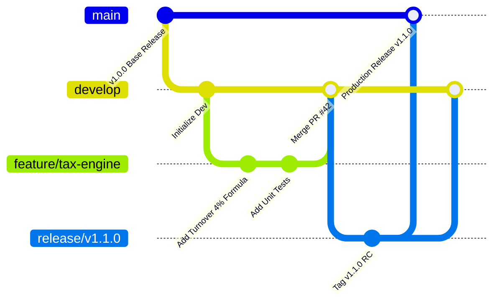
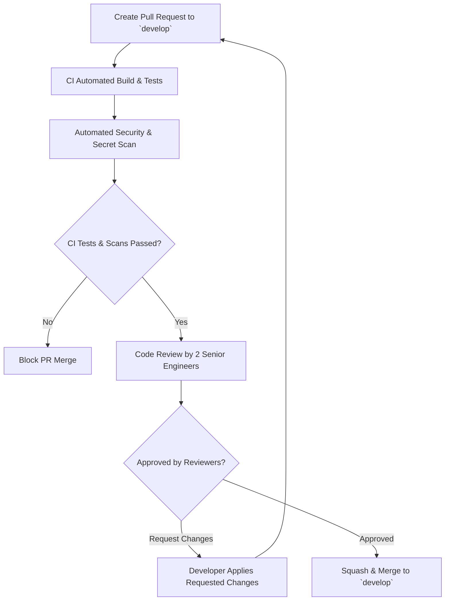

# Soliqly — Enterprise Engineering Standards & Development Playbook

**Version:** 1.0.0  
**Status:** Approved  
**Author:** Founding Product & Engineering Team (Engineering Excellence & Core Staff Division)  
**Created Date:** July 27, 2026  
**Last Updated:** July 27, 2026  
**Related Documents:** [PROJECT_DISCOVERY.md](file:///c:/Users/LENOVO/soliqli/soliqli-1/docs/00-project-management/PROJECT_DISCOVERY.md), [PRD.md](file:///c:/Users/LENOVO/soliqli/soliqli-1/docs/01-product/PRD.md), [USER_RESEARCH.md](file:///c:/Users/LENOVO/soliqli/soliqli-1/docs/01-product/USER_RESEARCH.md), [INFORMATION_ARCHITECTURE.md](file:///c:/Users/LENOVO/soliqli/soliqli-1/docs/02-architecture/INFORMATION_ARCHITECTURE.md), [SOFTWARE_ARCHITECTURE.md](file:///c:/Users/LENOVO/soliqli/soliqli-1/docs/02-architecture/SOFTWARE_ARCHITECTURE.md), [DATABASE_BLUEPRINT.md](file:///c:/Users/LENOVO/soliqli/soliqli-1/docs/03-database/DATABASE_BLUEPRINT.md), [API_SPECIFICATION.md](file:///c:/Users/LENOVO/soliqli/soliqli-1/docs/04-api/API_SPECIFICATION.md), [AI_ARCHITECTURE.md](file:///c:/Users/LENOVO/soliqli/soliqli-1/docs/05-ai/AI_ARCHITECTURE.md), [SECURITY_ARCHITECTURE.md](file:///c:/Users/LENOVO/soliqli/soliqli-1/docs/07-security/SECURITY_ARCHITECTURE.md), [DEVOPS_ARCHITECTURE.md](file:///c:/Users/LENOVO/soliqli/soliqli-1/docs/08-devops/DEVOPS_ARCHITECTURE.md), [TESTING_STRATEGY.md](file:///c:/Users/LENOVO/soliqli/soliqli-1/docs/09-quality/TESTING_STRATEGY.md), [ENGINEERING_CONSTITUTION.md](file:///c:/Users/LENOVO/soliqli/soliqli-1/docs/ENGINEERING_CONSTITUTION.md)  
**Dependencies:** All Baseline Phase 0 Architectural, Product, and Infrastructure Specifications  

---

## 1. Executive Summary

### 1.1 Purpose of Engineering Playbook
This Engineering Standards and Development Playbook establishes the mandatory coding rules, directory structures, naming conventions, git workflows, commit standards, code review checklists, AI coding agent instructions, error handling rules, and release protocols for **Soliqly**.

This document serves as the operational handbook for all human software engineers, staff architects, and autonomous AI coding agents contributing code or documentation to the Soliqly platform.

---

## 2. Core Engineering Principles

```
┌─────────────────────────────────────────────────────────────────────────────┐
│                       CORE ENGINEERING PLAYBOOK PRINCIPLES                  │
├─────────────────┬───────────────────────────────────────────────────────────┤
│ Principle       │ Architectural Rationale & Implementation                  │
├─────────────────┼───────────────────────────────────────────────────────────┤
│ 1. SOLID        │ Single Responsibility, Open/Closed, Liskov Substitution,  │
│                 │ Interface Segregation, Dependency Inversion.              │
│ 2. Clean Layering│ Strictly inward dependency flow:                          │
│                 │ Presentation ➔ Application ➔ Domain ➔ Infrastructure.     │
│ 3. Deterministic│ Financial tax calculations executed strictly in Python,   │
│    Tax Math     │ prohibiting LLM probabilistic mathematical reasoning.    │
│ 4. AI First     │ Multi-agent orchestration, versioned prompt libraries,    │
│                 │ and native RAG vector embeddings (`pgvector`).            │
│ 5. Security by  │ OWASP ASVS v4 compliance, PII masking, AES-256 GCM DB     │
│    Default      │ field encryption, and zero hardcoded secrets.             │
└─────────────────┴───────────────────────────────────────────────────────────┘
```

---

## 3. Monorepo Structure & Directory Organization

```
soliqli/
├── apps/
│   ├── web/                     # Next.js 15 Web SPA (App Router)
│   │   ├── app/                 # Next.js Routes (/app/dashboard, /app/transactions)
│   │   ├── components/          # React UI Components
│   │   └── hooks/               # Custom React Hooks (TanStack Query)
│   └── api/                     # FastAPI Backend Application
│       ├── app/
│       │   ├── api/v1/          # REST API Controllers / Route Handlers
│       │   ├── core/            # Config, Security, Database Engine Setup
│       │   └── domains/         # Bounded Domain Modules (Auth, Txns, Taxes, AI)
├── packages/
│   ├── ui/                      # Shared shadcn/ui React Components
│   ├── types/                   # Shared TypeScript Interfaces & DTO Schemas
│   ├── config/                  # Shared Eslint, Prettier, TypeScript Configs
│   └── shared/                  # Deterministic Tax Rules & Prompt Templates
├── docs/                        # Phase 0 Documentation Repository (Parts 1-6)
├── scripts/                     # Seed Scripts & DB Migration Runners
└── infrastructure/              # Docker, Nginx & Terraform Deployment Specs
```

---

## 4. Master Naming Conventions Matrix

| Code Asset Category | Naming Standard | Case Pattern | Example |
| :--- | :--- | :--- | :--- |
| **Directory Names** | `kebab-case` | Lowercase hyphenated | `app/ai-assistant/` |
| **Frontend Component Files** | `PascalCase.tsx` | UpperCamelCase | `TransactionTable.tsx` |
| **Frontend Custom Hooks** | `useCamelCase.ts` | LowerCamelCase | `useTransactionSummary.ts` |
| **Backend Service Files** | `snake_case.py` | Lowercase underscore | `tax_calculation_service.py` |
| **Backend Repository Classes**| `PascalCaseRepository` | UpperCamelCase | `TransactionRepository` |
| **Database Tables** | `snake_case_plural` | Lowercase underscore | `transactions`, `tax_calculations` |
| **Database Columns** | `snake_case` | Lowercase underscore | `company_id`, `amount_uzs` |
| **Database Migrations** | `YYYYMMDD_HHMMSS_action.py`| Timestamped prefix | `20260727_143000_add_txns.py` |
| **Unit Test Files** | `test_*.py` / `*.test.ts` | Prefix / Suffix | `test_tax_engine.py` |
| **Markdown Documentation** | `UPPERCASE_SNAKE_CASE.md` | Uppercase underscore | `SOFTWARE_ARCHITECTURE.md` |

---

## 5. Frontend & Backend Technology Standards

### 5.1 Frontend Coding Standards (Next.js 15 + TypeScript)
* **TypeScript Strict Mode:** Mandatory `strict: true` in `tsconfig.json`. Explicit return types required for all exported functions (`noImplicitAny`).
* **Server Components vs. Client Components:** Default to Server Components (`RSC`). Use `'use client'` directive **only** when component requires interactive hooks (`useState`, `useEffect`, `useForm`).
* **Form & Schema Validation:** React Hook Form (`RHF`) paired with Zod schemas matching shared TypeScript DTO types (`packages/types`).
* **Styling:** Tailwind CSS v4 utility classes governed by design system tokens (`packages/ui`).

---

### 5.2 Backend Coding Standards (FastAPI + Python 3.13)
* **Async IO Standard:** Asynchronous route handlers (`async def`) for high-concurrency Non-Blocking I/O.
* **DTO Serialization:** Pydantic v2 schemas for explicit request payload validation and response serialization.
* **Database ORM:** Async SQLAlchemy 2.0 ORM query builders (`AsyncSession`) using the Repository Pattern.
* **Dependency Injection:** Inject database sessions, services, and current user context via FastAPI `Depends()`.

---

## 6. Git Workflow & Branching Strategy



### 6.1 Branch Naming Taxonomy
* `main`: Protected production branch (Only merged via release branches / hotfixes).
* `develop`: Active integration development branch.
* `feature/<domain>-<short-description>`: Feature branches (e.g. `feature/tax-engine-fixed-tax`).
* `fix/<issue-number>-<short-description>`: Bug fix branches (e.g. `fix/issue-102-calc-rounding`).
* `hotfix/<version>-<short-description>`: Emergency production hotfix (e.g. `hotfix/v1.0.1-auth-fix`).

---

## 7. Conventional Commit Standard

All commit messages **must** follow the Conventional Commits specification:

$$\text{type}(\text{scope}):\ \text{short description in imperative mood}$$

```bash
# Good Commit Examples
git commit -m "feat(taxes): add deterministic 4% turnover tax calculation function"
git commit -m "fix(auth): resolve JWT token expiration refresh cookie race condition"
git commit -m "docs(api): update OpenAPI specification for POST /api/v1/transactions"

# Bad Commit Examples (REJECTED BY CI)
git commit -m "updated code"
git commit -m "fixed bug"
```

---

## 8. Code Review & Pull Request Protocol



### 8.1 Code Review Checklist Matrix

| Review Dimension | Mandatory Quality Criterion | Verification Standard |
| :--- | :--- | :--- |
| **Architecture** | Respects Clean Layering (Presentation ➔ Domain ➔ Infra). | No reverse dependencies or direct framework imports in domain. |
| **Security** | OWASP compliant; no hardcoded API keys; input sanitized. | Pydantic validation used; zero raw SQL strings. |
| **Performance** | Database queries indexed; async/await properly used. | No N+1 query patterns; async IO handlers verified. |
| **Testing** | New feature covered by unit/integration tests (≥ 85%). | Pytest/Vitest suite passes 100%. |
| **AI Rules** | AI math isolation rule respected; prompts versioned. | LLMs never calculate financial numbers directly. |

---

## 9. Mandatory Instructions for AI Coding Agents

```
┌─────────────────────────────────────────────────────────────────────────────┐
│                      MANDATORY AI CODING AGENT DIRECTIVES                   │
├─────────────────────────────────────────────────────────────────────────────┤
│ 1. Read existing codebase before generating new code.                      │
│ 2. NEVER duplicate existing services, utilities, or React UI components.   │
│ 3. Strictly preserve Clean Architecture boundaries & domain layering.      │
│ 4. Write corresponding unit tests for every new function or route created. │
│ 5. NEVER generate placeholder code, stub comments, or unasked TODO items.  │
│ 6. Enforce 100% deterministic code for all tax & monetary calculations.     │
└─────────────────────────────────────────────────────────────────────────────┘
```

---

## 10. Error Handling & Structured Logging Standards

### 10.1 Structured JSON Logging Standard
All logs emitted by backend services must output structured JSON to `stdout`:

```json
{
  "timestamp": "2026-07-27T14:30:00.124Z",
  "level": "INFO",
  "service": "soliqly-api",
  "module": "app.domains.taxes.services",
  "trace_id": "req-902319208a01",
  "user_id": "usr-8f92a1b4-290c",
  "company_id": "c1a93b48-110a",
  "message": "Turnover tax calculated successfully",
  "context": {
    "gross_revenue_uzs": 45000000,
    "tax_due_uzs": 1800000
  }
}
```

---

## 11. Key Engineering Metrics Dashboard

* **Code Coverage:** Target ≥ **85%** overall (Core Tax Engine = **100%**).
* **Cyclomatic Complexity:** Target < **10** per function module.
* **Pull Request Review Time:** Target < **4 Hours** from creation to review feedback.
* **Change Failure Rate (CFR):** Target < **1.0%** in production deployments.
* **Mean Time to Recovery (MTTR):** Target < **30 Minutes**.

---

## 12. Cross References

* [PROJECT_DISCOVERY.md](file:///c:/Users/LENOVO/soliqli/soliqli-1/docs/00-project-management/PROJECT_DISCOVERY.md) — Baseline Product Discovery Document
* [PRD.md](file:///c:/Users/LENOVO/soliqli/soliqli-1/docs/01-product/PRD.md) — Product Requirements Document
* [SOFTWARE_ARCHITECTURE.md](file:///c:/Users/LENOVO/soliqli/soliqli-1/docs/02-architecture/SOFTWARE_ARCHITECTURE.md) — Software Architecture Blueprint
* [DATABASE_BLUEPRINT.md](file:///c:/Users/LENOVO/soliqli/soliqli-1/docs/03-database/DATABASE_BLUEPRINT.md) — Enterprise Database Blueprint
* [API_SPECIFICATION.md](file:///c:/Users/LENOVO/soliqli/soliqli-1/docs/04-api/API_SPECIFICATION.md) — Enterprise API Specification
* [AI_ARCHITECTURE.md](file:///c:/Users/LENOVO/soliqli/soliqli-1/docs/05-ai/AI_ARCHITECTURE.md) — Enterprise AI Platform Specification
* [SECURITY_ARCHITECTURE.md](file:///c:/Users/LENOVO/soliqli/soliqli-1/docs/07-security/SECURITY_ARCHITECTURE.md) — Enterprise Security Blueprint
* [DEVOPS_ARCHITECTURE.md](file:///c:/Users/LENOVO/soliqli/soliqli-1/docs/08-devops/DEVOPS_ARCHITECTURE.md) — DevOps Architecture Blueprint
* [TESTING_STRATEGY.md](file:///c:/Users/LENOVO/soliqli/soliqli-1/docs/09-quality/TESTING_STRATEGY.md) — Testing Strategy Blueprint

---

**End of Document.**
