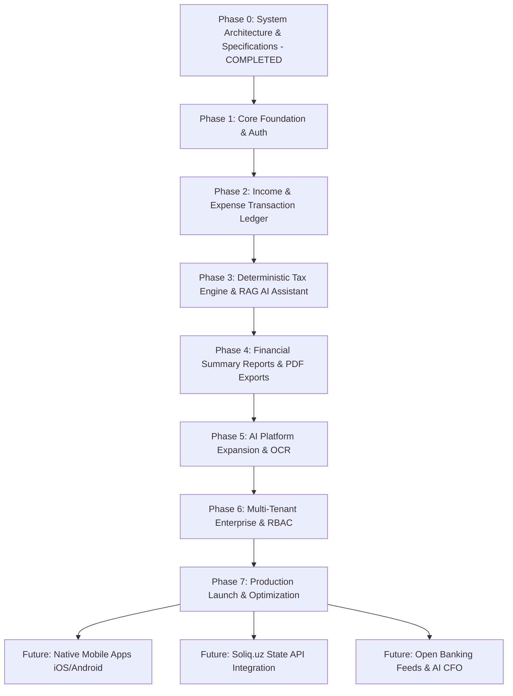
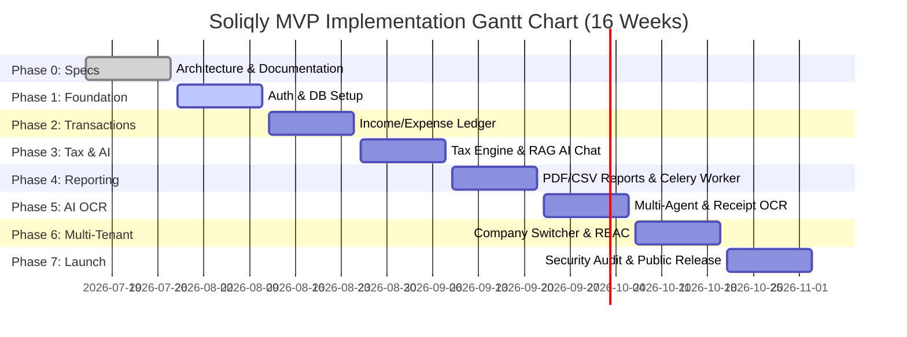
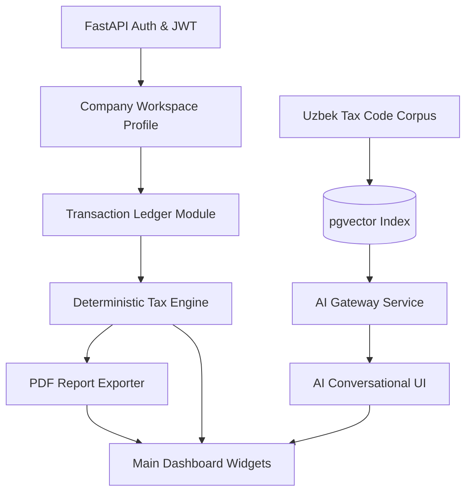

# Soliqly — Enterprise Product Roadmap, Delivery Strategy & Implementation Master Plan

**Version:** 1.0.0  
**Status:** Approved  
**Author:** Founding Product & Engineering Team (Product Delivery & Program Management Division)  
**Created Date:** July 27, 2026  
**Last Updated:** July 27, 2026  
**Related Documents:** [PROJECT_DISCOVERY.md](file:///c:/Users/LENOVO/soliqli/soliqli-1/docs/00-project-management/PROJECT_DISCOVERY.md), [PRD.md](file:///c:/Users/LENOVO/soliqli/soliqli-1/docs/01-product/PRD.md), [USER_RESEARCH.md](file:///c:/Users/LENOVO/soliqli/soliqli-1/docs/01-product/USER_RESEARCH.md), [INFORMATION_ARCHITECTURE.md](file:///c:/Users/LENOVO/soliqli/soliqli-1/docs/02-architecture/INFORMATION_ARCHITECTURE.md), [UX_BLUEPRINT.md](file:///c:/Users/LENOVO/soliqli/soliqli-1/docs/06-design/UX_BLUEPRINT.md), [DESIGN_SYSTEM.md](file:///c:/Users/LENOVO/soliqli/soliqli-1/docs/06-design/DESIGN_SYSTEM.md), [SOFTWARE_ARCHITECTURE.md](file:///c:/Users/LENOVO/soliqli/soliqli-1/docs/02-architecture/SOFTWARE_ARCHITECTURE.md), [DATABASE_BLUEPRINT.md](file:///c:/Users/LENOVO/soliqli/soliqli-1/docs/03-database/DATABASE_BLUEPRINT.md), [API_SPECIFICATION.md](file:///c:/Users/LENOVO/soliqli/soliqli-1/docs/04-api/API_SPECIFICATION.md), [AI_ARCHITECTURE.md](file:///c:/Users/LENOVO/soliqli/soliqli-1/docs/05-ai/AI_ARCHITECTURE.md), [SECURITY_ARCHITECTURE.md](file:///c:/Users/LENOVO/soliqli/soliqli-1/docs/07-security/SECURITY_ARCHITECTURE.md), [DEVOPS_ARCHITECTURE.md](file:///c:/Users/LENOVO/soliqli/soliqli-1/docs/08-devops/DEVOPS_ARCHITECTURE.md), [TESTING_STRATEGY.md](file:///c:/Users/LENOVO/soliqli/soliqli-1/docs/09-quality/TESTING_STRATEGY.md), [ENGINEERING_PLAYBOOK.md](file:///c:/Users/LENOVO/soliqli/soliqli-1/docs/10-engineering/ENGINEERING_PLAYBOOK.md), [ENGINEERING_CONSTITUTION.md](file:///c:/Users/LENOVO/soliqli/soliqli-1/docs/ENGINEERING_CONSTITUTION.md)  
**Dependencies:** All Baseline Phase 0 Architectural, Data, API, AI, Security, DevOps, and Engineering Specifications  

---

## 1. Executive Summary

### 1.1 Purpose of Product Roadmap
This Product Roadmap, Delivery Strategy & Implementation Master Plan establishes the delivery schedule, sprint breakdowns, phase milestones, feature prioritization matrices, risk management plans, team responsibilities, and release gates for **Soliqly**.

It bridges Phase 0 system documentation with Phase 1 execution, ensuring that human software engineers and autonomous AI coding agents deliver the Minimum Viable Product (MVP) on schedule, within scope, and in strict alignment with the financial and tax compliance realities of the Republic of Uzbekistan.

---

## 2. Product Vision & North Star Metric

### 2.1 Mission & Vision Statements
* **Mission:** Eliminate financial, accounting, and tax compliance friction for entrepreneurs in Uzbekistan by delivering an intuitive, automated, and intelligent AI platform that transforms complex state regulations into simple, actionable daily guidance.
* **Vision:** Become the **Financial Operating System of Uzbekistan**—the single digital infrastructure where every business entity registers, invoices, collects payments, calculates taxes, accesses capital, and maintains compliance effortlessly.

### 2.2 The North Star Metric
The primary indicator of product success for Soliqly is:

$$\text{North Star Metric} = \text{Active Business Entities filing accurate, zero-penalty tax returns in } < \mathbf{5\text{ minutes/month}}$$

---

## 3. Core Implementation Principles

```
┌─────────────────────────────────────────────────────────────────────────────┐
│                     CORE PRODUCT IMPLEMENTATION PRINCIPLES                  │
├─────────────────┬───────────────────────────────────────────────────────────┤
│ Principle       │ Architectural Specification & Delivery Rule               │
├─────────────────┼───────────────────────────────────────────────────────────┤
│ 1. MVP First    │ Soliqly MVP focuses strictly on core income/expense logging│
│                 │ deterministic 4% turnover tax math, and Uzbek RAG AI.     │
│ 2. Incremental  │ Ship functional software increments every 2-week sprint;  │
│    Delivery     │ validate early with real YTT shop owners and freelancers. │
│ 3. Deterministic│ Financial tax calculations executed strictly in Python,   │
│    Tax Core     │ prohibiting LLM probabilistic mathematical reasoning.    │
│ 4. Documentation│ Implementation follows approved Phase 0 specs. No code is │
│    First        │ written without a corresponding architectural design.     │
│ 5. AI-Assisted  │ Human engineers collaborate with autonomous AI agents     │
│    Engineering  │ following strict AI rules in the Engineering Playbook.    │
└─────────────────┴───────────────────────────────────────────────────────────┘
```

---

## 4. Product Evolution & Multi-Phase Roadmap



### 4.1 Implementation Phase Matrix

| Phase | Phase Name | Core Deliverables | Target Duration | Completion Gate |
| :--- | :--- | :--- | :--- | :--- |
| **Phase 0** | **System Documentation** | Complete Phase 0 specification repository (`docs/`). | **Weeks 1–2** | All 14 Phase 0 docs approved. |
| **Phase 1** | **Foundation & Auth** | Next.js 15 SPA shell, FastAPI Auth, JWT, PostgreSQL DB. | **Weeks 3–4** | User registration & login working. |
| **Phase 2** | **Transaction Ledger** | Income/Expense logger, ledger table, category system. | **Weeks 5–6** | Sub-10s mobile transaction logging. |
| **Phase 3** | **Tax Engine & AI Chat**| Turnover Tax (4%) engine, `pgvector` RAG, AI Assistant.| **Weeks 7–8** | 100% tax math accuracy; RAG working. |
| **Phase 4** | **Reporting & Exports** | PDF & CSV summary report generation, Celery task worker.| **Weeks 9–10** | Downloadable PDF tax statement working. |
| **Phase 5** | **AI OCR & Multi-Agent** | Multi-agent orchestration, image upload, OCR receipts. | **Weeks 11–12** | OCR parsing vendor & amounts. |
| **Phase 6** | **Multi-Tenant RBAC** | Organization switcher, bookkeeper roles (`OWNER`/`ACCOUNTANT`). | **Weeks 13–14** | Multi-company switching tested. |
| **Phase 7** | **Launch & Polish** | Blue-Green deployment, SRE monitoring, security audit. | **Weeks 15–16** | **Public MVP Production Launch**. |

---

## 5. MVP Scope & MoSCoW Prioritization Matrix

```
┌─────────────────────────────────────────────────────────────────────────────┐
│                           MVP MOSCOW SCOPE MATRIX                           │
├─────────────────────────────────────────────────────────────────────────────┤
│  MUST HAVE:     User Auth, Company Setup, Income/Expense Logger, Ledger,    │
│                 Deterministic Tax Calculator, Uzbek/Russian RAG AI, Reports  │
│  SHOULD HAVE:   Batch CSV Import, Category Analytics Charts, Dark Mode      │
│  COULD HAVE:    Telegram Notification Integration, Receipt Photo Upload     │
│  WON'T HAVE:    Inventory, CRM, Payroll, HR, ERP, Soliq.uz API Sync, E-IMZO │
└─────────────────────────────────────────────────────────────────────────────┘
```

| Feature Name | MoSCoW Category | Target User | Business & Technical Rationale |
| :--- | :--- | :--- | :--- |
| **Phone & Password Auth** | **Must Have** | All Users | Essential account security foundation. |
| **Entity Setup Wizard** | **Must Have** | YTT / Freelancer | Configures correct tax formulas (Turnover 4% vs Fixed). |
| **Income / Expense Logger**| **Must Have** | All Users | Core financial tracking input mechanism. |
| **Searchable Transaction Ledger**| **Must Have** | All Users | Financial visibility & audit log access. |
| **Deterministic Tax Calculator** | **Must Have** | YTT Owners | **P0 Core Value:** 100% accurate turnover tax calculation. |
| **Uzbek/Russian AI RAG Chat** | **Must Have** | All Users | Conversational tax guidance with legal source citations. |
| **PDF Tax Report Exporter** | **Must Have** | YTT / Bookkeeper | Offline record-keeping and state compliance filing. |
| **Soliq.uz Direct API Sync** | **Won't Have (MVP)** | YTT Owners | Deferred to Phase 4 post-MVP. |
| **Inventory / Payroll** | **Won't Have (MVP)** | MCHJ Companies | Explicitly excluded from MVP scope to prevent feature bloat.|

---

## 6. Master 2-Week Sprint Schedule



### 6.1 Sprint Planning Matrix (Sprints 0–8)

| Sprint ID | Sprint Focus / Goal | Primary Deliverables | Exit & Gate Criteria |
| :--- | :--- | :--- | :--- |
| **Sprint 0** | **Phase 0 Specifications** | All 14 Phase 0 technical & product docs (`docs/`). | All 14 docs approved by CTO/CPO. |
| **Sprint 1** | **Monorepo & Auth Foundation**| Next.js SPA shell, FastAPI backend, JWT Auth endpoints.| Users can register, log in, and issue tokens.|
| **Sprint 2** | **Company Context & Setup** | Company setup wizard, entity choice (Self-Employed/YTT).| Active company context persisted in DB. |
| **Sprint 3** | **Transaction Ledger Core** | "+ Add Income/Expense" drawer, transaction table. | Income/expense logged & rendered in ledger. |
| **Sprint 4** | **Deterministic Tax Engine** | Python math module computing 4% Turnover & Social Tax.| Tax due widget renders correct calculation math.|
| **Sprint 5** | **AI Platform RAG Assistant**| `pgvector` index, AI Gateway SSE streaming, Uzbek RAG. | AI streams answer with legal article citations. |
| **Sprint 6** | **PDF/CSV Report Exporter** | Celery background PDF generator, Cloudflare R2 links. | User can export downloadable PDF tax summary.|
| **Sprint 7** | **Multi-Tenant RBAC & Security**| Workspace switcher, security audit, rate limiting. | Bookkeeper can switch 35+ client accounts.|
| **Sprint 8** | **Production Blue-Green Launch**| CI/CD Blue-Green release, SRE Grafana monitoring. | **Public MVP Production Launch**. |

---

## 7. Major Project Milestones

```
[M0: Specs Ratified] ──► [M1: Core Auth Working] ──► [M2: Ledger & Tax Math Live]
                                                               │
[M5: Public MVP Launch] ◄── [M4: Beta Test Passed] ◄── [M3: RAG AI & PDF Live]
```

* **Milestone 0 (Week 2):** *Phase 0 Specifications Complete & Ratified.* (100% docs approved).
* **Milestone 1 (Week 4):** *Core Platform Foundation & Identity Live.* (Auth + DB working).
* **Milestone 2 (Week 8):** *Transaction Ledger & Tax Engine Operational.* (Tax math 100% accurate).
* **Milestone 3 (Week 10):** *AI RAG Assistant & PDF Reports Complete.* (Streamed answers + PDF exports).
* **Milestone 4 (Week 14):** *Closed Beta Testing Passed.* (Tested by 25 YTT shop owners in Tashkent).
* **Milestone 5 (Week 16):** *Production Launch & Public Availability.* (**Soliqly MVP Live**).

---

## 8. Master Technical Dependency Mapping



---

## 9. Comprehensive Risk Management Matrix

| Risk ID | Category | Description | Severity | Likelihood | Mitigation Strategy |
| :--- | :--- | :--- | :--- | :--- | :--- |
| **R-01** | **Regulatory** | State Tax Committee updates turnover tax rates or BHM values. | High | High | Store tax rates in database configuration tables (`tax_rates`), editable without code deployment. |
| **R-02** | **AI Safety** | LLM provides incorrect legal advice or hallucinated math. | Critical | Medium | Enforce strict RAG, display mandatory legal disclaimers, and compute math via Python engine. |
| **R-03** | **Security** | Unauthorized access to user financial transaction data. | Critical | Low | Encrypt stored data (AES-256 GCM); enforce JWT token rotation and tenant isolation by `company_id`. |
| **R-04** | **Adoption** | Non-accountant users confused by traditional financial terms. | High | Medium | Conduct usability testing; replace accounting jargon with plain Uzbek/Russian ("Money In", "Money Out"). |
| **R-05** | **Performance**| Latency spikes during end-of-month report generation window. | High | Medium | Offload report generation to asynchronous Celery workers backed by Redis queues. |

---

## 10. Team Responsibilities & AI Agent Collaboration Matrix

| Role / Agent | Primary Responsibilities | Phase 1–7 Deliverable Focus |
| :--- | :--- | :--- |
| **Product Manager (CPO)** | Requirements, user feedback, milestone sign-off. | PRD, User Stories, Backlog. |
| **Lead Architect (CTO)** | Architecture integrity, API contracts, security bounds. | System Architecture, ADRs. |
| **Frontend Engineer** | Next.js 15 SPA, shadcn/ui components, Zustand, forms. | Dashboard UI, Ledger, AI Chat UI. |
| **Backend Engineer** | FastAPI endpoints, Python tax math, Alembic migrations. | Auth API, Tax Engine, Repositories. |
| **AI / RAG Engineer** | `pgvector` indexing, AI Gateway, prompt templates. | RAG Pipeline, Vector Search, SSE. |
| **DevOps / SRE** | Docker, CI/CD Actions, Blue-Green deployments, monitoring.| Infrastructure, Pipelines, Grafana. |
| **QA Engineer** | Automated Pytest/Playwright suites, AI accuracy benchmarks.| Quality Gates, E2E Tests. |
| **AI Coding Agents** | Code generation following Engineering Playbook rules. | Component implementation & tests. |

---

## 11. Release Strategy & Quality Gates

* **Alpha Release (Week 10):** Internal testing by founding product team and architects.
* **Closed Beta Release (Week 14):** Private beta testing with 25 invited YTT shop owners and freelancers in Uzbekistan.
* **Production Release (Week 16):** Automated Zero-Downtime Blue-Green deployment to live production environment (`soliqly.uz`).
* **Release Quality Gate:** Requires 100% CI test pass rate, 0 High/Critical CVEs, DeepEval AI Accuracy ≥ 99.5%, and p95 API Latency < 250ms.

---

## 12. Master Success Metrics KPI Matrix

| Metric Category | Key Indicator Name | Measurement Tool | Target Goal |
| :--- | :--- | :--- | :--- |
| **Business KPI** | Monthly Recurring Revenue (MRR) | Stripe / Payment Gateway | **$50,000 MRR** by Month 12 |
| **User KPI** | Task Completion Time | Analytics Event Tracking | **< 10 Seconds** per income log |
| **Product KPI** | Net Promoter Score (NPS) | In-app Survey | **NPS ≥ +65** across YTT users |
| **Engineering KPI**| API Response Latency (p95) | OpenTelemetry / Prometheus | **< 250 ms** across all REST endpoints |
| **AI KPI** | Legal Citation Accuracy Score | DeepEval Framework | **≥ 99.5%** Citation Accuracy |
| **Quality KPI** | Production Change Failure Rate | GitHub Release Metrics | **< 1.0%** Release Failures |

---

## 13. Multi-Year Product Roadmap Evolution

```
Year 1 (MVP & Core Compliance)
├── Self-Employed & YTT Automated Registration
├── Turnover Tax Calculation Engine (Aylanma 4%)
├── Income & Expense Ledger Tracking
├── Uzbek/Russian AI Tax Assistant (RAG Core)
└── Basic Financial Summary Exports (PDF/CSV)

Year 3 (Ecosystem & Business Automation)
├── Multi-entity Management (MCHJ Full Support)
├── E-Faktura (Didox/Factura.uz) Integration & E-IMZO Signing
├── Automated Payroll, INPS & Social Tax Filing
├── Native Open Banking Real-time Sync (Kapitalbank, TBC)
└── Native Mobile Apps (iOS / Android)

Year 5 (Financial Operating System)
├── B2B Embedded Payments & Escrow Services
├── AI-Driven Credit Scoring for Business Loans
├── Inventory & Sales Tax Integration
└── Central Asian Expansion (Kazakhstan & Kyrgyzstan Tax Adaptations)
```

---

## 14. Cross References

* [PROJECT_DISCOVERY.md](file:///c:/Users/LENOVO/soliqli/soliqli-1/docs/00-project-management/PROJECT_DISCOVERY.md) — Baseline Product Discovery Document
* [PRD.md](file:///c:/Users/LENOVO/soliqli/soliqli-1/docs/01-product/PRD.md) — Product Requirements Document
* [USER_RESEARCH.md](file:///c:/Users/LENOVO/soliqli/soliqli-1/docs/01-product/USER_RESEARCH.md) — Personas & User Journeys
* [INFORMATION_ARCHITECTURE.md](file:///c:/Users/LENOVO/soliqli/soliqli-1/docs/02-architecture/INFORMATION_ARCHITECTURE.md) — Information Architecture Specification
* [SOFTWARE_ARCHITECTURE.md](file:///c:/Users/LENOVO/soliqli/soliqli-1/docs/02-architecture/SOFTWARE_ARCHITECTURE.md) — Software Architecture Blueprint
* [DATABASE_BLUEPRINT.md](file:///c:/Users/LENOVO/soliqli/soliqli-1/docs/03-database/DATABASE_BLUEPRINT.md) — Enterprise Database Blueprint
* [API_SPECIFICATION.md](file:///c:/Users/LENOVO/soliqli/soliqli-1/docs/04-api/API_SPECIFICATION.md) — Enterprise API Specification
* [AI_ARCHITECTURE.md](file:///c:/Users/LENOVO/soliqli/soliqli-1/docs/05-ai/AI_ARCHITECTURE.md) — Enterprise AI Platform Specification
* [SECURITY_ARCHITECTURE.md](file:///c:/Users/LENOVO/soliqli/soliqli-1/docs/07-security/SECURITY_ARCHITECTURE.md) — Enterprise Security Blueprint
* [DEVOPS_ARCHITECTURE.md](file:///c:/Users/LENOVO/soliqli/soliqli-1/docs/08-devops/DEVOPS_ARCHITECTURE.md) — DevOps Architecture Blueprint
* [TESTING_STRATEGY.md](file:///c:/Users/LENOVO/soliqli/soliqli-1/docs/09-quality/TESTING_STRATEGY.md) — Testing Strategy Blueprint
* [ENGINEERING_PLAYBOOK.md](file:///c:/Users/LENOVO/soliqli/soliqli-1/docs/10-engineering/ENGINEERING_PLAYBOOK.md) — Engineering Standards Playbook

---

**End of Document.**
