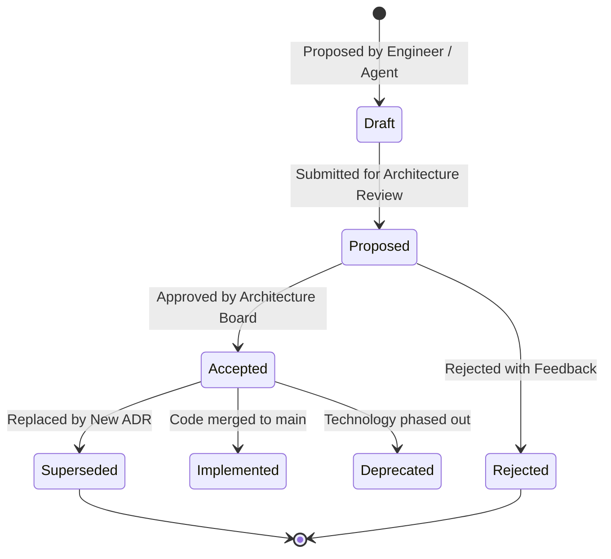
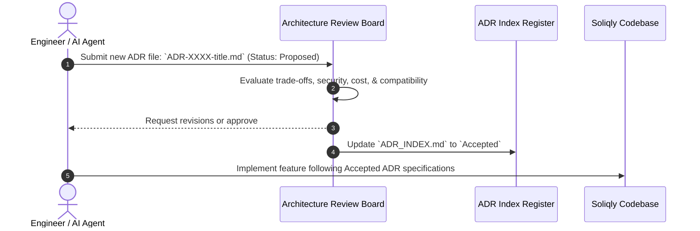

# Soliqly — Master Architecture Decision Records (ADR) Index & Governance Log

**Version:** 1.0.0  
**Status:** Official & Binding  
**Author:** Founding Architecture Governance Board (CTO, Chief Architect & Staff Engineering Council)  
**Created Date:** July 27, 2026  
**Last Updated:** July 27, 2026  
**Related Documents:** [PROJECT_DISCOVERY.md](file:///c:/Users/LENOVO/soliqli/soliqli-1/docs/00-project-management/PROJECT_DISCOVERY.md), [PRD.md](file:///c:/Users/LENOVO/soliqli/soliqli-1/docs/01-product/PRD.md), [SOFTWARE_ARCHITECTURE.md](file:///c:/Users/LENOVO/soliqli/soliqli-1/docs/02-architecture/SOFTWARE_ARCHITECTURE.md), [DATABASE_BLUEPRINT.md](file:///c:/Users/LENOVO/soliqli/soliqli-1/docs/03-database/DATABASE_BLUEPRINT.md), [API_SPECIFICATION.md](file:///c:/Users/LENOVO/soliqli/soliqli-1/docs/04-api/API_SPECIFICATION.md), [AI_ARCHITECTURE.md](file:///c:/Users/LENOVO/soliqli/soliqli-1/docs/05-ai/AI_ARCHITECTURE.md), [SECURITY_ARCHITECTURE.md](file:///c:/Users/LENOVO/soliqli/soliqli-1/docs/07-security/SECURITY_ARCHITECTURE.md), [DEVOPS_ARCHITECTURE.md](file:///c:/Users/LENOVO/soliqli/soliqli-1/docs/08-devops/DEVOPS_ARCHITECTURE.md), [TESTING_STRATEGY.md](file:///c:/Users/LENOVO/soliqli/soliqli-1/docs/09-quality/TESTING_STRATEGY.md), [ENGINEERING_PLAYBOOK.md](file:///c:/Users/LENOVO/soliqli/soliqli-1/docs/10-engineering/ENGINEERING_PLAYBOOK.md), [PRODUCT_ROADMAP.md](file:///c:/Users/LENOVO/soliqli/soliqli-1/docs/11-roadmap/PRODUCT_ROADMAP.md), [AI_AGENT_DEVELOPMENT_CONTRACT.md](file:///c:/Users/LENOVO/soliqli/soliqli-1/docs/10-engineering/AI_AGENT_DEVELOPMENT_CONTRACT.md), [ENGINEERING_CONSTITUTION.md](file:///c:/Users/LENOVO/soliqli/soliqli-1/docs/ENGINEERING_CONSTITUTION.md)  
**Dependencies:** Central Architecture Register for All Engineering & Technical Decisions  

---

## 1. Executive Summary & Governance Purpose

This Architecture Decision Records (ADR) Index and Governance Register serves as the immutable single source of truth for all major architectural, technological, security, data, and design decisions made across the lifecycle of **Soliqly**.

The ADR system guarantees decision transparency, historical traceability, reproducible engineering choices, and controlled non-destructive evolution for both human software engineers and autonomous AI coding agents.

---

## 2. Core ADR Principles

```
┌─────────────────────────────────────────────────────────────────────────────┐
│                          CORE ADR GOVERNANCE PRINCIPLES                     │
├─────────────────┬───────────────────────────────────────────────────────────┤
│ Principle       │ Specification & Governance Standard                       │
├─────────────────┼───────────────────────────────────────────────────────────┤
│ 1. Immutable    │ Past ADR records are NEVER overwritten or deleted. They   │
│    History      │ may only be marked as `Superseded` by a newer ADR.        │
│ 2. Traceability │ Every technical decision must explicitly state its        │
│    & Context    │ problem statement, alternatives, trade-offs, and rationale│
│ 3. Single Source│ `ADR_INDEX.md` serves as the authoritative registry for   │
│    of Truth     │ checking architectural status across all project domains. │
│ 4. Binding for  │ Autonomous AI agents MUST inspect the ADR index and MUST  │
│    AI Agents    │ NOT violate accepted ADR decisions during code generation.│
└─────────────────┴───────────────────────────────────────────────────────────┘
```

---

## 3. Decision Lifecycle State Machine



---

## 4. Master ADR Register Index

| ADR ID | Decision Title | Status | Category | Date | Primary Technology Chosen | Record Link |
| :--- | :--- | :--- | :--- | :--- | :--- | :--- |
| **ADR-0001** | Project Vision & Rule of Determinism | **Accepted** | Product Core | 2026-07-27 | Python Tax Core + LLM Explainer | [ADR-0001](file:///c:/Users/LENOVO/soliqli/soliqli-1/docs/12-architecture-decisions/records/ADR-0001-project-vision.md) |
| **ADR-0002** | Monorepo Codebase Topology | **Accepted** | Repository | 2026-07-27 | pnpm / Turborepo Workspaces | [ADR-0002](file:///c:/Users/LENOVO/soliqli/soliqli-1/docs/12-architecture-decisions/records/ADR-0002-monorepo-topology.md) |
| **ADR-0003** | Frontend Web Framework Selection | **Accepted** | Frontend | 2026-07-27 | Next.js 15 App Router + Tailwind | [ADR-0003](file:///c:/Users/LENOVO/soliqli/soliqli-1/docs/12-architecture-decisions/records/ADR-0003-nextjs-frontend.md) |
| **ADR-0004** | Backend Web Framework Selection | **Accepted** | Backend | 2026-07-27 | FastAPI (Python 3.13) Async | [ADR-0004](file:///c:/Users/LENOVO/soliqli/soliqli-1/docs/12-architecture-decisions/records/ADR-0004-fastapi-backend.md) |
| **ADR-0005** | Primary Database & Engine Selection | **Accepted** | Database | 2026-07-27 | PostgreSQL 16+ Engine | [ADR-0005](file:///c:/Users/LENOVO/soliqli/soliqli-1/docs/12-architecture-decisions/records/ADR-0005-postgresql-database.md) |
| **ADR-0006** | Centralized AI Gateway & Router | **Accepted** | AI Platform | 2026-07-27 | OpenAI GPT-4o + Gemini Fallback| [ADR-0006](file:///c:/Users/LENOVO/soliqli/soliqli-1/docs/12-architecture-decisions/records/ADR-0006-ai-gateway-multiagent.md) |
| **ADR-0007** | RAG Vector Database Selection | **Accepted** | AI Vector | 2026-07-27 | `pgvector` HNSW Extension | [ADR-0007](file:///c:/Users/LENOVO/soliqli/soliqli-1/docs/12-architecture-decisions/records/ADR-0007-pgvector-rag.md) |
| **ADR-0008** | Authentication & Token Architecture | **Accepted** | Security | 2026-07-27 | OAuth2 Bearer JWT + Refresh Cookie| [ADR-0008](file:///c:/Users/LENOVO/soliqli/soliqli-1/docs/12-architecture-decisions/records/ADR-0008-jwt-authentication.md) |
| **ADR-0009** | Containerization & Deployment Model | **Accepted** | DevOps | 2026-07-27 | Docker Blue-Green Deployment | [ADR-0009](file:///c:/Users/LENOVO/soliqli/soliqli-1/docs/12-architecture-decisions/records/ADR-0009-blue-green-devops.md) |
| **ADR-0010** | Security, Data Privacy & Encryption | **Accepted** | Security | 2026-07-27 | AES-256 GCM (`pgcrypto`) + ZRU-547| [ADR-0010](file:///c:/Users/LENOVO/soliqli/soliqli-1/docs/12-architecture-decisions/records/ADR-0010-security-zero-trust.md) |

---

## 5. Architecture Review Board & Governance Workflow



---

## 6. Mandatory AI Coding Agent Rules for ADRs

1. **Read Before Implementing:** Every AI coding agent MUST read `ADR_INDEX.md` before executing architecture-level implementation tasks.
2. **Strict Adherence:** AI agents MUST NOT violate any accepted ADR decision (e.g., using Node.js for backend calculation engine when ADR-0004 specifies FastAPI/Python).
3. **No Unilateral Changes:** AI agents MUST NOT modify an existing ADR status without explicit user instruction.
4. **Citation in Pull Requests:** AI agents MUST reference relevant ADR numbers in code comments and handover documentation (e.g., *"Implemented per ADR-0005"*).

---

## 7. Cross References

* [PROJECT_DISCOVERY.md](file:///c:/Users/LENOVO/soliqli/soliqli-1/docs/00-project-management/PROJECT_DISCOVERY.md) — Baseline Product Discovery Document
* [PRD.md](file:///c:/Users/LENOVO/soliqli/soliqli-1/docs/01-product/PRD.md) — Product Requirements Document
* [SOFTWARE_ARCHITECTURE.md](file:///c:/Users/LENOVO/soliqli/soliqli-1/docs/02-architecture/SOFTWARE_ARCHITECTURE.md) — Software Architecture Blueprint
* [DATABASE_BLUEPRINT.md](file:///c:/Users/LENOVO/soliqli/soliqli-1/docs/03-database/DATABASE_BLUEPRINT.md) — Enterprise Database Blueprint
* [API_SPECIFICATION.md](file:///c:/Users/LENOVO/soliqli/soliqli-1/docs/04-api/API_SPECIFICATION.md) — Enterprise API Specification
* [AI_ARCHITECTURE.md](file:///c:/Users/LENOVO/soliqli/soliqli-1/docs/05-ai/AI_ARCHITECTURE.md) — Enterprise AI Platform Specification
* [SECURITY_ARCHITECTURE.md](file:///c:/Users/LENOVO/soliqli/soliqli-1/docs/07-security/SECURITY_ARCHITECTURE.md) — Enterprise Security Blueprint
* [DEVOPS_ARCHITECTURE.md](file:///c:/Users/LENOVO/soliqli/soliqli-1/docs/08-devops/DEVOPS_ARCHITECTURE.md) — DevOps Architecture Blueprint
* [TESTING_STRATEGY.md](file:///c:/Users/LENOVO/soliqli/soliqli-1/docs/09-quality/TESTING_STRATEGY.md) — Testing Strategy Blueprint
* [ENGINEERING_PLAYBOOK.md](file:///c:/Users/LENOVO/soliqli/soliqli-1/docs/10-engineering/ENGINEERING_PLAYBOOK.md) — Engineering Standards Playbook
* [PRODUCT_ROADMAP.md](file:///c:/Users/LENOVO/soliqli/soliqli-1/docs/11-roadmap/PRODUCT_ROADMAP.md) — Product Roadmap & Master Plan
* [AI_AGENT_DEVELOPMENT_CONTRACT.md](file:///c:/Users/LENOVO/soliqli/soliqli-1/docs/10-engineering/AI_AGENT_DEVELOPMENT_CONTRACT.md) — AI Agent Development Contract

---

**End of Document.**
