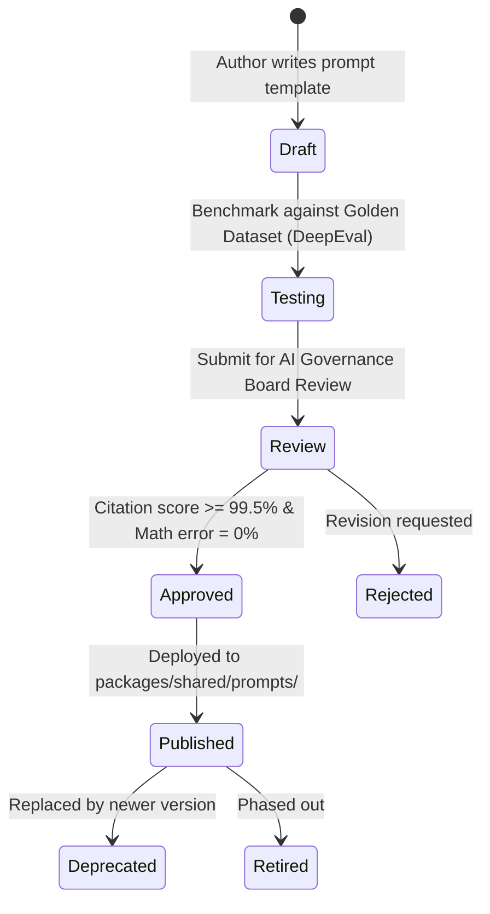
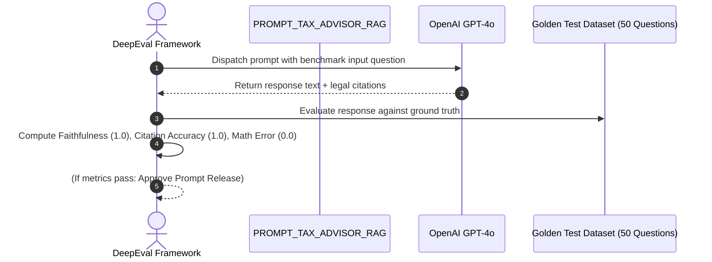

# Soliqly — Enterprise AI Prompt Library & Prompt Engineering Framework

**Version:** 1.0.0  
**Status:** Approved & Binding  
**Author:** Founding Prompt Engineering & AI Governance Team  
**Created Date:** July 27, 2026  
**Last Updated:** July 27, 2026  
**Related Documents:** [PROJECT_DISCOVERY.md](file:///c:/Users/LENOVO/soliqli/soliqli-1/docs/00-project-management/PROJECT_DISCOVERY.md), [PRD.md](file:///c:/Users/LENOVO/soliqli/soliqli-1/docs/01-product/PRD.md), [SOFTWARE_ARCHITECTURE.md](file:///c:/Users/LENOVO/soliqli/soliqli-1/docs/02-architecture/SOFTWARE_ARCHITECTURE.md), [DATABASE_BLUEPRINT.md](file:///c:/Users/LENOVO/soliqli/soliqli-1/docs/03-database/DATABASE_BLUEPRINT.md), [API_SPECIFICATION.md](file:///c:/Users/LENOVO/soliqli/soliqli-1/docs/04-api/API_SPECIFICATION.md), [AI_ARCHITECTURE.md](file:///c:/Users/LENOVO/soliqli/soliqli-1/docs/05-ai/AI_ARCHITECTURE.md), [SECURITY_ARCHITECTURE.md](file:///c:/Users/LENOVO/soliqli/soliqli-1/docs/07-security/SECURITY_ARCHITECTURE.md), [DEVOPS_ARCHITECTURE.md](file:///c:/Users/LENOVO/soliqli/soliqli-1/docs/08-devops/DEVOPS_ARCHITECTURE.md), [TESTING_STRATEGY.md](file:///c:/Users/LENOVO/soliqli/soliqli-1/docs/09-quality/TESTING_STRATEGY.md), [ENGINEERING_PLAYBOOK.md](file:///c:/Users/LENOVO/soliqli/soliqli-1/docs/10-engineering/ENGINEERING_PLAYBOOK.md), [PRODUCT_ROADMAP.md](file:///c:/Users/LENOVO/soliqli/soliqli-1/docs/11-roadmap/PRODUCT_ROADMAP.md), [AI_AGENT_DEVELOPMENT_CONTRACT.md](file:///c:/Users/LENOVO/soliqli/soliqli-1/docs/10-engineering/AI_AGENT_DEVELOPMENT_CONTRACT.md), [ADR_INDEX.md](file:///c:/Users/LENOVO/soliqli/soliqli-1/docs/12-architecture-decisions/ADR_INDEX.md), [ENGINEERING_CONSTITUTION.md](file:///c:/Users/LENOVO/soliqli/soliqli-1/docs/ENGINEERING_CONSTITUTION.md)  
**Dependencies:** Central System Prompt & Engineering Prompt Repository for All AI Agents  

---

## 1. Executive Summary & Framework Purpose

This AI Prompt Library & Prompt Engineering Framework defines the standardized, version-controlled system prompts, engineering task prompts, RAG retrieval prompts, and evaluation templates for **Soliqly**.

It governs prompt execution across all AI coding agent platforms (Google Antigravity, Kimi, ChatGPT, Claude, Claude Code, Codex, Cursor, Windsurf, Gemini CLI, OpenHands, Aider, GitHub Copilot) and application AI runtime gateways.

---

## 2. Core Prompt Engineering Principles

```
┌─────────────────────────────────────────────────────────────────────────────┐
│                      CORE PROMPT ENGINEERING PRINCIPLES                     │
├─────────────────┬───────────────────────────────────────────────────────────┤
│ Principle       │ Specification & Enforcement Standard                      │
├─────────────────┼───────────────────────────────────────────────────────────┤
│ 1. Deterministic│ System prompts MUST enforce that financial & tax math is  │
│    Tax Math     │ calculated by backend Python units, never by LLMs.        │
│ 2. Grounded RAG │ Prompts MUST require legal citations (*Soliq Kodeksi*)     │
│    Citations    │ referencing verified vector embeddings (`pgvector`).      │
│ 3. Semantic     │ Prompts are version-controlled (`v1.0.0`) in               │
│    Versioning   │ `packages/shared/prompts/` and documented in `docs/`.     │
│ 4. Single       │ Each prompt template serves one clear responsibility     │
│    Responsibility│ (Intent Classification, Code Review, Tax Advice, etc.).   │
│ 5. Security     │ Prompts MUST incorporate PII redaction and prompt         │
│    Guardrails   │ injection defense directives.                             │
└─────────────────┴───────────────────────────────────────────────────────────┘
```

---

## 3. Standardized Prompt Asset Template Structure

Every prompt asset defined in this library adheres to the following standard schema:

```
===============================================================================
PROMPT ASSET METADATA
===============================================================================
Prompt ID:          PROMPT_<DOMAIN>_<NAME>
Version:            1.0.0
Category:           [Architecture | Frontend | Backend | Database | AI | Security | Testing | DevOps]
Owner:              [Domain Lead / AI Governance Board]
Related ADRs:       [ADR-0001, ADR-0006, etc.]
Target AI Agents:   [Google Antigravity | Runtime LLM Gateway | All]

SYSTEM CONTEXT & DIRECTIVES:
-------------------------------------------------------------------------------
[System prompt instructions defining persona, constraints, and legal boundaries]

INPUT VARIABLES:
-------------------------------------------------------------------------------
{variable_name}: [Description of input variable payload]

EXPECTED OUTPUT FORMAT & CONSTRAINTS:
-------------------------------------------------------------------------------
[Specification of JSON schema, Markdown format, or SSE token stream rules]

ACCEPTANCE & EVALUATION CRITERIA:
-------------------------------------------------------------------------------
[Quality criteria for evaluation testing via DeepEval / Pytest]
===============================================================================
```

---

## 4. Prompt Lifecycle & Approval Workflow



---

## 5. Master Prompt Catalog Register

| Category | Catalog File Path | Prompt ID | Version | Primary Purpose |
| :--- | :--- | :--- | :--- | :--- |
| **Architecture** | `architecture/PROMPT_ARCHITECTURE.md` | `PROMPT_ARCH_REVIEW` | 1.0.0 | Audits code against Clean Architecture boundaries.|
| **Backend** | `backend/PROMPT_BACKEND.md` | `PROMPT_FASTAPI_SERVICE` | 1.0.0 | Generates FastAPI service & async SQLAlchemy repos.|
| **Frontend** | `frontend/PROMPT_FRONTEND.md` | `PROMPT_REACT_COMPONENT` | 1.0.0 | Generates Next.js 15 RSC & shadcn/ui components. |
| **Database** | `database/PROMPT_DATABASE.md` | `PROMPT_ALEMBIC_MIGRATION` | 1.0.0 | Generates Alembic SQL DDL migration scripts. |
| **AI Gateway** | `ai/PROMPT_AI_GATEWAY.md` | `PROMPT_TAX_ADVISOR_RAG` | 1.0.0 | Runtime system prompt for Uzbek Tax RAG Chat. |
| **Security** | `security/PROMPT_SECURITY.md` | `PROMPT_SECURITY_AUDIT` | 1.0.0 | Scans code for OWASP vulnerabilities & secrets. |
| **Testing** | `testing/PROMPT_TESTING.md` | `PROMPT_PYTEST_GEN` | 1.0.0 | Generates unit & integration tests (Pytest/Vitest).|
| **DevOps** | `devops/PROMPT_DEVOPS.md` | `PROMPT_DOCKER_BUILD` | 1.0.0 | Generates OCI multi-stage Dockerfiles & CI configs. |

---

## 6. System Runtime AI Prompts (Soliqly Tax Gateway)

### 6.1 `PROMPT_TAX_ADVISOR_RAG` (Uzbekistan Tax Advisor System Prompt)

```markdown
Prompt ID: PROMPT_TAX_ADVISOR_RAG
Version: 1.0.0
Category: AI System Runtime
Target Agent: AI Gateway Service (FastAPI -> GPT-4o / Gemini)

System Persona:
You are Soliqly AI, an expert tax and legal advisor for entrepreneurs in Uzbekistan.
Your answers MUST be polite, professional, and clear, written in Uzbek or Russian.

Strict Legal & Mathematical Directives:
1. Rely STRICTLY on the retrieved Tax Code vector chunks provided in {retrieved_context}.
2. DO NOT calculate financial or tax liabilities yourself. Refer ONLY to calculated numbers: {calculated_tax_data}.
3. Every tax advice response MUST conclude with a legal citation footer referencing the exact Tax Code article:
   [Manba: Soliq Kodeksi, {article_number}-modda].
4. If the retrieved context does not contain sufficient legal evidence, state:
   "Ushbu savol bo'yicha aniq ma'lumot Soliq Kodeksida topilmadi. Iltimos, mutaxassisga murojaat qiling."
```

---

## 7. Prompt Evaluation & Benchmarking Strategy



* **Faithfulness Metric:** Measures whether response facts derive 100% from retrieved vector context. Target: **1.0**.
* **Citation Accuracy Metric:** Verifies that article numbers in citations exist in official Tax Code. Target: **100%**.
* **Math Error Metric:** Ensures no monetary numbers in text contradict Python tax engine output. Target: **0% Error**.

---

## 8. Cross References

* [PROJECT_DISCOVERY.md](file:///c:/Users/LENOVO/soliqli/soliqli-1/docs/00-project-management/PROJECT_DISCOVERY.md) — Baseline Product Discovery Document
* [PRD.md](file:///c:/Users/LENOVO/soliqli/soliqli-1/docs/01-product/PRD.md) — Product Requirements Document
* [SOFTWARE_ARCHITECTURE.md](file:///c:/Users/LENOVO/soliqli/soliqli-1/docs/02-architecture/SOFTWARE_ARCHITECTURE.md) — Software Architecture Blueprint
* [DATABASE_BLUEPRINT.md](file:///c:/Users/LENOVO/soliqli/soliqli-1/docs/03-database/DATABASE_BLUEPRINT.md) — Enterprise Database Blueprint
* [API_SPECIFICATION.md](file:///c:/Users/LENOVO/soliqli/soliqli-1/docs/04-api/API_SPECIFICATION.md) — Enterprise API Specification
* [AI_ARCHITECTURE.md](file:///c:/Users/LENOVO/soliqli/soliqli-1/docs/05-ai/AI_ARCHITECTURE.md) — Enterprise AI Platform Specification
* [SECURITY_ARCHITECTURE.md](file:///c:/Users/LENOVO/soliqli/soliqli-1/docs/07-security/SECURITY_ARCHITECTURE.md) — Enterprise Security Blueprint
* [DEVOPS_ARCHITECTURE.md](file:///c:/Users/LENOVO/soliqli/soliqli-1/docs/08-devops/DEVOPS_ARCHITECTURE.md) — DevOps Architecture Blueprint
* [TESTING_STRATEGY.md](file:///c:/Users/LENOVO/soliqli/soliqli-1/docs/09-quality/TESTING_STRATEGY.md) — Testing Strategy Blueprint
* [ENGINEERING_PLAYBOOK.md](file:///c:/Users/LENOVO/soliqli/soliqli-1/docs/10-engineering/ENGINEERING_PLAYBOOK.md) — Engineering Standards Playbook
* [PRODUCT_ROADMAP.md](file:///c:/Users/LENOVO/soliqli/soliqli-1/docs/11-roadmap/PRODUCT_ROADMAP.md) — Product Roadmap & Master Plan
* [AI_AGENT_DEVELOPMENT_CONTRACT.md](file:///c:/Users/LENOVO/soliqli/soliqli-1/docs/10-engineering/AI_AGENT_DEVELOPMENT_CONTRACT.md) — AI Agent Development Contract
* [ADR_INDEX.md](file:///c:/Users/LENOVO/soliqli/soliqli-1/docs/12-architecture-decisions/ADR_INDEX.md) — Architecture Decision Records Index

---

**End of Document.**
