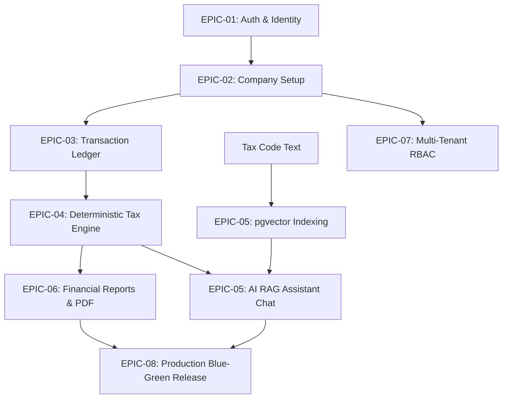

# Soliqly — Enterprise Implementation Backlog & Task Catalog

**Version:** 1.0.0  
**Status:** Approved & Ready for Execution  
**Author:** Founding Product Delivery & Engineering Management Board  
**Created Date:** July 27, 2026  
**Last Updated:** July 27, 2026  
**Related Documents:** [PROJECT_DISCOVERY.md](file:///c:/Users/LENOVO/soliqli/soliqli-1/docs/00-project-management/PROJECT_DISCOVERY.md), [PRD.md](file:///c:/Users/LENOVO/soliqli/soliqli-1/docs/01-product/PRD.md), [USER_RESEARCH.md](file:///c:/Users/LENOVO/soliqli/soliqli-1/docs/01-product/USER_RESEARCH.md), [INFORMATION_ARCHITECTURE.md](file:///c:/Users/LENOVO/soliqli/soliqli-1/docs/02-architecture/INFORMATION_ARCHITECTURE.md), [SOFTWARE_ARCHITECTURE.md](file:///c:/Users/LENOVO/soliqli/soliqli-1/docs/02-architecture/SOFTWARE_ARCHITECTURE.md), [DATABASE_BLUEPRINT.md](file:///c:/Users/LENOVO/soliqli/soliqli-1/docs/03-database/DATABASE_BLUEPRINT.md), [API_SPECIFICATION.md](file:///c:/Users/LENOVO/soliqli/soliqli-1/docs/04-api/API_SPECIFICATION.md), [AI_ARCHITECTURE.md](file:///c:/Users/LENOVO/soliqli/soliqli-1/docs/05-ai/AI_ARCHITECTURE.md), [SECURITY_ARCHITECTURE.md](file:///c:/Users/LENOVO/soliqli/soliqli-1/docs/07-security/SECURITY_ARCHITECTURE.md), [DEVOPS_ARCHITECTURE.md](file:///c:/Users/LENOVO/soliqli/soliqli-1/docs/08-devops/DEVOPS_ARCHITECTURE.md), [TESTING_STRATEGY.md](file:///c:/Users/LENOVO/soliqli/soliqli-1/docs/09-quality/TESTING_STRATEGY.md), [ENGINEERING_PLAYBOOK.md](file:///c:/Users/LENOVO/soliqli/soliqli-1/docs/10-engineering/ENGINEERING_PLAYBOOK.md), [PRODUCT_ROADMAP.md](file:///c:/Users/LENOVO/soliqli/soliqli-1/docs/11-roadmap/PRODUCT_ROADMAP.md), [AI_AGENT_DEVELOPMENT_CONTRACT.md](file:///c:/Users/LENOVO/soliqli/soliqli-1/docs/10-engineering/AI_AGENT_DEVELOPMENT_CONTRACT.md), [ADR_INDEX.md](file:///c:/Users/LENOVO/soliqli/soliqli-1/docs/12-architecture-decisions/ADR_INDEX.md), [PROMPT_LIBRARY.md](file:///c:/Users/LENOVO/soliqli/soliqli-1/docs/13-prompt-library/PROMPT_LIBRARY.md), [ENGINEERING_CONSTITUTION.md](file:///c:/Users/LENOVO/soliqli/soliqli-1/docs/ENGINEERING_CONSTITUTION.md)  
**Dependencies:** Central Master Implementation Work Breakdown Structure for Phase 1–7  

---

## 1. Executive Summary & Delivery Governance

This Enterprise Implementation Backlog & Task Catalog transforms all Phase 0 product, technical, AI, security, data, and DevOps specifications into executable engineering Epics, Features, User Stories, and Tasks for **Soliqly**.

It serves as the operational execution backlog for human engineering sprints and autonomous AI coding agent tasks during Phase 1–7 deployment in Uzbekistan.

---

## 2. Backlog Hierarchy & Estimation Rules

```
Initiative: Soliqly Financial Operating System
└── Epic (e.g. EPIC-03: Transaction Ledger Engine)
    └── Feature (e.g. FEAT-3.1: Income & Expense Transaction Logger)
        └── User Story (e.g. US-3.1.1: Log Income Transaction Drawer)
            └── Task (e.g. TASK-3.1.1-BE: FastAPI Income Transaction Endpoint)
```

* **Story Point Estimation:** Uses the standard Fibonacci scale (**1, 2, 3, 5, 8, 13, 21**).
* **Task Granularity:** Engineering tasks must be sized between **1 and 5 story points** (Tasks > 5 points must be broken down into subtasks).

---

## 3. Definition of Ready (DoR) & Definition of Done (DoD)

### 3.1 Definition of Ready (DoR)
A user story or task is **Ready for Development** when:
1. Requirements, business logic, and acceptance criteria are explicitly documented.
2. Target API paths, database tables, and UI component dependencies are identified.
3. Relevant ADRs and Phase 0 documentation links are referenced.
4. Estimated in Story Points by engineering team.

### 3.2 Definition of Done (DoD)
A task is considered **Done & Complete** when:
1. Code passes all automated Pytest and Vitest unit/integration tests (≥ 85% coverage).
2. Code passes ESLint, Ruff, Trivy security, and Gitleaks secret scans.
3. Code respects Clean Layering boundaries with zero hardcoded secrets or TODO stubs.
4. Relevant Phase 0 markdown documentation and API specifications are updated.
5. Code is reviewed and approved by 2 senior reviewers / architecture board.

---

## 4. Master Epics Inventory Matrix

| Epic ID | Epic Title | Target Phase | Total Story Points | Related ADRs | Primary Owner Role |
| :--- | :--- | :--- | :--- | :--- | :--- |
| **EPIC-01** | Foundation, Auth & Tenant Identity | Phase 1 (W3-W4) | 34 Points | [ADR-0002](file:///c:/Users/LENOVO/soliqli/soliqli-1/docs/12-architecture-decisions/records/ADR-0002-monorepo-topology.md), [ADR-0008](file:///c:/Users/LENOVO/soliqli/soliqli-1/docs/12-architecture-decisions/records/ADR-0008-jwt-authentication.md) | Backend & Security |
| **EPIC-02** | Company Setup & Entity Profile | Phase 1 (W3-W4) | 21 Points | [ADR-0005](file:///c:/Users/LENOVO/soliqli/soliqli-1/docs/12-architecture-decisions/records/ADR-0005-postgresql-database.md) | Frontend & Product |
| **EPIC-03** | Income & Expense Ledger Engine | Phase 2 (W5-W6) | 42 Points | [ADR-0003](file:///c:/Users/LENOVO/soliqli/soliqli-1/docs/12-architecture-decisions/records/ADR-0003-nextjs-frontend.md), [ADR-0004](file:///c:/Users/LENOVO/soliqli/soliqli-1/docs/12-architecture-decisions/records/ADR-0004-fastapi-backend.md) | Full-Stack Team |
| **EPIC-04** | Deterministic Tax Calculation Core| Phase 3 (W7-W8) | 34 Points | [ADR-0001](file:///c:/Users/LENOVO/soliqli/soliqli-1/docs/12-architecture-decisions/records/ADR-0001-project-vision.md) | Backend Core Lead |
| **EPIC-05** | Uzbek RAG AI Assistant Gateway | Phase 3 (W7-W8) | 55 Points | [ADR-0006](file:///c:/Users/LENOVO/soliqli/soliqli-1/docs/12-architecture-decisions/records/ADR-0006-ai-gateway-multiagent.md), [ADR-0007](file:///c:/Users/LENOVO/soliqli/soliqli-1/docs/12-architecture-decisions/records/ADR-0007-pgvector-rag.md) | AI & RAG Engineer |
| **EPIC-06** | Financial Summary Reports & PDF | Phase 4 (W9-W10)| 26 Points | [ADR-0004](file:///c:/Users/LENOVO/soliqli/soliqli-1/docs/12-architecture-decisions/records/ADR-0004-fastapi-backend.md) | Backend & DevOps |
| **EPIC-07** | Multi-Tenant Workspace & RBAC | Phase 6 (W13-W14)| 21 Points | [ADR-0005](file:///c:/Users/LENOVO/soliqli/soliqli-1/docs/12-architecture-decisions/records/ADR-0005-postgresql-database.md), [ADR-0010](file:///c:/Users/LENOVO/soliqli/soliqli-1/docs/12-architecture-decisions/records/ADR-0010-security-zero-trust.md)| Full-Stack Lead |
| **EPIC-08** | Production Launch & Observability| Phase 7 (W15-W16)| 34 Points | [ADR-0009](file:///c:/Users/LENOVO/soliqli/soliqli-1/docs/12-architecture-decisions/records/ADR-0009-blue-green-devops.md) | DevOps & SRE Lead |

---

## 5. Master Implementation Dependency Graph



---

## 6. Sprint Allocation & Detailed Task Breakdown

### 6.1 Sprint 1 & 2 Breakdown: EPIC-01 & EPIC-02 (Foundation & Auth)

* **TASK-1.1-DB:** Initialize PostgreSQL 16 extensions (`uuid-ossp`, `pgvector`, `pgcrypto`) & Alembic migrations script for `users` and `sessions` tables. *(Story Points: 3)*
* **TASK-1.2-BE:** Implement FastAPI JWT Auth module (`/api/v1/auth/register`, `/api/v1/auth/login`, `/api/v1/auth/refresh`) with Argon2id password hashing. *(Story Points: 5)*
* **TASK-1.3-FE:** Build Next.js 15 Auth UI pages (`/login`, `/register`) using React Hook Form, Zod, and shadcn/ui primitives. *(Story Points: 5)*
* **TASK-2.1-BE:** Implement Company Entity setup API (`POST /api/v1/companies`) storing business TIN/STIR with AES-256 field encryption. *(Story Points: 5)*
* **TASK-2.2-FE:** Build Company Setup Wizard UI step flow (`YTT`, `Self-Employed`, `MCHJ`). *(Story Points: 3)*

---

### 6.2 Sprint 3 & 4 Breakdown: EPIC-03 & EPIC-04 (Ledger & Tax Engine)

* **TASK-3.1-BE:** Implement Transaction Ledger API (`GET /POST /api/v1/transactions`) with `X-Idempotency-Key` write deduplication. *(Story Points: 5)*
* **TASK-3.2-FE:** Build "+ Add Transaction" drawer and searchable data table UI in Next.js SPA. *(Story Points: 8)*
* **TASK-4.1-BE:** Implement Deterministic Python Tax Engine module calculating 4% Turnover Tax and Social Tax (*Ijtimoiy soliq*). *(Story Points: 8)*
* **TASK-4.2-FE:** Build Dashboard Tax Liability summary card & quarter breakdown UI widgets. *(Story Points: 5)*

---

### 6.3 Sprint 5 & 6 Breakdown: EPIC-05 & EPIC-06 (AI RAG & PDF Reports)

* **TASK-5.1-AI:** Chunk and index Uzbekistan Tax Code corpus into PostgreSQL `knowledge_chunks` using OpenAI `text-embedding-3-small` vectors. *(Story Points: 8)*
* **TASK-5.2-BE:** Implement Server-Sent Events (SSE) AI Streaming endpoint (`POST /api/v1/ai/chat/stream`) with `pgvector` HNSW search. *(Story Points: 8)*
* **TASK-5.3-FE:** Build Conversational AI Chat sidebar drawer UI with streaming token rendering and legal citation footers (*Soliq Kodeksi, 467-modda*). *(Story Points: 8)*
* **TASK-6.1-BE:** Build background Celery PDF report generator worker creating downloadable tax statements uploaded to Cloudflare R2 storage. *(Story Points: 8)*

---

## 7. Cross References

* [PROJECT_DISCOVERY.md](file:///c:/Users/LENOVO/soliqli/soliqli-1/docs/00-project-management/PROJECT_DISCOVERY.md) — Baseline Product Discovery Document
* [PRD.md](file:///c:/Users/LENOVO/soliqli/soliqli-1/docs/01-product/PRD.md) — Product Requirements Document
* [SOFTWARE_ARCHITECTURE.md](file:///c:/Users/LENOVO/soliqli/soliqli-1/docs/02-architecture/SOFTWARE_ARCHITECTURE.md) — Software Architecture Blueprint
* [DATABASE_BLUEPRINT.md](file:///c:/Users/LENOVO/soliqli/soliqli-1/docs/03-database/DATABASE_BLUEPRINT.md) — Enterprise Database Blueprint
* [API_SPECIFICATION.md](file:///c:/Users/LENOVO/soliqli/soliqli-1/docs/04-api/API_SPECIFICATION.md) — Enterprise API Specification
* [AI_ARCHITECTURE.md](file:///c:/Users/LENOVO/soliqli/soliqli-1/docs/05-ai/AI_ARCHITECTURE.md) — Enterprise AI Platform Specification
* [SECURITY_ARCHITECTURE.md](file:///c:/Users/LENOVO/soliqli/soliqli-1/docs/07-security/SECURITY_ARCHITECTURE.md) — Enterprise Security Blueprint
* [DEVOPS_ARCHITECTURE.md](file:///c:/Users/LENOVO/soliqli/soliqli-1/docs/08-devops/DEVOPS_ARCHITECTURE.md) — DevOps Architecture Blueprint
* [TESTING_STRATEGY.md](file:///c:/Users/LENOVO/soliqli/soliqli-1/docs/09-quality/TESTING_STRATEGY.md) — Testing Strategy Blueprint
* [ENGINEERING_PLAYBOOK.md](file:///c:/Users/LENOVO/soliqli/soliqli-1/docs/10-engineering/ENGINEERING_PLAYBOOK.md) — Engineering Standards Playbook
* [PRODUCT_ROADMAP.md](file:///c:/Users/LENOVO/soliqli/soliqli-1/docs/11-roadmap/PRODUCT_ROADMAP.md) — Product Roadmap & Master Plan
* [AI_AGENT_DEVELOPMENT_CONTRACT.md](file:///c:/Users/LENOVO/soliqli/soliqli-1/docs/10-engineering/AI_AGENT_DEVELOPMENT_CONTRACT.md) — AI Agent Development Contract
* [ADR_INDEX.md](file:///c:/Users/LENOVO/soliqli/soliqli-1/docs/12-architecture-decisions/ADR_INDEX.md) — Architecture Decision Records Index
* [PROMPT_LIBRARY.md](file:///c:/Users/LENOVO/soliqli/soliqli-1/docs/13-prompt-library/PROMPT_LIBRARY.md) — Enterprise AI Prompt Library

---

**End of Document.**
