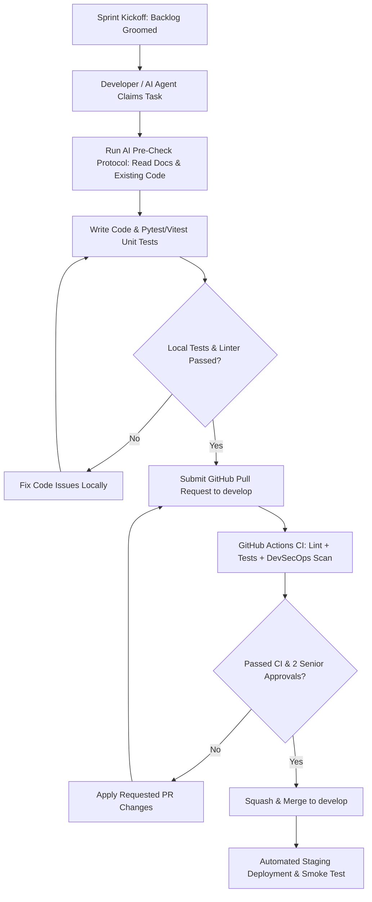

# Soliqly — Enterprise MVP Sprint Execution Plan & AI Delivery Playbook

**Version:** 1.0.0  
**Status:** Approved & Binding  
**Author:** Founding Delivery Management Office & Agile Engineering Council  
**Created Date:** July 27, 2026  
**Last Updated:** July 27, 2026  
**Related Documents:** [PROJECT_DISCOVERY.md](file:///c:/Users/LENOVO/soliqli/soliqli-1/docs/00-project-management/PROJECT_DISCOVERY.md), [PRD.md](file:///c:/Users/LENOVO/soliqli/soliqli-1/docs/01-product/PRD.md), [SOFTWARE_ARCHITECTURE.md](file:///c:/Users/LENOVO/soliqli/soliqli-1/docs/02-architecture/SOFTWARE_ARCHITECTURE.md), [DATABASE_BLUEPRINT.md](file:///c:/Users/LENOVO/soliqli/soliqli-1/docs/03-database/DATABASE_BLUEPRINT.md), [API_SPECIFICATION.md](file:///c:/Users/LENOVO/soliqli/soliqli-1/docs/04-api/API_SPECIFICATION.md), [AI_ARCHITECTURE.md](file:///c:/Users/LENOVO/soliqli/soliqli-1/docs/05-ai/AI_ARCHITECTURE.md), [SECURITY_ARCHITECTURE.md](file:///c:/Users/LENOVO/soliqli/soliqli-1/docs/07-security/SECURITY_ARCHITECTURE.md), [DEVOPS_ARCHITECTURE.md](file:///c:/Users/LENOVO/soliqli/soliqli-1/docs/08-devops/DEVOPS_ARCHITECTURE.md), [TESTING_STRATEGY.md](file:///c:/Users/LENOVO/soliqli/soliqli-1/docs/09-quality/TESTING_STRATEGY.md), [ENGINEERING_PLAYBOOK.md](file:///c:/Users/LENOVO/soliqli/soliqli-1/docs/10-engineering/ENGINEERING_PLAYBOOK.md), [PRODUCT_ROADMAP.md](file:///c:/Users/LENOVO/soliqli/soliqli-1/docs/11-roadmap/PRODUCT_ROADMAP.md), [AI_AGENT_DEVELOPMENT_CONTRACT.md](file:///c:/Users/LENOVO/soliqli/soliqli-1/docs/10-engineering/AI_AGENT_DEVELOPMENT_CONTRACT.md), [ADR_INDEX.md](file:///c:/Users/LENOVO/soliqli/soliqli-1/docs/12-architecture-decisions/ADR_INDEX.md), [PROMPT_LIBRARY.md](file:///c:/Users/LENOVO/soliqli/soliqli-1/docs/13-prompt-library/PROMPT_LIBRARY.md), [IMPLEMENTATION_BACKLOG.md](file:///c:/Users/LENOVO/soliqli/soliqli-1/docs/14-implementation/IMPLEMENTATION_BACKLOG.md), [ENGINEERING_CONSTITUTION.md](file:///c:/Users/LENOVO/soliqli/soliqli-1/docs/ENGINEERING_CONSTITUTION.md)  
**Dependencies:** Central Sprint Delivery Master Plan for All Human Teams & Autonomous AI Coding Agents  

---

## 1. Executive Summary & Delivery Governance

This MVP Sprint Execution Plan & AI Delivery Playbook establishes the 2-week sprint schedules, delivery workflows, quality gate validations, GitHub project tracking setups, and AI coding agent execution tasks required to build, test, and deploy **Soliqly**.

It operationalizes the Implementation Backlog into 9 executable sprints (Sprint 00 through Sprint 08), guaranteeing that human engineers and autonomous AI coding agents deliver the Minimum Viable Product on schedule for Uzbekistan.

---

## 2. Core Delivery Principles

```
┌─────────────────────────────────────────────────────────────────────────────┐
│                         CORE SPRINT DELIVERY PRINCIPLES                     │
├─────────────────┬───────────────────────────────────────────────────────────┤
│ Principle       │ Architectural Rationale & Delivery Rule                   │
├─────────────────┼───────────────────────────────────────────────────────────┤
│ 1. Small        │ Decompose tasks into 1 to 5 story point items to maximize  │
│    Batches      │ PR throughput and facilitate rapid AI agent reviews.       │
│ 2. Continuous   │ Run automated Pytest, Vitest, and Playwright tests on     │
│    Testing      │ every sprint pull request prior to merging code.          │
│ 3. Deterministic│ Financial tax math is computed strictly by backend Python │
│    Tax Engine   │ modules, prohibiting LLM probabilistic calculations.     │
│ 4. Documentation│ Code commits MUST be accompanied by updates to            │
│    First        │ corresponding markdown documentation in `docs/`.          │
│ 5. AI Agent     │ AI agents MUST follow the AI Agent Development Contract   │
│    Playbook     │ and reference relevant ADR numbers in all PRs.            │
└─────────────────┴───────────────────────────────────────────────────────────┘
```

---

## 3. Master Sprint Execution Schedule (Sprints 00–08)

```mermaid
gantt
    title Soliqly Master Sprint Delivery Timeline (Sprints 00-08)
    dateFormat  YYYY-MM-DD
    section Bootstrap
    Sprint 00: Architecture & Specs        :done,    s0, 2026-07-15, 2026-07-28
    section Foundation
    Sprint 01: Auth, Identity & DB         :active,  s1, 2026-07-29, 2026-08-11
    Sprint 02: Company Setup & Profile     :         s2, 2026-08-12, 2026-08-25
    section Ledger & Tax
    Sprint 03: Income/Expense Ledger UI    :         s3, 2026-08-26, 2026-09-08
    Sprint 04: Deterministic Tax Calculator:         s4, 2026-09-09, 2026-09-22
    section AI & Reports
    Sprint 05: Uzbek RAG AI Assistant      :         s5, 2026-09-23, 2026-10-06
    Sprint 06: PDF/CSV Reports & Celery    :         s6, 2026-10-07, 2026-10-20
    section Multi-Tenant & Launch
    Sprint 07: Multi-Tenant RBAC & Security:         s7, 2026-10-21, 2026-11-03
    Sprint 08: Production Blue-Green Launch:         s8, 2026-11-04, 2026-11-17
```

### 3.1 Master Sprint Register Matrix

| Sprint ID | Sprint Focus | Target Schedule | Story Points | Primary Deliverable | Milestone Gate |
| :--- | :--- | :--- | :--- | :--- | :--- |
| **Sprint 00**| **Phase 0 Specifications** | Weeks 1–2 | 55 Points | All 20 Phase 0 engineering & product docs (`docs/`).| M0: Specs Ratified |
| **Sprint 01**| **Foundation & Auth** | Weeks 3–4 | 34 Points | Next.js SPA shell, FastAPI JWT Auth, Argon2id passwords.| M1: Identity Live |
| **Sprint 02**| **Company Setup Wizard** | Weeks 5–6 | 21 Points | Company entity wizard (`YTT`, `Self-Employed`, `MCHJ`). | Setup Saved in DB |
| **Sprint 03**| **Transaction Ledger** | Weeks 7–8 | 42 Points | Searchable ledger table, "+ Add Income/Expense" drawer. | Ledger UI Live |
| **Sprint 04**| **Deterministic Tax Engine**| Weeks 9–10 | 34 Points | Python math engine computing 4% Turnover & Social Tax. | M2: Tax Math 100% |
| **Sprint 05**| **Uzbek RAG AI Assistant** | Weeks 11–12| 55 Points | `pgvector` indexing, AI Gateway SSE streaming, citations. | M3: RAG Chat Live |
| **Sprint 06**| **PDF Reports & Celery** | Weeks 13–14| 26 Points | Background Celery PDF generator, Cloudflare R2 links. | PDF Report Export |
| **Sprint 07**| **Multi-Tenant RBAC** | Weeks 15–16| 21 Points | Bookkeeper company switcher, security rate limiting. | M4: Beta Passed |
| **Sprint 08**| **Production Launch** | Weeks 17–18| 34 Points | Blue-Green CI/CD release, SRE Grafana monitoring. | M5: MVP Production |

---

## 4. Sprint Execution Flow & Quality Gate Pipeline



---

## 5. AI Coding Agent Delivery Playbook

When assigned to a sprint task, autonomous AI coding agents (Google Antigravity, Kimi, ChatGPT, Claude Code, Cursor, Windsurf) **must follow this execution sequence**:

1. **Phase 1 — Context Acquisition:** Read the target Sprint Plan file (`docs/15-execution/sprint-XX/SPRINT_XX_PLAN.md`), the AI Agent Contract (`docs/10-engineering/AI_AGENT_DEVELOPMENT_CONTRACT.md`), and related ADRs.
2. **Phase 2 — Code Search:** Search the workspace (`ripgrep` / `grep_search`) for existing components, hooks, services, and schemas to reuse.
3. **Phase 3 — Implementation:** Generate clean, production-ready code obeying folder structures and Clean Layering boundaries.
4. **Phase 4 — Testing:** Generate matching unit and integration test files (`test_*.py` / `*.test.ts`).
5. **Phase 5 — Documentation & Handover:** Update markdown documentation and append the mandatory AI Handover Report.

---

## 6. GitHub Project Execution Plan

```
GitHub Repository: soliqli/soliqli
├── Projects: Soliqly MVP Delivery Board (Kanban)
├── Milestones:
│   ├── M0: System Specs Ratified (v0.1.0)
│   ├── M1: Foundation & Auth (v0.2.0)
│   ├── M2: Ledger & Tax Engine (v0.5.0)
│   ├── M3: RAG AI & PDF Reports (v0.8.0)
│   └── M5: Production MVP Release (v1.0.0)
├── Branch Taxonomy: `main`, `develop`, `feature/*`, `fix/*`, `release/*`
└── Labels: `epic`, `feature`, `bug`, `ai-task`, `security`, `p0-blocker`
```

---

## 7. Sprint KPI & Quality Dashboard

* **Sprint Velocity Target:** **35–45 Story Points** completed per 2-week sprint.
* **Test Coverage Gate:** Overall code coverage ≥ **85%** (Tax Engine = **100%**).
* **AI Citation Accuracy:** RAG legal citation accuracy score ≥ **99.5%**.
* **Zero Security CVEs:** 0 High or Critical vulnerabilities in Trivy container scans.

---

## 8. Cross References

* [PROJECT_DISCOVERY.md](file:///c:/Users/LENOVO/soliqli/soliqli-1/docs/00-project-management/PROJECT_DISCOVERY.md) — Baseline Product Discovery Document
* [PRD.md](file:///c:/Users/LENOVO/soliqli/soliqli-1/docs/01-product/PRD.md) — Product Requirements Document
* [SOFTWARE_ARCHITECTURE.md](file:///c:/Users/LENOVO/soliqli/soliqli-1/docs/02-architecture/SOFTWARE_ARCHITECTURE.md) — Software Architecture Blueprint
* [DATABASE_BLUEPRINT.md](file:///c:/Users/LENOVO/soliqli/soliqli-1/docs/03-database/DATABASE_BLUEPRINT.md) — Enterprise Database Blueprint
* [API_SPECIFICATION.md](file:///c:/Users/LENOVO/soliqli/soliqli-1/docs/04-api/API_SPECIFICATION.md) — Enterprise API Specification
* [AI_ARCHITECTURE.md](file:///c:/Users/LENOVO/soliqli/soliqli-1/docs/05-ai/AI_ARCHITECTURE.md) — Enterprise AI Platform Specification
* [SECURITY_ARCHITECTURE.md](file:///c:/Users/LENOVO/soliqli/soliqli-1/docs/07-security/SECURITY_ARCHITECTURE.md) — Enterprise Security Blueprint
* [DEVOPS_ARCHITECTURE.md](file:///c:/Users/LENOVO/soliqli/soliqli-1/docs/08-devops/DEVOPS_ARCHITECTURE.md) — DevOps Architecture Blueprint
* [TESTING_STRATEGY.md](file:///c:/Users/LENOVO/soliqli/soliqli-1/docs/09-quality/TESTING_STRATEGY.md) — Testing Strategy Blueprint
* [ENGINEERING_PLAYBOOK.md](file:///c:/Users/LENOVO/soliqli/soliqli-1/docs/10-engineering/ENGINEERING_PLAYBOOK.md) — Engineering Standards Playbook
* [PRODUCT_ROADMAP.md](file:///c:/Users/LENOVO/soliqli/soliqli-1/docs/11-roadmap/PRODUCT_ROADMAP.md) — Product Roadmap & Master Plan
* [AI_AGENT_DEVELOPMENT_CONTRACT.md](file:///c:/Users/LENOVO/soliqli/soliqli-1/docs/10-engineering/AI_AGENT_DEVELOPMENT_CONTRACT.md) — AI Agent Development Contract
* [ADR_INDEX.md](file:///c:/Users/LENOVO/soliqli/soliqli-1/docs/12-architecture-decisions/ADR_INDEX.md) — Architecture Decision Records Index
* [PROMPT_LIBRARY.md](file:///c:/Users/LENOVO/soliqli/soliqli-1/docs/13-prompt-library/PROMPT_LIBRARY.md) — Enterprise AI Prompt Library
* [IMPLEMENTATION_BACKLOG.md](file:///c:/Users/LENOVO/soliqli/soliqli-1/docs/14-implementation/IMPLEMENTATION_BACKLOG.md) — Enterprise Implementation Backlog

---

**End of Document.**
