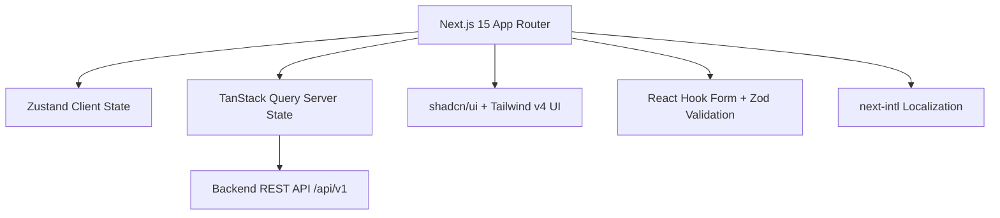
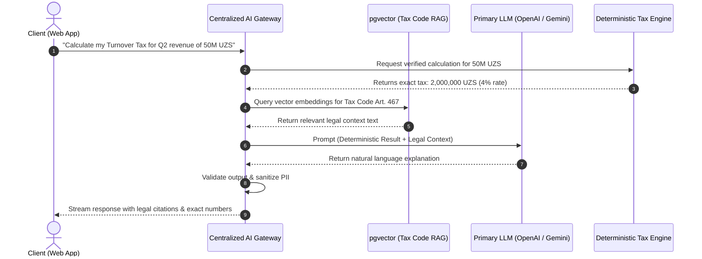

# Soliqly Engineering Constitution

## Part 5 — Technology Stack, Infrastructure & AI Platform Standards

**Version:** 1.0  
**Status:** Official Technology Standard  
**Author:** Founding Product & Engineering Team  
**Last Updated:** July 2026  
**Related Documents:** [ENGINEERING_CONSTITUTION.md](file:///c:/Users/LENOVO/soliqli/soliqli-1/ENGINEERING_CONSTITUTION.md), [ENGINEERING_CONSTITUTION_PART_2.md](file:///c:/Users/LENOVO/soliqli/soliqli-1/ENGINEERING_CONSTITUTION_PART_2.md), [ENGINEERING_CONSTITUTION_PART_3.md](file:///c:/Users/LENOVO/soliqli/soliqli-1/ENGINEERING_CONSTITUTION_PART_3.md), [ENGINEERING_CONSTITUTION_PART_4.md](file:///c:/Users/LENOVO/soliqli/soliqli-1/ENGINEERING_CONSTITUTION_PART_4.md)  

---

## 1. Overview & Platform Strategy

This document establishes the official technology selections, infrastructure deployment topology, centralized AI platform architecture, and operational performance standards for Soliqly.

```
┌─────────────────────────────────────────────────────────────────────────────┐
│                        SOLIQLY PLATFORM STRATEGY                            │
├──────────────────────┬──────────────────────────────────────────────────────┤
│ Strategy             │ Architectural Enforcement                            │
├──────────────────────┼──────────────────────────────────────────────────────┤
│ Architecture         │ Cloud-Native, Decoupled Modular Monolith             │
│ Deployment           │ Container-First (Docker / OCI Images)                │
│ Infrastructure       │ Infrastructure as Code (Terraform / Docker Compose)  │
│ API Design           │ API-First (OpenAPI 3.0 / REST v1)                    │
│ AI Architecture      │ AI-Native Gateway & RAG Pipeline                     │
│ Documentation        │ Documentation-First (Part 3 Governance)              │
│ Code Organization    │ Monorepo (`apps/`, `packages/`, `docs/`)             │
└──────────────────────┴──────────────────────────────────────────────────────┘
```

---

## 2. Official Technology Stack & Technical Rationale

### 2.1 Frontend Technology Stack



| Layer / Library | Technology Selection | Architectural Rationale & Justification |
| :--- | :--- | :--- |
| **Core Framework** | **Next.js 15 (App Router)** | Provides Server Components for fast initial HTML rendering, optimized bundling, and edge caching essential for mobile web performance across Uzbekistan. |
| **Language** | **TypeScript 5.x** | Guarantees strict compile-time type safety across shared DTO schemas, preventing runtime `TypeError` crashes. |
| **Styling** | **Tailwind CSS v4** | Delivers zero-runtime utility styling with ultra-small CSS bundle footprints and fast render speeds. |
| **UI Component Primitives**| **shadcn/ui** | Accessible, unstyled React components that grant 100% code ownership without heavy third-party CSS overhead. |
| **Iconography** | **Lucide React** | Lightweight, consistent SVG icon set optimized for tree-shaking. |
| **Micro-Animations** | **Framer Motion** | Subdued, high-performance UI state transitions and drawer animations. |
| **Form Engine** | **React Hook Form** | Uncontrolled input management providing zero unnecessary component re-renders during long transaction entry forms. |
| **Schema Validation** | **Zod** | Enforces runtime data validation matching API DTO contracts seamlessly with TypeScript types. |
| **Client State** | **Zustand** | Lightweight (< 2KB), unopinionated global state store for active company context and session data. |
| **Server State Sync** | **TanStack Query (v5)** | Handles automated caching, request deduplication, background revalidation, and optimistic updates. |
| **Data Visualization** | **Recharts** | Declarative, responsive SVG charting library for rendering income/expense trends and tax projections. |
| **Internationalization**| **next-intl** | First-class support for Uzbek (*uz*), Russian (*ru*), and English (*en*) localization with zero bundle bloat. |
| **Theme System** | **next-themes** | Seamless dark/light theme switching with zero FOUC (Flash of Unstyled Content). |

---

### 2.2 Backend Technology Stack

| Layer / Technology | Selection | Architectural Rationale & Justification |
| :--- | :--- | :--- |
| **API Framework** | **FastAPI** | High-performance Python async web framework with native OpenAPI schema generation and sub-millisecond route dispatch latency. |
| **Language** | **Python 3.13+** | Industry standard for data manipulation, financial calculations, and AI model orchestration. |
| **Data Serialization**| **Pydantic v2** | Rust-backed C-speed validation and serialization of incoming/outgoing JSON request bodies. |
| **Database ORM** | **SQLAlchemy 2.0 (Async)** | Robust, type-safe SQL query generation supporting complex relational joins and async connection pooling. |
| **Database Migrations**| **Alembic** | Deterministic, version-controlled schema migration management for PostgreSQL. |
| **Authentication** | **JWT (OAuth2 Bearer)** | Stateless access tokens paired with secure HTTP-only refresh tokens for cross-device authentication. |
| **Task Queue Engine** | **Celery** | Distributed asynchronous task execution for generating heavy PDF reports and executing scheduled tax audits. |
| **In-Memory Store** | **Redis 7.x** | Low-latency storage for Celery task brokers, user rate limits, session caches, and transient AI context memory. |

---

### 2.3 Database & Storage Architecture

| Core Component | Technology | Rationale & Use Cases |
| :--- | :--- | :--- |
| **Relational Database**| **PostgreSQL 16+** | Primary transactional datastore providing ACID compliance, complex relational integrity, and JSONB support. |
| **Vector Search** | **pgvector Extension** | Native PostgreSQL extension for storing and searching vector embeddings for RAG, avoiding dedicated vector DB cost/complexity during MVP. |
| **Cryptographic Utils** | **uuid-ossp, pgcrypto** | Native UUID PK generation and database-level field encryption for sensitive tax identifiers (*JSHSHIR/TIN*). |
| **Local Object Storage**| **MinIO (Development)** | S3-compatible local object storage for uploaded receipts and invoice PDFs during local testing. |
| **Prod Object Storage**| **Cloudflare R2** | Zero-egress-cost S3-compatible cloud storage for secure document backups and generated report files. |
| **Full-Text Search** | **Postgres FTS** | Native Uzbek/Russian text indexing for searching transactions and invoice titles without external search clusters. |

---

## 3. Centralized AI Platform & RAG Architecture

### 3.1 AI Platform Architecture Diagram



---

### 3.2 AI Gateway Responsibilities & Rules
All AI interactions pass exclusively through a single **Centralized AI Gateway** inside `apps/api`. Direct frontend communication with third-party LLM APIs is strictly prohibited.

1. **Authentication & Rate Limiting:** Enforces user quota limits per subscription tier.
2. **Deterministic Computation Interception:** Route numerical computation requests to the deterministic Python tax engine first.
3. **Prompt Routing & Provider Fallback:** Primary routing to **OpenAI (GPT-4o/o3-mini)** with automatic failover to **Google Gemini 1.5 Pro** upon API timeout or degradation.
4. **Prompt Versioning:** All prompts are stored in `packages/shared/prompts/` with semantic versioning (`ID`, `Version`, `Variables`, `Output Format`).
5. **PII Masking & Safety Filter:** Automatic redaction of passport numbers, credit card numbers, and private keys prior to LLM API dispatch.
6. **Audit & Cost Tracking:** Log token consumption (prompt tokens, completion tokens, latency, cost USD) per user transaction.

---

### 3.3 RAG (Retrieval-Augmented Generation) Pipeline

```
  Tax Laws & Regulations (PDF/Text)
               │
               ▼
  Document Parsing & Sentence Chunking (500 tokens, 10% overlap)
               │
               ▼
  Embedding Generation (OpenAI text-embedding-3-small)
               │
               ▼
  Vector Storage (PostgreSQL pgvector / HNSW index)
               │
               ▼
  Hybrid Vector + Keyword Retrieval (Cosine Similarity ≥ 0.78)
               │
               ▼
  Context Injection into Grounded System Prompt
```

---

### 3.4 AI Tool Calling Specifications

The AI Assistant is granted controlled access to specific backend utility tools via structured JSON schemas:

| Tool Name | Action Scope | Execution Constraint |
| :--- | :--- | :--- |
| `tax_calculator` | Computes fixed tax or turnover tax for given revenue and regime. | Read-Only. Calls deterministic engine. |
| `knowledge_base_search`| Searches indexed Uzbekistan Tax Code articles and regulations. | Read-Only. Vector + Full-text search. |
| `transaction_summary` | Summarizes income/expense totals for specified date ranges. | Read-Only. Filtered strictly by active `company_id`. |
| `report_generator` | Triggers background Celery task to generate PDF tax report. | Async Queue dispatch with user confirmation. |

---

## 4. Infrastructure, Deployment & Environment Strategy

### 4.1 Deployment Environment Matrix

| Environment | Host Infrastructure | Database & Storage | SSL & Edge |
| :--- | :--- | :--- | :--- |
| **Development** | Local Docker Compose | Local PostgreSQL + Redis + MinIO | Self-signed / HTTP localhost |
| **Testing / CI** | GitHub Actions Container Runners | Isolated Postgres Service Container | N/A |
| **Staging** | Isolated Cloud VPC Container | Dedicated Managed Postgres instance | Cloudflare Wildcard SSL |
| **Production** | Auto-scaling Cloud Container Cluster | High-Availability Managed Postgres + Cloudflare R2 | Cloudflare Edge TLS 1.3 |

---

### 4.2 Production Infrastructure Topology

```
                   [ Internet Traffic ]
                            │
                            ▼
              [ Cloudflare CDN / WAF / DNS ]
                            │
                            ▼
                [ Nginx Reverse Proxy ]
                            │
            ┌───────────────┴───────────────┐
            ▼                               ▼
    [ Next.js Web App ]             [ FastAPI Core API ]
            │                               │
            │                     ┌─────────┴─────────┐
            │                     ▼                   ▼
            │               [ PostgreSQL ]     [ Redis Cache ]
            │             (Data + pgvector)    (Celery + Session)
            └─────────────────────┼───────────────────┘
                                  ▼
                        [ Cloudflare R2 Storage ]
```

---

## 5. Observability & Monitoring Standard

* **Structured Logging:** JSON format featuring `timestamp`, `log_level`, `service_name`, `trace_id`, `user_id`, `company_id`, and `message`.
* **Application Metrics:** Prometheus-compatible metrics endpoint exporting request throughput, error rates (4xx/5xx), database pool utilization, and task queue latency.
* **Distributed Tracing:** OpenTelemetry propagation headers across API requests and background Celery jobs.
* **Health Check Endpoints:**
  * `GET /health/liveness`: Returns 200 OK if web process is running.
  * `GET /health/readiness`: Returns 200 OK if PostgreSQL and Redis connections are healthy.

---

## 6. Official System Performance Targets

| Operation / Endpoint | Target Latency (p95) | Target Latency (p99) | Performance Rationale |
| :--- | :--- | :--- | :--- |
| **Initial Page Load (Web)**| **< 1.8 seconds** | **< 3.0 seconds** | Mobile web optimization over 3G/4G networks in Uzbekistan regions. |
| **Dashboard API (`/api/v1/summary`)**| **< 250 ms** | **< 500 ms** | Pre-calculated Redis cache for active company summaries. |
| **Transaction Ingestion API**| **< 150 ms** | **< 300 ms** | Fast write path with async audit logging. |
| **AI Assistant Stream First-Byte**| **< 1.5 seconds** | **< 3.0 seconds** | Immediate UI feedback via Server-Sent Events (SSE). |
| **Complete AI Response**| **< 6.0 seconds** | **< 10.0 seconds** | Capped context window size and fast vector retrieval. |
| **Full-Text Transaction Search**| **< 300 ms** | **< 800 ms** | PostgreSQL GIN index optimization. |
| **PDF Report Generation**| **< 5.0 seconds** | **< 12.0 seconds** | Offloaded asynchronously to background Celery workers. |
| **System Uptime SLA** | **99.9% Uptime** | N/A | High-availability database failover configuration. |

---

## 7. Cost Optimization & Resource Efficiency Strategy

1. **Vector Database Consolidation:** Utilizing `pgvector` inside the primary PostgreSQL instance eliminates $100+/mo vector database SaaS costs during MVP.
2. **Storage Egress Savings:** Using Cloudflare R2 instead of AWS S3 saves 100% of bandwidth egress costs for PDF report downloads.
3. **Aggressive AI Context Truncation:** Restricting RAG retrieval to top-3 most relevant chunks (max 1,500 tokens context) cuts LLM API token consumption by up to 60%.
4. **Redis Cache Layering:** Caching static tax rate tables and legal code search results in Redis avoids duplicate database queries and LLM API calls.

---

**Ratified & Enforced.**  
*Soliqly Founding Product & Engineering Team*
