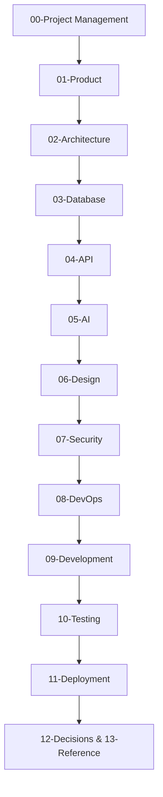

# Soliqly Engineering Constitution

## Part 6 — Project Documentation Framework & Phase 0 Blueprint

**Version:** 1.0  
**Status:** Official Documentation Generation Framework  
**Author:** Founding Product & Engineering Team  
**Last Updated:** July 2026  
**Related Documents:** [ENGINEERING_CONSTITUTION.md](file:///c:/Users/LENOVO/soliqli/soliqli-1/ENGINEERING_CONSTITUTION.md), [ENGINEERING_CONSTITUTION_PART_2.md](file:///c:/Users/LENOVO/soliqli/soliqli-1/ENGINEERING_CONSTITUTION_PART_2.md), [ENGINEERING_CONSTITUTION_PART_3.md](file:///c:/Users/LENOVO/soliqli/soliqli-1/ENGINEERING_CONSTITUTION_PART_3.md), [ENGINEERING_CONSTITUTION_PART_4.md](file:///c:/Users/LENOVO/soliqli/soliqli-1/ENGINEERING_CONSTITUTION_PART_4.md), [ENGINEERING_CONSTITUTION_PART_5.md](file:///c:/Users/LENOVO/soliqli/soliqli-1/ENGINEERING_CONSTITUTION_PART_5.md)  

---

## 1. Overview & Phase 0 Objective

This document defines the official generation framework, directory organization, document sequence, traceability matrix, and quality review gates for **Phase 0 (System Architecture & Documentation)** of Soliqly.

Phase 0 generates zero application source code. Its sole deliverable is a production-ready, fully consistent, highly detailed software engineering documentation repository that allows independent engineering teams and AI coding agents to execute implementation without ambiguity.

---

## 2. Standardized Directory Layout (`docs/`)

All documentation generated in Phase 0 must be placed strictly within the following `docs/` folder structure:

```
soliqli/
└── docs/
    ├── README.md
    ├── 00-project-management/
    │   ├── PROJECT_CHARTER.md
    │   ├── PROJECT_DISCOVERY.md
    │   ├── ROADMAP.md
    │   └── MILESTONES.md
    ├── 01-product/
    │   ├── PRD.md
    │   ├── USER_PERSONAS.md
    │   ├── USER_JOURNEYS.md
    │   ├── FEATURE_CATALOG.md
    │   ├── MVP_SCOPE.md
    │   └── BUSINESS_RULES.md
    ├── 02-architecture/
    │   ├── SOFTWARE_ARCHITECTURE.md
    │   ├── SYSTEM_CONTEXT.md
    │   ├── CONTAINER_DIAGRAM.md
    │   ├── COMPONENT_DIAGRAM.md
    │   └── INFORMATION_ARCHITECTURE.md
    ├── 03-database/
    │   ├── DATABASE_BLUEPRINT.md
    │   ├── ENTITY_RELATIONSHIP.md
    │   └── DATA_DICTIONARY.md
    ├── 04-api/
    │   ├── API_GUIDELINES.md
    │   ├── API_SPECIFICATION.md
    │   └── AUTHENTICATION_API.md
    ├── 05-ai/
    │   ├── AI_ARCHITECTURE.md
    │   ├── PROMPT_LIBRARY.md
    │   ├── RAG_ARCHITECTURE.md
    │   └── AGENT_DESIGN.md
    ├── 06-design/
    │   ├── DESIGN_SYSTEM.md
    │   ├── DESIGN_PRINCIPLES.md
    │   ├── COMPONENT_LIBRARY.md
    │   └── UX_GUIDELINES.md
    ├── 07-security/
    │   ├── SECURITY_ARCHITECTURE.md
    │   ├── RBAC.md
    │   ├── PRIVACY.md
    │   └── COMPLIANCE.md
    ├── 08-devops/
    │   ├── DEVOPS_ARCHITECTURE.md
    │   ├── CI_CD.md
    │   ├── ENVIRONMENTS.md
    │   └── MONITORING.md
    ├── 09-development/
    │   ├── CODING_STANDARDS.md
    │   ├── GIT_WORKFLOW.md
    │   └── CONTRIBUTING.md
    ├── 10-testing/
    │   ├── TESTING_STRATEGY.md
    │   └── TEST_PLAN.md
    ├── 11-deployment/
    │   └── DEPLOYMENT_GUIDE.md
    ├── 12-decisions/
    │   └── ADR_INDEX.md
    └── 13-reference/
        └── GLOSSARY.md
```

---

## 3. Mandatory 13-Step Sequential Generation Workflow

To preserve architectural consistency, technical dependencies, and cross-document references, documentation **must** be created in this exact linear sequence:



---

## 4. Requirement Traceability Matrix Standard

Every feature, requirement, or schema defined across Phase 0 documentation must maintain end-to-end forward and backward traceability:

$$\text{Business Goal} \longrightarrow \text{Feature} \longrightarrow \text{Domain Module} \longrightarrow \text{API Endpoint} \longrightarrow \text{Database Table} \longrightarrow \text{Test Case}$$

### 4.1 Traceability Mapping Table Structure

| Business Goal ID | Feature ID | Module | API Endpoint | Database Table | Test ID |
| :--- | :--- | :--- | :--- | :--- | :--- |
| `BG-01` (Zero Penalties) | `FEAT-TAX-01` | `Taxes` | `POST /api/v1/taxes/calculate` | `tax_calculations` | `TEST-TAX-001` |
| `BG-02` (Fast Income Tracking) | `FEAT-INC-01` | `Transactions` | `POST /api/v1/transactions` | `transactions` | `TEST-TXN-002` |

---

## 5. Standardized Mandatory Document Template

Every document generated inside `docs/` must strictly use the following header and section hierarchy:

```markdown
# [DOCUMENT TITLE]

**Version:** 1.0.0  
**Status:** [Draft | Review | Approved]  
**Author:** Founding Product & Engineering Team  
**Last Updated:** YYYY-MM-DD  
**Related Documents:** [Reference Link 1](file:///path), [Reference Link 2](file:///path)  

---

## 1. Overview & Purpose
[Explains document objectives and context]

## 2. Goals & Non-Goals
[Explains explicit accomplishments and exclusions]

## 3. Scope
[Defines boundaries]

## 4. Architecture & Technical Specifications
[Detailed technical specifications, diagrams, tables, formulas]

## 5. Architectural Decisions (ADR Linkage)
[Decision rationale and trade-offs]

## 6. Risk Assessment & Mitigation
[Identified risks and resolution strategies]

## 7. Future Scalability & Evolution
[Post-MVP roadmap alignment]

## 8. References & Appendix
[Glossary links and external source citations]

## 9. Revision History
[Version log]
```

---

## 6. Five-Gate Quality Assurance Protocol

Before any document in `docs/` transitions from `Draft` to `Approved`, it must pass five explicit validation review gates:

1. **Business Gate:** Verified alignment with MVP objectives, user priorities, and Uzbekistan tax realities.
2. **Architecture Gate:** Verified adherence to Clean Architecture, Domain-Driven Design, and layer boundaries.
3. **Engineering Gate:** Verified feasibility, non-ambiguous specs, and complete data types.
4. **Documentation Gate:** Verified compliance with metadata header standards, Mermaid diagram syntax, and file naming (`UPPERCASE_SNAKE_CASE.md`).
5. **Quality Gate:** Verified zero placeholder text, zero duplicated concepts, and 100% complete traceability links.

---

**Ratified & Enforced.**  
*Soliqly Founding Product & Engineering Team*
